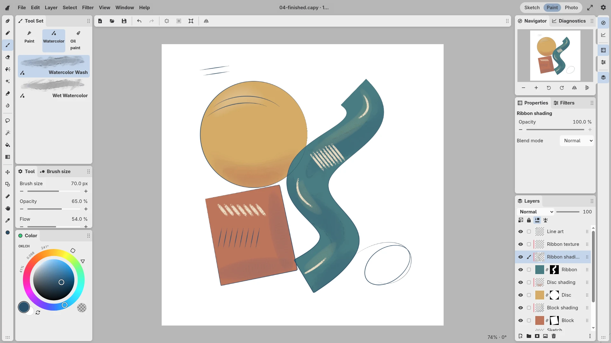

<p align="center">
  <a href="https://capycanvas.art/">
    <picture>
      <source media="(prefers-color-scheme: dark)" srcset="docs/assets/capy-dark.svg">
      <source media="(prefers-color-scheme: light)" srcset="docs/assets/capy-light.svg">
      
    </picture>
  </a>
</p>

<h1 align="center">Capy Canvas</h1>

<p align="center">
  <a href="https://capycanvas.art/">Website</a> ·
  <a href="https://capycanvas.art/download/">Downloads</a> ·
  <a href="https://capycanvas.art/docs/">Documentation</a> ·
  <a href="https://editor.capycanvas.art/">Web&nbsp;Demo</a>
</p>

Capy Canvas is a free, cross-platform app for sketching, illustration and
photography, in development. It is built for Linux first, where artists have long
had fewer choices in professional software. The [web editor](https://editor.capycanvas.art/)
runs the same core in the browser; the Android, iPadOS, macOS and Windows clients
are in development and have no published packages yet.

Its GPU-accelerated brush and compositing engines are designed to improve
performance and battery life, particularly on mobile devices. The Sketch, Paint
and Photo workspaces provide familiar starting layouts, and artists can adapt
panels, toolbars and shortcuts to the muscle memory they have built in other apps.

This project is fully free and open source, and keeps artists in control of their
own data. There are no accounts, subscriptions or tracking. Drawing and editing
happen locally on your device, and the code is licensed under MIT or Apache-2.0.

<picture>
  <source media="(prefers-color-scheme: dark)" srcset="docs/assets/paint-workspace-dark.webp">
  
</picture>

## Overall architecture

When designing Capy Canvas, we did not want to compromise on UI responsiveness.
We target 120 Hz for controls and pen input on every supported platform, even
while the drawing engine handles large brushes and hundreds of layers.
We also need tools and documents to behave consistently across platforms, even
though each uses different UI and graphics APIs.

To achieve these goals, we designed the app around a shared core written in Rust.
The core contains the editor's business logic, including tools, UI behavior and
layout, brushes, layers and document editing. We cross-compile it for each
platform and wrap it in the native toolkit, which supplies the widgets and OS
integration. The web client runs the same core compiled to WebAssembly.

For the best user experience, we use each platform's own UI toolkit:
GTK4/libadwaita on Linux, WinUI 3 on Windows, Jetpack Compose on Android,
AppKit on macOS and UIKit on iPadOS.

The canvas also needs a common way to use each platform's GPU. We built its
pixel-processing stack on `wgpu`, a Rust graphics library that translates our
shaders and rendering commands to Vulkan on Linux and Android, Metal on macOS and
iPadOS, Direct3D 12 on Windows and WebGPU in the browser. This lets us implement
a brush, filter or layer operation once and use it in every client.

```text
Native UI toolkit or browser controls
    | pen samples and tool commands
    v
Shared Rust core
    +-- editor: documents, tools, UI behavior and layout
    +-- stroke processing: pressure and brush placement
    +-- renderer: GPU brushes, filters and composition via wgpu
    |
    v
Vulkan / Metal / Direct3D 12 / WebGPU
    |
    v
Native drawing surface or browser canvas
```

To keep a long draw from blocking controls or pen input, we keep GPU waits off
the native UI threads, and the web client schedules drawing through browser
animation callbacks. We batch new brush marks and update only the regions an edit
affects, reusing the rest of the image between frames.

Painting requires a hardware GPU. The [performance guide](docs/development/testing.md#performance)
explains how we measure frame time and input-to-display latency. The
[architecture guide](docs/architecture.md) follows a pen event through the shared
core to the displayed stroke.

## Package layout

We keep the shared Rust code under `crates/` and the platform clients under
`apps/`. Package READMEs explain their main types and where to start reading.
The `layer-` prefix is the internal Cargo naming convention.

| Package | Responsibility |
| --- | --- |
| [`layer-core`](crates/layer-core/README.md) | Defines documents, layers and brushes, applies undoable edits, and handles the `.capy` project format. |
| [`layer-engine`](crates/layer-engine/README.md) | Turns pen samples into brush contacts, including pressure and tilt response, prediction and contact placement. |
| [`layer-ui`](crates/layer-ui/README.md) | Implements editor tools, commands, panel layout, preferences and file-operation state shared by the clients. |
| [`layer-workspace`](crates/layer-workspace) | Stores workspaces and applies their ownership and persistence rules. |
| [`layer-color`](crates/layer-color) | Applies ICC color transforms and decodes and encodes profiled photo formats. |
| [`layer-render`](crates/layer-render/README.md) | Defines the drawing work and image requests passed between the engine and renderer. |
| [`layer-render-wgpu`](crates/layer-render-wgpu/README.md) | Draws brushes, combines layers, runs filters and presents the canvas using `wgpu`. |
| [`layer-host`](crates/layer-host/README.md) | Connects the shared editor and renderer for Android, Apple and Windows. GTK and web connect them directly. |
| [`layer-ffi`](crates/layer-ffi/README.md) | Exposes offscreen drawing through a C interface for tests, benchmarks and embedding. |
| [`layer-bench`](crates/layer-bench/README.md) | Runs GPU benchmarks and renderer regressions, and generates brush previews. |

Brush resources and runtime filter definitions live in [`assets/`](assets).
We share the interface icons and bundled brush previews in
[`apps/layer-web/`](apps/layer-web) with the native clients; their build scripts
reuse those files.

## Configurable interface

We built the workspace from configurable panels and toolbars so artists can put
the controls they use where they expect to find them. Panels can be docked,
floated, grouped in tabs or collapsed. Artists can choose toolbar contents and
adjust control visibility and sizing. The Tool panel follows the active tool,
and Properties shows the selected filter's parameters.

To clear controls from the canvas without rearranging the workspace, we added
Zen mode. It temporarily hides controls while keeping the canvas size and position
fixed, so entering or leaving the mode does not shift the artwork under the pen.
Settings → Appearance → Zen mode includes **Show Capy in Zen mode** (on by default) to keep
the top-left exit button visible, and **Reveal panels near screen edges** (off by default)
to show controls when tapping or moving the pointer near an occupied edge.
The Zen keyboard shortcut remains available when the Capy is hidden.

We keep this behavior in Rust. A client sends each button press or layout change
as a typed `UiAction` to `UiSession`, which applies it and reports which parts of
the UI changed, so clients update controls in place without interrupting a slider
drag or text edit. Buttons, menus and shortcuts share command definitions, and
workspace changes have their own undo history, separate from the painting.

The [workspace guide](docs/ui/README.md) explains how the layout model and shared
actions connect to native widgets.

## Settings and documents

We define preferences in Rust so every platform uses the same defaults, validation
and shortcut rules; each client builds its settings controls from those definitions
and stores the choices through its own APIs. Workspaces are stored separately from
preferences and artwork, so rearranging panels does not mark a drawing as modified.

An editable project needs to preserve more than the pixels on screen. A `.capy`
file stores the layer tree, masks and effect parameters, raster tiles at the
document's color space and depth, and imported source images with their ICC
profiles; undo history is not saved. Export writes a profiled PNG, JPEG or TIFF, or
for HDR documents a gain-map JPEG or AVIF, PQ PNG or OpenEXR. The Rust core tracks
unsaved changes, open drawings and file requests, while each client supplies file
pickers and reads or writes the bytes.

The [settings guide](docs/ui/settings.md) explains preference definitions and
storage. The [document guide](docs/internals/documents.md) covers editable projects,
undo and save handling.

## Rendering engine

We need to handle illustrations with hundreds of layers, even though many layers
contain only a few marks. Giving each layer a full-canvas texture would quickly
use up graphics memory, and recomputing the entire stack after every pen movement
would repeat work on unchanged pixels.

Documents use sRGB, Display P3, Adobe RGB or ProPhoto RGB at 8- or 16-bit integer
or 16- or 32-bit float (HDR) precision, and composition runs in linear light.
We store painted content in 256 × 256 tiles held in GPU textures, allocating them
as regions are touched. Shaders update the affected tiles, and the compositor
combines them with the other layers to produce the visible image. We track which
regions changed and which cached results depend on them, so we can reuse the
remaining results.

Those dependencies branch when an adjustment uses a mask. In this example, a color
adjustment clipped to a paint layer changes that paint but not the background or
the ink above it; its mask and opacity control how much filtered color replaces
the original, while the paint's coverage stays the same:

```text
Paint tile ----+----> Color filter ------+
               |                         |
               +---------------------+   |
                                     v   v
Effect mask + opacity -----------> Mix with original
                                          |
                                          v
Background tile -----------------> Paint over background
                                          |
                                          v
Ink tile ------------------------> Ink over result
                                          |
                                          v
                                      Output tile
```

If the mask changes, we recompute the adjustment and the composition above it,
reusing the paint, background and ink tiles. Per-pixel adjustments and their masks
are fused into one shader pass. Blurs need neighboring pixels, so we cache their
larger intermediate images on the GPU; some filters still need full-image storage.

We keep the composed image in GPU textures through presentation, avoiding a
second rendered canvas on the CPU. Even with unified memory, a second copy costs
memory and bandwidth, and reading it requires CPU/GPU synchronization, so we read
results back only when export, thumbnails or color sampling need CPU access.

The [rendering guide](docs/internals/rendering.md) explains how we track changes
and reuse intermediate results. The [runtime filter reference](docs/reference/runtime-filters.md)
describes how to add filters using JSON definitions and WGSL shader code.

## Brush engine

A brush that stamps small marks, or dabs, can run well on a CPU. Once it needs to
pick up color, smear paint or deform it with liquify, it must repeatedly sample
and update the existing image. Large brush tips multiply that work. More elaborate
watercolor and oil models also need to track and move paint as the stroke advances.

We keep pressure, tilt and path modeling on the CPU and put the pixel work on the
GPU. Most presets use swept contacts: the CPU emits pairs of contact poses, and the
GPU interpolates the footprint between them and evaluates material contact, such
as paper grain fixed to the page, without stamping dabs. Spray, watercolor, oil,
two paint presets, Blend and Liquify still place distance-spaced dabs. When a brush
needs an earlier contact's result, we preserve that ordering across GPU passes.

Layer pixels and the paint carried by wet brushes stay in GPU textures, so a stroke
never reads the canvas back between updates. Watercolor tracks localized water
and pigment transport, while ink and erasers use a direct blending path without
wet-paint state. Sparse tiles and bounded damage regions limit the work per update.

The goal is to make complex brushes substantially faster than a CPU pixel engine
while reducing CPU overhead and memory traffic, which matters on tablets where
battery and heat limit sustained performance. On a 9504 × 6336 photo, a 1000 px
G-Pen completes 127 frame updates per second on an M4 iPad Pro and 177 on an M2 Pro
Mac mini ([benchmark](docs/development/apple-port-1000px-20260922.md); rendering
capacity, not pen-to-display latency). Energy use is not yet measured.

The [brush guide](docs/internals/brushes.md) follows a stroke from pen samples to
GPU paint updates and explains the state used by different brush types.

## Platform support

Pen input, window lifecycle and file access differ across operating systems,
so each client adapts those services to the shared core:

| Client | UI and graphics | Platform integration |
| --- | --- | --- |
| [Linux](docs/development/linux.md) | GTK4/libadwaita and Vulkan on Wayland. | Runs the GPU worker separately from GTK and presents the canvas in a Wayland subsurface beneath the controls. |
| [Web](docs/development/web.md) | DOM controls and WebGPU. | Runs the shared core as WebAssembly, schedules drawing through browser callbacks, keeps recovery copies in browser storage, works offline as a PWA, and presents HDR where the browser supports extended-range canvases. |
| [Android](docs/development/android.md) | Kotlin/Jetpack Compose and Vulkan. | Calls Rust through JNI, draws pen strokes into a retained front buffer in a `SurfaceView`, and uses Android document providers for files. |
| [macOS / iPadOS](docs/development/apple.md) | AppKit / UIKit and Metal. | Presents the canvas through a `CAMetalLayer`. The iPad client also forwards Pencil predictions and later corrections to estimated samples. |
| [Windows](docs/development/windows.md) | C++/WinRT, WinUI 3 and Direct3D 12. | Hosts the canvas in a `SwapChainPanel` and keeps input and rendering independent of control updates. |

We are still bringing the ports into UI parity; for now, native clients are built
from source. The [platform guide](docs/platforms/README.md) links to their
implementation notes and device-test records.

## Development workflow

After implementing a feature in GTK, coding agents port the interface to the web
client, and other agents use that browser implementation as the reference for each
platform's native toolkit:

```text
Linux / Wayland (GTK4)
    |  New features and UI development
    |
    |  Coding agents port the interface
    v
Web (DOM + Rust/WebAssembly)
    |
    |  Coding agents adapt the UI to native toolkits
    +----> Android (Jetpack Compose)
    +----> macOS (AppKit)
    +----> iPadOS (UIKit)
    +----> Windows (WinUI 3)

Shared Rust editor and renderer compile for every target.
```

We compare the web UI with GTK, then each native port with the web UI, using
screenshots and the same interaction tests at each step; the
[platform guide](docs/platforms/README.md#development-workflow) explains these checks.

## Build and run on Linux

Linux with Wayland is our primary development target and receives new editor
features first.

To build the Linux app, install a recent stable Rust toolchain, a C/C++ build
toolchain, `pkg-config`, and GTK4, libadwaita and Wayland development packages.
We develop with GTK 4.22 and libadwaita 1.9. Running the canvas requires a Wayland
session and a hardware Vulkan driver with mailbox presentation and
premultiplied-alpha surface support.

```bash
git clone https://github.com/capyatelier/capycanvas.git
cd capycanvas
./apps/layer-linux/run.sh
```

The [Linux setup guide](docs/development/linux.md) covers dependencies and
packaging. Start with the [developer guide](docs/development/README.md) for the
other platforms, testing and performance measurements.

## Contributing

We need help with product design, testing sketching, illustration, comic and
photo workflows, and shader development. Our current focus is getting the user
interface right. Once the UX is in good shape, we plan to clean up the
agent-generated code, optimize performance, and simplify or rewrite the brush and
compositor engines.

## License and branding

We license the original code and non-brand assets under [MIT](LICENSE-MIT) or
[Apache-2.0](LICENSE-APACHE); you can choose either license. Contributions to those
parts of the project are submitted under both licenses unless agreed otherwise.

The Capy Canvas and Capy Atelier names and capybara artwork have separate
[branding terms](BRANDING.md). If you publish a modified version, use your own
branding unless you have permission. Dependencies keep their own licenses; see
[third-party notices](THIRD_PARTY_NOTICES.md) and the
[publication guide](docs/development/publication.md).
