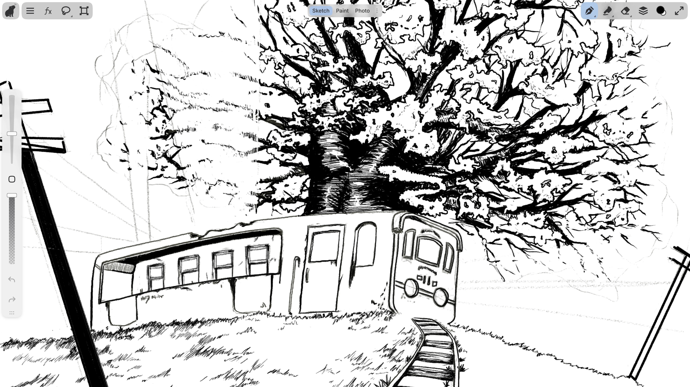
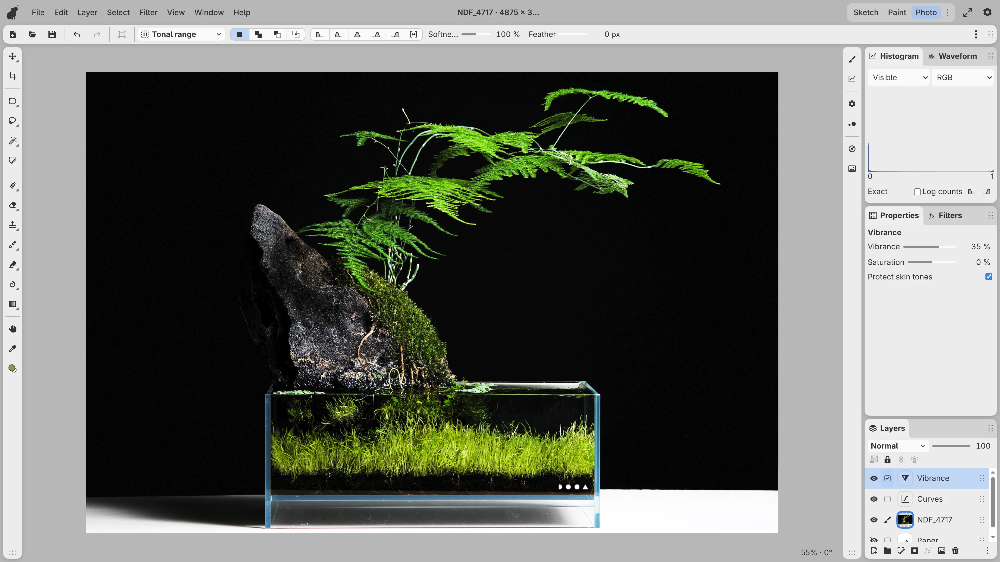

  <a href="https://capycanvas.art/">
    <picture>
      <source media="(prefers-color-scheme: dark)" srcset="docs/assets/capy-dark.svg">
      <source media="(prefers-color-scheme: light)" srcset="docs/assets/capy-light.svg">
      
    </picture>
  </a>

<h1 align="center">Capy Canvas</h1>

Linux · Windows · macOS · iPad · Android · Web

  <strong><a href="https://capycanvas.art/download/">Download</a></strong> ·
  <a href="https://editor.capycanvas.art/">Try in your browser</a> ·
  <a href="https://capycanvas.art/docs/">Artist guide</a> ·
  <a href="docs/engineering.md">Engineering</a>

Capy Canvas is free, GPU-accelerated painting and photo editing software. We
started it because we wanted a faster alternative to paid art software,
especially on Linux, where artists have fewer choices. It also runs on Windows,
Mac, iPad and Android, and you can try it in your browser without installing
anything.

We want artists to build their own tools. Write your own brush engine. Make a
shader for an effect you’ve always wanted, and share it with other artists. You
shouldn’t have to wait for a software company to decide that your idea is worth
building. That is why Capy Canvas is open source and forever free, and we want
this to be a community, not a product.

Drawing and editing happen on your device. No account, subscription or tracking.

## Sketch

Sketch keeps most of the screen for the drawing. Brushes and layers open in
drawers when you need them, with brush size and opacity at the edge of the canvas.
If you hide the controls in Zen mode, the canvas stays where it was. We don’t
want the drawing moving under your pen because you closed a panel.

The pencils respond to pressure and tilt, and their grain stays fixed to the
paper. Repeated strokes build up in the same tooth.

<picture>
  <source media="(prefers-color-scheme: dark)" srcset="docs/assets/sketch-workspace-dark.webp">
  
</picture>

## Paint

Oil and watercolor brushes pick up color already on the layer. You can change
how much paint they carry and how they mix it, or work with dry media and ink.
Paint puts the brushes, colors and layers beside the canvas, where you can keep
them open while you work.

Clipping layers keep shading inside the shapes below. Selection layers hold
areas you want to return to later, and attached effects stay editable. Add an
effect to one layer and keep painting through it, then change your mind about
the settings later.

Sketch, Paint and Photo are starting layouts for the same editor. Move the
panels, change the toolbars, keep the shortcuts you’re used to. You can save your
own workspace too. Rearranging it has its own undo history.

<picture>
  <source media="(prefers-color-scheme: dark)" srcset="docs/assets/paint-workspace-dark.webp">
  
</picture>

## Photo

An imported photo keeps its source image and color profile, with painting stored
on top. Attach Curves and other adjustments to it, mask them, and come back to
change the settings later. Several effects can stay linked to the same layer;
they move with it.

Tonal selections can isolate highlights or shadows for an adjustment. There’s
also cloning and healing, wide-gamut color, HDR painting and editing, and print
proofing. An HDR drawing has an editable SDR rendition for ordinary screens and
exports. You can work on that version without changing the HDR pixels.

<picture>
  <source media="(prefers-color-scheme: dark)" srcset="docs/assets/photo-workspace-dark.webp">
  
</picture>

## Tools

Here’s what’s available across the editor. The linked guides cover the controls
and their limits.

| Area | Tools and operations |
| --- | --- |
| [Brushes](https://capycanvas.art/docs/drawing/brush-tools/) | Pencil, charcoal, ink, bristle, watercolor, oil and airbrush; pressure and tilt, paper grain, textured tips and color mixing. |
| [Layers](https://capycanvas.art/docs/layers/types/) | Groups, clipping layers, layer masks, blend modes, editable color and gradient fills, and selection layers. |
| [Selections](https://capycanvas.art/docs/selections/tools/) | Rectangle, ellipse, lasso, polygon, contiguous color and tonal range; Quick Mask, feathering and saved selections. |
| [Effects](https://capycanvas.art/docs/filters/how-filters-apply/) | Linked non-destructive effect chains, adjustment layers and effect masks; Curves, Levels, color grading, blur, sharpening, halftone and painterly effects. |
| [Retouching](https://capycanvas.art/docs/retouch/clone-heal/) | Clone Stamp, Healing and Spot Healing, dodge and burn, blending and liquify. |
| [Color](https://capycanvas.art/docs/color-management/color-spaces/) | sRGB, Display P3, Adobe RGB and ProPhoto RGB; ICC profiles, 8/16-bit SDR, 16/32-bit float HDR, print proofing and gamut warnings. |
| [Drawing](https://capycanvas.art/docs/drawing/fill/) and [transforms](https://capycanvas.art/docs/transform/move-transform/) | Reference-layer fills, Enclose and Fill, gradients, rulers, crop, resize, perspective and mesh warp. |
| [Workspace](https://capycanvas.art/docs/customize/workspaces/) | Docked or floating panels, tab groups, configurable toolbars and shortcuts, saved layouts and Zen mode. |

## Building the engine

We wanted to build the fastest brush and rendering engine we could. The goal is
120 frames per second and beyond, with brushes thousands of pixels wide. That
pushed us toward the way game engines work: build around the GPU, and do the
pixel work in shaders.

A large [wet brush](docs/engineering.md#brush-engine) has a lot to do. It has to
pick up color, carry paint and mix it into the next part of the stroke. We keep
that work on the GPU, along with
the layers it paints into. Pencils and ink take a different path: the shader
sweeps the tip along the stroke, with paper grain fixed to the canvas.

Then there’s the rest of the drawing. Hundreds of layers can hold a lot of
empty space, so we allocate paint storage in small tiles where marks exist.
[Edits update the affected regions](docs/engineering.md#incremental-composition).
Compatible adjustments [run together in one shader](docs/engineering.md#live-effects),
avoiding an intermediate image between every effect.

The engine is written in Rust and shared by every platform, including the
browser. Each [native app](docs/engineering.md#native-apps-and-shared-core) uses
its platform’s own controls. We wanted the same brushes everywhere, and an
interface that belongs on the device you’re using.

We’re still working toward the performance goals. The
[measurements](docs/PERFORMANCE_TARGETS.md#where-we-stand) show what meets them
and what doesn’t. Painting requires a hardware GPU.

The [engineering whitepaper](docs/engineering.md) follows the full design,
including [color and original images](docs/engineering.md#color-and-original-images)
and [writing new effects](docs/engineering.md#extending-the-engine).

## Contributing

We need artists to use Capy Canvas and tell us where it gets in their way. We
also need help with brushes, shaders and the interface. If you want to work on
any of that, we’d like to hear from you.

For a first shader project, the [Tent Blur example](examples/filters/tent-blur)
is a small effect defined in JSON and WGSL. Brush-engine work starts in the
[brush guide](docs/internals/brushes.md). Bring feedback and ideas to
[GitHub issues](https://github.com/capyatelier/capycanvas/issues).

## Try it or build it

Capy Canvas is in development. Linux and web are the most complete versions;
we’re bringing the other ports up to the same level. The
[download page](https://capycanvas.art/download/) lists available builds, and
the [browser editor](https://editor.capycanvas.art/) is there to try now.

To build from source, follow the guide for
[Linux](docs/development/linux.md), [Web](docs/development/web.md),
[Android](docs/development/android.md), [macOS and iPadOS](docs/development/apple.md)
or [Windows](docs/development/windows.md). The
[developer guide](docs/development/README.md) covers setup and checks.

## Package layout

Shared Rust crates and platform clients

Shared code lives in `crates/`, native clients and the browser app in `apps/`.

| Package | Responsibility |
| --- | --- |
| [`layer-core`](crates/layer-core/README.md) | Artwork, undoable edits and `.capy` files. |
| [`layer-engine`](crates/layer-engine/README.md) | Pen input, brush dynamics and stroke generation. |
| [`layer-ui`](crates/layer-ui/README.md) | Shared tools, commands, editor state and layout. |
| [`layer-workspace`](crates/layer-workspace) | Saved workspace layouts. |
| [`layer-color`](crates/layer-color) | Color profiles and photo codecs. |
| [`layer-render`](crates/layer-render/README.md) | Engine-to-renderer contract. |
| [`layer-render-wgpu`](crates/layer-render-wgpu/README.md) | GPU painting, effects and composition. |
| [`layer-host`](crates/layer-host/README.md) | Shared native integration. |
| [`layer-bench`](crates/layer-bench/README.md) | GPU benchmarks and brush previews. |

## License and branding

Original code and non-brand assets are licensed under [MIT](LICENSE-MIT) or
[Apache-2.0](LICENSE-APACHE), your choice. Contributions to those parts are
submitted under both licenses unless agreed otherwise.

The Capy Canvas and Capy Atelier names and capybara artwork have separate
[branding terms](BRANDING.md). Modified versions need their own branding unless
you have permission. Dependencies retain their own licenses; see
[third-party notices](THIRD_PARTY_NOTICES.md).
