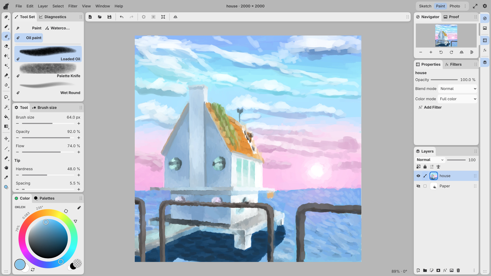

<p align="center">
  <a href="https://capycanvas.art/">
    <picture>
      <source media="(prefers-color-scheme: dark)" srcset="docs/assets/capy-dark.svg">
      <source media="(prefers-color-scheme: light)" srcset="docs/assets/capy-light.svg">
      
    </picture>
  </a>
</p>

<h1 align="center">Capy Canvas</h1>

<p align="center">
  <a href="https://capycanvas.art/">Website</a> ·
  <a href="https://capycanvas.art/download/">Downloads</a> ·
  <a href="https://capycanvas.art/docs/">Documentation</a> ·
  <a href="https://editor.capycanvas.art/">Web&nbsp;Demo</a>
</p>

Capy Canvas is an app for sketching, illustration and photography. It is built for
Linux first, where artists have long had fewer choices in professional software,
and it also runs on Android, iPad, Mac and Windows. You can
[try it in your browser](https://editor.capycanvas.art/) without installing anything.

Its GPU-accelerated brush and compositing engines are designed to improve
performance and battery life, particularly on mobile devices. The interface comes
with familiar layouts for sketching, painting and photo editing, and artists can
rearrange panels, toolbars and shortcuts to match the habits they have built in
other apps.

This project is fully free and open source, and keeps artists in control of their
own data. There are no accounts, subscriptions or tracking. Drawing and editing
happen locally on your device, and the code is licensed under MIT or Apache-2.0.

<picture>
  <source media="(prefers-color-scheme: dark)" srcset="docs/assets/paint-workspace-dark.webp">
  
</picture>

## Overall architecture

When designing Capy Canvas, we did not want to compromise on UI responsiveness.
Controls and pen input should run at 120 frames per second on every supported
platform, even while the drawing engine handles large brushes and hundreds of
layers. We also need tools and documents to behave consistently across platforms,
even though each uses different UI and graphics APIs.

To achieve these goals, we designed the app around a shared core written in Rust.
The core contains the editor's business logic, including tools, UI behavior and
layout, brushes, layers and document editing. We cross-compile it for each
platform and wrap it in the native toolkit, which supplies the widgets and OS
integration. The web client runs the same core compiled to WebAssembly.

For the best user experience, we use each platform's own UI toolkit:
GTK4/libadwaita on Linux, WinUI 3 on Windows, Jetpack Compose on Android,
AppKit on macOS and UIKit on iPadOS.

The canvas also needs a common way to use each platform's GPU. We built its
pixel-processing stack on `wgpu`, a Rust graphics library that translates our
shaders and rendering commands to Vulkan on Linux and Android, Metal on macOS and
iPadOS, Direct3D 12 on Windows and WebGPU in the browser. This lets us implement
a brush, filter or layer operation once and use it in every client.

```text
Native UI toolkit or browser controls
    | pen samples and tool commands
    v
Shared Rust core
    +-- editor: documents, tools, UI behavior and layout
    +-- stroke processing: pressure and brush placement
    +-- renderer: GPU brushes, filters and composition via wgpu
    |
    v
Vulkan / Metal / Direct3D 12 / WebGPU
    |
    v
Native drawing surface or browser canvas
```

To keep a long draw from blocking controls or pen input, we keep GPU waits off the
native UI threads. We batch new brush marks and update only the regions an edit
affects, reusing the rest of the image between frames.

Painting requires a hardware GPU. The [performance guide](docs/development/testing.md#performance)
explains how we measure frame time and input-to-display latency. The
[architecture guide](docs/architecture.md) follows a pen event through the shared
core to the displayed stroke.

## Package layout

We keep the shared Rust code under `crates/` and the platform clients under `apps/`.
Most packages have a README that explains their main types and where to start
reading. The `layer-` prefix is the internal Cargo naming convention.

| Package | Responsibility |
| --- | --- |
| [`layer-core`](crates/layer-core/README.md) | Defines documents, layers and brushes, applies undoable edits, and reads and writes `.capy` projects. |
| [`layer-engine`](crates/layer-engine/README.md) | Turns pen samples into brush marks, handling pressure and tilt response, prediction and spacing. |
| [`layer-ui`](crates/layer-ui/README.md) | Implements editor tools, commands, panel layout, preferences and file-operation state shared by the clients. |
| [`layer-workspace`](crates/layer-workspace) | Saves workspace layouts, keeps the built-in layouts separate from the artist's own, and imports and exports them. |
| [`layer-color`](crates/layer-color) | Converts colors between ICC profiles, and reads and writes photos with their embedded profiles. |
| [`layer-render`](crates/layer-render/README.md) | Defines the drawing work and image requests passed between the engine and renderer. |
| [`layer-render-wgpu`](crates/layer-render-wgpu/README.md) | Draws brushes, combines layers, runs filters and presents the canvas using `wgpu`. |
| [`layer-host`](crates/layer-host/README.md) | Connects the shared editor and renderer for Android, Apple and Windows. GTK and web connect them directly. |
| [`layer-bench`](crates/layer-bench/README.md) | Runs repeatable GPU drawing benchmarks and generates the bundled brush previews. |

Runtime filter definitions live in [`assets/filters/`](assets/filters). We share the
interface icons and bundled brush previews in [`apps/layer-web/`](apps/layer-web)
with the native clients, whose build scripts reuse those files.

## Configurable interface

We built the workspace from configurable panels and toolbars so artists can put the
controls they use where they expect to find them. Panels can be docked, floated,
grouped in tabs or collapsed. Toolbars and control sizes can be customized too. The
app includes Sketch, Paint and Photo workspaces as starting points, and artists can
save their own.

To clear controls from the canvas without rearranging the workspace, we added Zen
mode. It temporarily hides controls while keeping the canvas size and position
fixed, so entering or leaving the mode does not shift the artwork under the pen.
Artists can choose whether the Capy exit button stays visible and whether panels
reappear near the screen edges.

We keep this behavior in Rust. A client sends each button press or layout change to
`UiSession` as a typed `UiAction`. The session applies it and reports which parts of
the UI changed, so the client can update those controls in place without
interrupting a slider drag or text edit. Buttons, menus and shortcuts use the same
command definitions, so they agree on what a command does and when it is available.

Workspace changes have their own undo history, so moving a toolbar does not become
another step in the painting history.

The [workspace guide](docs/ui/README.md) explains how the layout model and shared
actions connect to native widgets.

## Settings and documents

We define preferences in Rust so every platform uses the same defaults, validation
and shortcut rules. Each client builds its settings controls from those definitions
and saves the choices through its own storage APIs. Workspace layouts are stored
separately from preferences and artwork, so rearranging panels does not mark the
drawing as modified.

An editable project needs to preserve more than the pixels on screen. A `.capy`
file keeps everything needed to continue working: the layers, masks and filter
settings, and any imported photos at their original quality and color profile.
Undo history is not saved. Export instead flattens the artwork into a standard
image file, such as PNG, JPEG or TIFF, or an HDR format for HDR documents. The
Rust core tracks unsaved changes and file requests, while each client supplies
file pickers and reads or writes the bytes.

The [settings guide](docs/ui/settings.md) explains preference definitions and
storage. The [document guide](docs/internals/documents.md) covers editable projects,
undo and save handling.

## Rendering engine

We need to handle illustrations with hundreds of layers, even though many layers
contain only a few marks. Giving each layer a full-canvas texture would quickly
use up graphics memory, and recomputing the entire stack after every pen movement
would repeat work on unchanged pixels.

Instead, we store painted content in 256 × 256 tiles held in GPU textures,
allocating them only where something has been painted. Shaders update the affected
tiles, and the compositor combines them with the other layers to produce the
visible image. It blends layers in linear light, so colors mix the way light does,
and supports wide-gamut and HDR documents. We track which regions changed and
which cached results depend on them, so we can reuse the rest.

Those dependencies branch when an adjustment uses a mask. In this example, a color
adjustment is clipped to a paint layer, so it must change that paint without
changing the background or the ink above it. Its mask and opacity control how much
filtered color replaces the original, while the paint's coverage stays the same:

```text
Paint tile ----+----> Color filter ------+
               |                         |
               +---------------------+   |
                                     v   v
Effect mask + opacity -----------> Mix with original
                                          |
                                          v
Background tile -----------------> Paint over background
                                          |
                                          v
Ink tile ------------------------> Ink over result
                                          |
                                          v
                                      Output tile
```

If the mask changes, we recompute the adjustment and the composition above it,
reusing the paint, background and ink tiles. Adjustments that work on one pixel at a
time are combined with their masks into a single shader, so no texture is written
between them. Blurs need neighboring pixels, so we cache their larger intermediate
images on the GPU. Some filters still need full-image storage.

We keep the composed image in GPU textures through presentation, so there is no
second copy of the canvas on the CPU. Even on devices where the CPU and GPU share
memory, a second copy would still use memory and bandwidth. We read results back
only when export, thumbnails or color sampling need them.

The [rendering guide](docs/internals/rendering.md) explains how we track changes
and reuse intermediate results. The [runtime filter reference](docs/reference/runtime-filters.md)
describes how to add filters using JSON definitions and WGSL shader code.

## Brush engine

A brush that stamps small marks, or dabs, can run well on a CPU. Once it needs to
pick up color, smear paint or deform it with liquify, it must repeatedly sample
and update the existing image. Large brush tips multiply that work. More elaborate
watercolor and oil models also need to track and move paint as the stroke advances.

We keep pressure, tilt and path modeling on the CPU and put the pixel work on the
GPU. Most brushes, including pencils, charcoal and ink, don't stamp overlapping
copies of the tip. Instead, the CPU records the tip's position, size and tilt as the
pen moves, and the GPU sweeps the tip from one point to the next. The paper texture
stays fixed to the page rather than moving with the brush, so repeated strokes build
up in the same grain, as graphite does on real paper.

Brushes that scatter or push paint around, such as spray, watercolor, oil,
blending and liquify, still stamp individual dabs. When a dab needs the result of
an earlier one, we preserve that order across GPU passes. Layer pixels and the
paint carried by wet brushes stay in GPU textures, so a stroke never reads the
canvas back to the CPU.

The goal is to make complex brushes substantially faster than a CPU pixel engine
while reducing CPU overhead and memory traffic. This matters particularly on
tablets, where battery use and heat limit sustained performance. In our
[benchmark](docs/development/apple-port-1000px-20260922.md), an M4 iPad Pro
completes 127 canvas updates per second while painting with a 1000-pixel G-Pen on
a 60-megapixel photo.

The [brush guide](docs/internals/brushes.md) follows a stroke from pen samples to
GPU paint updates and explains the state used by different brush types.

## Platform support

Pen input, window lifecycle and file access differ across operating systems,
so each client adapts those services to the shared core:

| Client | UI and graphics | Platform integration |
| --- | --- | --- |
| [Linux](docs/development/linux.md) | GTK4/libadwaita and Vulkan on Wayland. | Runs the GPU worker separately from GTK and presents the canvas in a Wayland subsurface beneath the controls. |
| [Web](docs/development/web.md) | DOM controls and WebGPU. | Runs the shared core as WebAssembly, schedules drawing through browser animation callbacks, and can be installed to work offline. |
| [Android](docs/development/android.md) | Kotlin/Jetpack Compose and Vulkan. | Calls Rust through JNI, draws pen strokes directly into the displayed buffer to reduce latency, and uses Android document providers for files. |
| [macOS / iPadOS](docs/development/apple.md) | AppKit / UIKit and Metal. | Presents the canvas through a `CAMetalLayer`, and on iPad forwards Apple Pencil's predicted points and later sample corrections. |
| [Windows](docs/development/windows.md) | C++/WinRT, WinUI 3 and Direct3D 12. | Hosts the canvas in a `SwapChainPanel` and keeps input and rendering independent of control updates. |

The Linux and web versions are the most complete, and we are still bringing the
other ports up to the same level. The [platform guide](docs/platforms/README.md)
links to their implementation notes and device-test records.

## Development workflow

After implementing a feature in GTK, we use coding agents to adapt the interface to
the web client. Other agents use that browser implementation as the reference when
adapting the interface to each platform's native toolkit:

```text
Linux / Wayland (GTK4)
    |  New features and UI development
    |
    |  Coding agents port the interface
    v
Web (DOM + Rust/WebAssembly)
    |
    |  Coding agents adapt the UI to native toolkits
    +----> Android (Jetpack Compose)
    +----> macOS (AppKit)
    +----> iPadOS (UIKit)
    +----> Windows (WinUI 3)

Shared Rust editor and renderer compile for every target.
```

We first compare the web UI with GTK, then compare each native port with the
web UI, using screenshots and the same interaction tests at each step. The
[platform guide](docs/platforms/README.md#development-workflow) explains these checks.

## Build and run on Linux

To build the Linux app, install a recent stable Rust toolchain, a C/C++ build
toolchain, `pkg-config`, and GTK4, libadwaita and Wayland development packages.
We develop with GTK 4.22 and libadwaita 1.9. Running the canvas requires a Wayland
session and a hardware Vulkan driver with mailbox presentation and
premultiplied-alpha surface support.

```bash
git clone https://github.com/capyatelier/capycanvas.git
cd capycanvas
./apps/layer-linux/run.sh
```

The [Linux setup guide](docs/development/linux.md) covers dependencies and
packaging. The other clients are also built from source for now, and the
[developer guide](docs/development/README.md) covers their setup, testing and
performance measurements.

## Contributing

We need help with product design and shader development, and with testing from
artists who sketch, illustrate, draw comics or edit photos. Our current focus is
getting the user interface right. Once the UX is in good shape, we plan to clean
up the agent-generated code, optimize performance, and simplify or rewrite the
brush and compositor engines.

## License and branding

We license the original code and non-brand assets under [MIT](LICENSE-MIT) or
[Apache-2.0](LICENSE-APACHE); you can choose either license. Contributions to those
parts of the project are submitted under both licenses unless agreed otherwise.

The Capy Canvas and Capy Atelier names and capybara artwork have separate
[branding terms](BRANDING.md). If you publish a modified version, use your own
branding unless you have permission. Dependencies keep their own licenses; see
[third-party notices](THIRD_PARTY_NOTICES.md) and the
[publication guide](docs/development/publication.md).
