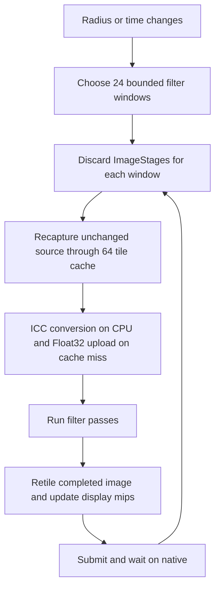

# Filter frame-time investigation — 2026-09-25

## Finding

**The second-long Gaussian Blur and animated Domain Warp frames are a shared
renderer design regression.** The largest cost is repeatedly converting and
uploading unchanged source pixels after the bounded image-window path discards
its input cache. Small source-cache admission makes this particularly expensive
on this machine and in Web. Serialized window processing and another conversion
of completed filter images into display tiles add further overhead.

This was reproduced with the supplied JPEG in GTK, WebGPU, and the shared
renderer without either host. The result becomes fast after the slider stops
because the completed display is reusable. Animated filters keep invalidating
the result and pay the cost continuously.

The Gaussian shader already uses separable passes and prepared paired weights.
Its manual sampling has a measurable large-radius cost, but shader changes
cannot account for, or remove, the dominant second-long stall.

Investigation base: `257ffe621992ff69174eb7efc2ce6a610991764c`.
The measurements below describe that investigation. The subsequent implementation
and comparison against `741a7f6095e3c003960450d87c9f03a11ad9e350` are recorded in
[the optimization qualification](filter-pipeline-qualification-2026-09-25.md).
Temporary window tracing was removed; its patch is in the artifacts.

## Workload and hardware

- Original file: `a_close_up_of_water.jpg`, **5184 × 3456 = 17,915,904 pixels**.
  The chat preview is smaller than the actual file. The JPEG contains an embedded
  ICC profile; this distinction is central to reproduction.
- Imported document: sRGB, integer8 backing, **RGBA32Float working images**.
  The source remains tagged and is converted to working space as needed.
  Fitting the photo into a smaller viewport does not reduce this filter work:
  the engine regenerates the document-resolution result before its display.
- AMD Ryzen 9 PRO 8945HS / Radeon 780M, PCI `1002:1900`, integrated GPU.
  Native adapter: RADV PHOENIX, Mesa 26.1.4, Vulkan. Linux
  `7.0.14-201.fc44.x86_64`; approximately 29 GiB usable system RAM.
- Driver/sysfs reported a 2 GiB local-memory carveout and approximately 14.9 GiB
  GTT allowance. These are not a 17 GiB allocation guarantee. Memory clock was
  2800 MHz; advertised maximum GPU clock is 2800 MHz. Dynamic clocking and other
  desktop applications were not disabled.
- Chrome also selected the hardware AMD/RDNA3 WebGPU adapter. Its headless
  *desktop compositor* was software; WebGPU rendering was hardware. Browser
  measurements cover frame generation and queue completion, not scanout or
  screenshot pixel correctness.

## Reproduction and measurements

All principal measurements used release builds and the original ICC-tagged
JPEG. Recorded runs were sequential, without concurrent builds. Times below
exclude file opening, shader compilation, and the first filtered frame unless
stated otherwise. These are small diagnostic samples, not tail-latency or
cross-device qualification.

### Actual hosts

GTK ran in the repository's isolated Mutter/Wayland test environment at a
1400 × 950 window size. The test dispatches actual radius edits through the
workspace. Its settle helper deliberately waits another ~120 ms; that wait is
excluded from the frame times in this table.

| GTK edit | Frame generation, including nested waits | Active render-thread CPU |
| --- | ---: | ---: |
| Radius 4 | 1,318.38 ms | 1,095.54 ms |
| Radius 12 | 1,443.80 ms | 1,141.17 ms |
| Radius 21 | 1,581.83 ms | 1,150.84 ms |
| Return to radius 3 | 1,359.35 ms | 1,133.76 ms |
| Set already-selected radius 3 | 0.49 ms | small/no regeneration |

Web used actual `App.dispatch`, `App.frame`, and
`App.wait_for_canvas()` / `GPUQueue.onSubmittedWorkDone`. Eight changed-radius
frames at 3–21 in the final confirmed run took **1,331.70 ms median synchronous
frame generation** and **1,344.75 ms median through queue completion**.
Individual frame-generation times were 1,308–1,485 ms; dispatch took 0.4–0.8 ms.
An earlier eight-frame run measured 1,426.50 / 1,441.45 ms respectively.
The final harness drives two untimed warm-up frames and verifies submission
of every recorded frame. The stall is inside frame generation, not slider event
dispatch.

### Controlled shared-renderer experiment

Same source, resolution, filter definitions, working precision, and hardware.
Gaussian radius is 3; warm updates alternate adjustment opacity 0.99/1.0 to
force regeneration without changing the source. Domain Warp uses its default
24 px displacement, 96 px scale, three octaves, and changing animation time.
Each entry is the median of eight frames, measured through GPU completion.

| Diagnostic configuration | Gaussian | Animated Domain Warp | Source tile misses/frame |
| --- | ---: | ---: | ---: |
| Current native defaults | **1,316.07 ms** | **1,261.72 ms** | 412 |
| Retain all converted source tiles; keep current windows/display | 204.24 ms | 175.83 ms | 0 |
| Allow existing full-image cache; keep current display path | 114.31 ms | 76.76 ms | 0 |
| Full-image cache plus existing dense display path | **66.46 ms** | **38.18 ms** | 0 |

Unchanged shared-renderer frames are about 0.2–0.5 ms through completion.
The last row takes about 0.3 ms of CPU encoding; most remaining time is GPU work.
Cold filtered frames still pay source preparation: the Gaussian full-image
controls took approximately 1.0 second on their first filtered frame.

These controls are **causal experiments, not proposed settings to ship**:

- Source control admits 512 MiB total source cache; the existing split leaves
  384 MiB for native Float32 tiles, enough for this photograph's 294 tiles.
- Full-image control changes the test instance's image ceiling to 2 GiB.
- Dense display control selects the existing dense branch in the test instance.
- No ICC tags are discarded, precision reduced, or shaders replaced in this
  table. Memory residency increases; performance alone does not qualify these
  configurations for large documents, multiple layers, or constrained devices.

## Why the current frame is expensive



### 1. A memory threshold changes cache semantics

[`scene/windows.rs`](../../crates/layer-render-wgpu/src/scene/windows.rs)
uses a fixed **256 MiB** image-stage ceiling. A single image here is
286,654,464 bytes / 273.375 MiB. Gaussian input, intermediate, and output consume
859,963,392 bytes / **820.125 MiB**, before other renderer resources. Domain Warp
requires two such images. Both select windowing at every radius.

For this simple stack, the Gaussian threshold is only about 5.59 million pixels;
Domain Warp's is about 8.39 million. More image boundaries lower the threshold.
This is an abrupt workload/residency-dependent performance cliff.

`compose_windows` assigns `self.images = ImageStages::default()` **inside every
window iteration**, recaptures the source, processes the filter, and releases
window pixels. It loses the input reuse available in
[`scene_images.rs`](../../crates/layer-render-wgpu/src/scene_images.rs).
The default Gaussian has a 9 px support per pass and a conservative combined
18 px halo; 1024 px output windows produce a 6 × 4 sweep.

### 2. The source cache cannot retain that sweep

[`scene/sources.rs`](../../crates/layer-render-wgpu/src/scene/sources.rs)
admits **64 MiB / 64 Float32 256 × 256 tiles** here, plus a 16 MiB in-flight
upload allowance. The complete source needs 21 × 14 = **294 tiles**. The
window/halo traversal reloads **412 tiles per warm changed frame**, equivalent
to 412 MiB of padded Float32 upload payload, despite zero changes to the photo.

Built-in profiles have a GPU conversion path. Embedded ICC sources use
`upload_icc` → `WorkingDecoder::decode_tile_cached` → `decode_pixels`.
The cached samples in `PipelineDevice::source_samples` are **encoded source
samples**; caching them avoids repeated decompression but does not retain the
converted working pixels.

[`icc/working.rs`](../../crates/layer-color/src/icc/working.rs) and
[`icc.rs`](../../crates/layer-color/src/icc.rs) show the RGB transform's
per-pixel curve/matrix work. A separate CPU-only benchmark, with already decoded
source tiles and no GPU, measured **669.28 ms for one 294-tile ICC conversion**
(median of five warm sweeps). Scaling the measured cost to 412 tiles predicts
**938 ms** of color conversion per changed frame. That explains most of the
1.1-second active CPU measurement before source upload/bookkeeping is included.

A diagnostic reinterpretation as built-in sRGB took 58.30 ms for the same CPU
loop. This demonstrates a cost distinction, **not profile equivalence**; stripping
or relabeling the ICC profile is not an acceptable solution.

Source-cache admission depends on display-memory allowance. Native Linux uses
driver device-local headroom; Web supplies zero for that native query and gets
the conservative fallback. Larger GPUs can retain more converted tiles and
hide the largest cost, but still perform the window recapture. This explains
hardware sensitivity without requiring a Radeon-specific shader/driver defect.

### 3. Repeated submissions serialize the work

The measured default frame makes **25 image-window submissions** (one before
the sweep, 24 after windows), plus **15 display-composition submissions**.
`Scene::submit_chunk` waits for native completion. Source preparation, rendering,
and retirement therefore occur in small serialized groups.

The source-retention control still takes 204 ms for blur. Keeping the full-image
input reduces that to 114 ms without changing the display path. These deltas
include recapture, halos, allocation, recording, and synchronization together;
they are not separate timers for each cost.

The Wasm `wait_submission` branch does not block on GPU completion. Web still
pays synchronous source conversion and records the window sweep, which is why
removing native waits alone cannot solve the shared regression. It also means
the native window retirement argument does not, by itself, prove the same peak
in-flight residency bound in the browser.

### 4. A completed filter image is converted into tiles again

[`Scene::compose_display_pixels`](../../crates/layer-render-wgpu/src/scene.rs)
has a direct copy path for a completed adjustment image, but excludes it when
`live_display` is present. That path goes through tile composition and display
pyramid updates. With full-image filtering allowed, this measured 36 display
submissions per update. Selecting the existing dense display path reduces blur
from 114 to 66 ms and Domain Warp from 77 to 38 ms.

Display mipmaps are useful for inexpensive pan/zoom. The problem is the extra
ownership and representation round trip on regeneration; the measurements do
not establish that mipmaps themselves should be removed.

## Historical causal test

Built the parent of `c325268f` and then the same checkout with **only that
commit's file changes applied**, using the same release harness, photo, and GPU.
The old import API requires attaching the retained source directly to a layer;
both historical arms use that identical setup. One cold frame is excluded;
eleven subsequent frames are included for each filter.

| Version | Gaussian update | Animated Domain Warp |
| --- | ---: | ---: |
| `4e14a2e5` — immediately before windowing | **73.62 ms** | **40.38 ms** |
| `c325268f` — bounded dependency windows | **4,310.70 ms** | **4,290.83 ms** |
| Current base, native defaults | 1,316.07 ms | 1,261.72 ms |

This proves that windowing introduced the pathological repeated work in the
native renderer. It was about 59× slower for Gaussian and 106× for Domain Warp
in that immediate comparison. The historical native constructor is deliberately
used in both arms; this is not a claim that the default GTK host had already
enabled native rendering in the parent commit.

Relevant sequence:

- `98089a3f`, September 14: shared native Float32 working color/manual sampling.
- **`c325268f`, September 14: bounded native filter windows**, the isolated
  regression above.
- `2a985772`, September 14: GTK connects document rendering to native SDR.
- `9f7abe15`, September 15: portable Rust JPEG/ICC implementation.
- `695a5f53`, September 15: Web activates native SDR storage.
- `914fd339`, September 15: display headroom admission; subsequent source and
  display changes improve parts of the workload but retain the window reset.

The current renderer is faster than the first windowed implementation. This
investigation does not isolate all intervening improvements or attribute the
remaining conversion cost specifically to the C-to-Rust replacement.

The [GTK color validation](../history/color-management-gtk-m2-validation.md)
explicitly qualifies unchanged-photo navigation while deferring dirty-pixel,
filter, and histogram regeneration. Its reference system was an RTX PRO 6000
Blackwell Max-Q with roughly 96 GiB GPU memory. Older filter-library benchmarks
also use a legacy RGBA8 path. Neither establishes acceptable interactive
regeneration for a large ICC source on the current native/Web path.

Pen front buffering, panel transparency, and host compositing are absent from
the shared-renderer reproduction. They are not required to trigger this issue.
This does not claim that those paths have no independent performance problems.

## Shader workload and achievable times

The diagnostic shader benchmark uploads the actual photo into linear Float32
textures, warms each pipeline four times, then records 20 completed frames.
It excludes source conversion, windowing, scene composition, display mips, and
presentation. The input for this *workload* control assumes sRGB when making
Float32 samples; the production/host and causal-control tables above retain ICC.

| GPU workload at 5184 × 3456, RGBA32Float | Median GPU time |
| --- | ---: |
| Two trivial render-copy passes | 36.88 ms |
| Two Gaussian passes, current manual bilinear style, radius 3 | **38.88 ms** |
| Same radius 3, two-load axis interpolation | 37.77 ms |
| Same radius 3, ordinary discrete taps | 37.38 ms |
| Same radius 3, hardware Float32 bilinear sampling | 38.17 ms |
| Current manual bilinear style, radius 21 | 69.99 ms |
| Axis interpolation, radius 21 | 52.74 ms |
| Discrete taps, radius 21 | 65.87 ms |
| Hardware Float32 bilinear, radius 21 | 58.37 ms |
| One Domain Warp pass, default three-octave noise | **19.20 ms** |

These variants are timing controls, not pixel-difference-qualified replacements.
The Domain Warp benchmark specializes the default octave count; it is an
arithmetic/workload bound, not the entire production effect wrapper.

[`gaussian-prepare.wgsl`](../../assets/filters/gaussian-prepare.wgsl) runs a
single 64-lane preparation group when sigma changes. At sigma 3, support is
19 discrete taps per axis, implemented as one center plus five symmetric paired
samples: 11 interpolated samples per pass. This is already separable, not a
19 × 19 convolution per pixel, and it does not calculate exponentials per
fragment.

[`working_sample_float`](../../crates/layer-render-wgpu/src/working_color.wgsl)
expresses each interpolated sample as four texture loads and mixes. For an
axis-aligned blur, two loads suffice; a compiler may also eliminate some
redundancy. Thus the manual path expresses up to 44 loads per pass at sigma 3,
versus 19 ordinary discrete taps. This undermines part of the paired-sampling
advantage. At radius 3, memory/output costs dominate the measured variants.
At radius 21, improving the sampler saves roughly 12–17 ms in this control,
which matters after eliminating the much larger pipeline cost.

### First-principles bounds

1. **Pixel volume:** 17.916 million pixels, 16 bytes each. A texture is
   286.65 MB. Two fully materialized passes must, in the simple uncompressed
   streaming model, read and write that volume twice: **1.1466 GB** minimum
   traffic, excluding extra taps that miss caches and other passes.
2. **Bandwidth:** AMD specifies DDR5-5600 support for this processor. A populated
   128-bit DDR5-5600 interface has a nominal **89.6 GB/s**, giving **12.8 ms** for
   that traffic alone. Installed channel width was not independently verified;
   this is a conditional optimistic bound, not measured available bandwidth.
   GPU/CPU sharing, clocks, cache behavior, compression, and render-target
   throughput alter achieved performance. A fused tiled kernel could avoid a
   full intermediate DRAM round trip, so 12.8 ms is not a universal algorithmic
   lower bound.
3. **Measured useful throughput:** the two real-photo copy passes take 36.88 ms,
   equivalent to about **31.1 GB/s** of that minimum read/write traffic. Radius-3
   blur adds only about 2 ms. This gives a defensible **~39 ms demonstrated
   shader target**, more useful than assuming peak bandwidth.
4. **Arithmetic:** 19 taps × two axes × four channels is 152 multiply-adds per
   pixel, about **5.45 GFLOP** for ordinary separable accumulation. A 12-CU RDNA3
   GPU at 2.8 GHz has a conventional FP32 FMA peak of about 4.3 TFLOP/s (before
   potential dual issue). Even this simple peak arithmetic estimate is only
   ~1.3 ms; it does not include addressing, interpolation, occupancy limits,
   or memory. A one-second arithmetic explanation is inconsistent with the
   measured kernels.
5. **Domain Warp:** four fBM evaluations × three octaves × four lattice hashes
   means roughly 48 hashes/pixel, or 860 million hashes, plus interpolation and
   the displaced sample. It is a substantial shader, but the measured workload
   still completes in 19.2 ms; the existing dense production path takes 38.2 ms.

Hardware references: [AMD processor specification](https://www.amd.com/pt/products/processors/laptop/ryzen-pro/8000-series/amd-ryzen-9-pro-8945hs.html),
[AMD GPU architecture specifications](https://rocm.docs.amd.com/en/docs-7.2.0/reference/gpu-arch-specs.html).
The traffic and compute estimates above are derived from those limits and the
actual image/shader workload, not advertised frame-rate claims.

For Gaussian, the measured gap is therefore approximately:

- **1,316 → 204 ms:** remove source misses, conversion, and reuploads.
- **204 → 114 ms:** retain filter input / avoid window recapture and retirement.
- **114 → 66 ms:** avoid the display tile round trip in this control.
- **66 → 39 ms:** remaining whole-pipeline work relative to the minimal kernel
  (effect wrappers, output handling/copy, and presentation work); these pieces
  were not individually isolated.

The deltas describe successive different configurations; resource overlap means
they should not be mistaken for independent additive profiler scopes. A
**20× improvement to the existing full-resolution production filter path** is
demonstrated by the 66 ms control. A ~34× improvement reaches the isolated
39 ms workload. Full-resolution 60/120 Hz on this GPU is not established by
these results; it would require additional algorithm/representation work or an
explicit interactive-preview resolution policy.

## Simplification direction

The useful invariant is: **source conversion depends on source revision,
profile, and working space; filter parameters/time do not change that input.**
Windowing should change execution granularity, not erase this dependency fact.

Suggested next design/prototype, without adding another cache to the current
stack:

1. Give working image regions one owner and one invalidation model. Source
   conversion becomes an upstream node; a radius/time edit dirties its filter
   descendants. Dense and tiled execution share that ownership and scheduling.
2. Use one residency/in-flight planner for source, filter scratch, and completed
   output. Remove competing allowances whose interaction forces repeated
   conversion. Retain only intermediates justified by reuse; provide bounded
   region execution when a complete working set cannot fit.
3. Feed a completed filter region directly to the display update/mip generation
   path. Avoid filter-image → temporary composition tiles → display-image
   reconstruction when the image already represents the completed composition.
4. Make queue submission and retirement explicit in the scheduler. Preserve
   bounded staging and safe resource lifetimes with completion tracking; remove
   hidden per-window CPU waits from composition. Simply deleting waits would
   invalidate the current lifetime/memory assumptions.
5. Optimize axis sampling only after that simpler path is measured. Preserve
   extended working-space values and existing color/alpha contracts. Neither
   RGBA8 fallback nor discarding ICC metadata is justified by these results.

The prototype should replace the separate reset/rebuild path and redundant
display reconstruction, with **less production code and fewer resource owners**.
Increasing limits, adding a third converted-source cache, or adding another
host-specific fast path would conceal the ownership problem.

Evaluation gates for that prototype:

- This photo: zero repeated source conversions/uploads during a warm radius or
  time edit while its input is resident; changed and unchanged frames reported
  separately.
- Report active CPU, command encoding, actual pass GPU durations, queue waits,
  completion, and peak resident/in-flight bytes separately.
- Large-radius blur, animated Domain Warp, masks, nested groups, source/profile
  changes, and region seams preserve the specified appearance/alpha behavior.
- Include a working set larger than the admitted memory, multi-layer/multi-tab
  load, actual GTK and Web, and both integrated and discrete hardware.
- No regression in pen responsiveness or cached navigation; those are distinct
  workloads rather than substitutes for regeneration measurements.

## Measurement caveats and reproducibility

The current displayed GPU timestamp spans commands across several submissions.
CPU conversion and native waits can leave the GPU idle *between* those commands,
so a ~1,300 ms GPU timestamp does not prove 1,300 ms of shader execution. The GTK
active-thread clock and isolated kernels distinguish these cases. CPU frame
generation includes nested completion waits despite its UI description saying
it is not GPU completion. Per-window image counters are reset with `ImageStages`;
their final value is not the whole-frame pass-pixel count.

Only this AMD/Mesa machine was physically tested. No driver comparison, fixed
power/clock experiment, full latency percentile study, or visual qualification
of alternative shaders was performed. These limitations do not affect the
single-commit causal test or the source-retention controls.

Raw logs, browser JSON, screenshots, tracing patch, and a machine-readable
`summary.json` are under
`artifacts/filter-investigation/` (ignored build artifacts). Principal files:
`gtk-trace.log`, `web.json`, `web-first.json`, `jpeg-{default,sources,full,dense}.log`,
`jpeg-domain-{default,sources,full,dense}.log`, `micro-photo.log`,
`source-conversion.log`, and `history-{before,after}-windows.log`.
Earlier exploratory `micro.log` uses zero-valued input and an inadequate wait;
it is excluded. Early raw-source/build-overlap logs are also excluded from the
principal causal table. `web.json` is the final confirmed browser run and
`web-first.json` the earlier eight-frame run. An intermediate harness check
exposed deferred startup frames; that run is retained as
`web-deferred-startup.json` and excluded. The retained browser harness now drives
untimed preparation and rejects deferred frames. A final native run after
removing tracing also reproduced 412 misses and ~1.3-second changed frames
(`final-native-smoke.log`).

Opt-in diagnostic sources:

- [Shared-renderer and GPU kernel benchmarks](../../crates/layer-render-wgpu/src/tests/filter_investigation.rs)
  and [workload shader](../../crates/layer-render-wgpu/src/tests/filter_microbench.wgsl).
- [GTK reproduction](../../apps/layer-linux/src/filter_investigation_tests.rs).
- [Browser reproduction](../../apps/layer-web/filter-investigation.test.mjs).
- [Historical harness](../../tools/performance/filter-history-benchmark.rs) and
  [CPU conversion benchmark](../../tools/performance/filter-source-conversion.rs).

Example current renderer run (needs access to the physical GPU):

```sh
export CAPY_FILTER_SOURCE_JPEG=/path/to/a_close_up_of_water.jpg
mkdir -p artifacts/filter-investigation
magick "$CAPY_FILTER_SOURCE_JPEG" -depth 8 rgba:artifacts/filter-investigation/photo.rgba
export CAPY_FILTER_PHOTO_RGBA=artifacts/filter-investigation/photo.rgba
cargo test --release -p layer-render-wgpu photo_filter_frame_time -- --ignored --nocapture --test-threads=1
CAPY_FILTER_NAME=domain_warp cargo test --release -p layer-render-wgpu photo_filter_frame_time -- --ignored --nocapture --test-threads=1
cargo test --release -p layer-render-wgpu filter_microbench -- --ignored --nocapture --test-threads=1
```

The raw RGBA file only supplies diagnostic controls/microbench input; setting
`CAPY_FILTER_SOURCE_JPEG` makes the production experiment import the original
profiled JPEG. Re-run with `CAPY_FILTER_SOURCE_MIB=512`, or
`CAPY_FILTER_LIMIT_MIB=2048`, or the latter plus `CAPY_FILTER_DISPLAY=dense` for
the controlled table. Never apply these environment controls to a production
configuration: they are read only by the opt-in test.

For GTK, build `cargo test --release -p layer-linux --no-run`, use the emitted
test executable with `tools/performance/gtk-raster.sh`, select
`native_photo_filter_investigation`, and set `CAPY_FILTER_PHOTO` to the JPEG.
The trace log additionally used the archived `window-trace.patch`; ordinary
reproduction does not require it.

For Web, build with `apps/layer-web/build.sh`, temporarily copy the photo to
`apps/layer-web/filter-investigation-photo.jpg`, serve that directory, and run
`LAYER_WEB_URL=http://127.0.0.1:4187 node apps/layer-web/test.mjs --headless --filter-investigation`.
Remove the temporary photo afterward. The harness creates a disposable browser
profile. The shared test runner uses an extended timeout for this investigation.

For historical A/B, archive `c325268f^`, include the historical harness inside
the archived filter-library test module, and adapt only its import setup to the
old API: `extent = source.extent`, default document color, and a paint layer with
`source = Some(Arc::new(source))`. Build/run, then apply precisely the files
changed by `c325268f` and rebuild/run the same test. The preserved archive under
the artifacts is now the *after* version despite its `before-windows` directory
name. Both measured logs contain exactly one executed test.

For the CPU-only control, compile `filter-source-conversion.rs` with release
`rustc -C opt-level=3 --edition=2024`, `-L dependency=target/release/deps`, and
`--extern layer_color=<the current release liblayer_color rlib>`. Run with
`CAPY_FILTER_SOURCE_JPEG` set. File decode and tile decompression occur before
the timed loop.
