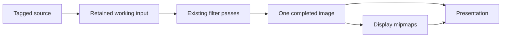

# Filter pipeline qualification — 2026-09-25

## Scope and ownership

The [investigation](filter-frame-time-investigation-2026-09-25.md) identified
repeated source conversion and submission waits introduced by unconditional
filter windowing. The Gaussian and Domain Warp shaders are unchanged.

For an admitted full-image graph, the data flow is:



The renderer now uses one allowance for filter images and completed display
pixels. Display admission reserves the existing minimum filter-window capacity;
the filter graph can use the allowance remaining after the document's display
plan. Placement previews use the remaining surplus after exact dependencies.
Large graphs still use the existing bounded-window executor. Source and editable
tile caches retain their separate bounded lifetimes.

Completed root adjustments bypass tile recomposition. For an admitted complete
display, the filter owns the full-resolution result and the display borrows it
for sampling and mip reduction. This removes another full-resolution allocation
and copy (273.375 MiB for the supplied photo). If a foreground layer or inspection
overlay needs to draw into the composite, the display first acquires its own
writable image. Window outputs publish through the existing tile/mip writer.
Native color encoding, embedded ICC interpretation, Float32 working precision,
paint history, and input scheduling retain their existing semantics.

For active filter dependencies, Linux integrated GPUs can use measured available
system/process memory when a driver budget is unavailable. Optional source and
unfiltered display caches retain their original admission policy. Removing the
last physical filter restores that policy and recomposes display pixels without
resetting paint. wgpu 30 deliberately disables RADV's unreliable
`VK_EXT_memory_budget`; the implementation respects that suppression. See the upstream
[RADV accounting issue](https://github.com/gfx-rs/wgpu/issues/9742). Native admission
uses one quarter of measured headroom on Linux for filter dependencies; Android
retains its existing policy. These are admission snapshots, not reservations. Web keeps
its existing bounded capacity-based allowance, now shared by filters and display;
`navigator.deviceMemory` is not treated as free memory.

This reduces rendering stages and pixel ownership. Production Rust grows by
117 lines: allocation planning and explicit transitions between a borrowed
finished image and a writable composite. This is a runtime simplification, not a
net source-line reduction. The ownership transition prevents composition from
overwriting a filter dependency. The existing shaders and decoded-tile caches
retain their roles.

## Comparison protocol

Baseline production code is `741a7f6095e3c003960450d87c9f03a11ad9e350`, fetched
from `origin/main` before implementation. Before merging, main advanced to
`35518698ccb742be5d04e1200c3985d5cfe530c6` with command-search changes. That commit
was incorporated; GTK and Web baseline/candidate builds were rebuilt against it.
The renderer, engine, render interface, core, and color crates are identical
between these two baseline commits. Shared-renderer executables remain the
frozen 741a7f60 baseline; host baselines come from the updated source archive. Both versions use the same test harness and fixtures. The large-project
filter harness was also compiled against the archived baseline.

Main subsequently advanced to `9b830b420dd52253c06549ac6e7485e06628bd90`, including
shared demand-driven shader preparation. It was incorporated without conflicts.
The final confirmation rebuilds both renderer and host baselines against that
commit; the earlier full matrix remains separately identified rather than
mixing samples across changes to startup/input admission.
The final host build base is `e0d747570bb7ed7e7403c7bcea4b9a6f014a63d9`. Its additional
command-help and Apple/Windows UI changes do not change the renderer, engine,
GTK render worker, or shared input scheduling. Final native controls build both
versions from the same workspace path, with separate frozen executables.
The push integrated concurrent `2e3e7c18` afterward. That change enables Windows
demand shader preparation; shared changes are a documentation comment and adding
Windows to the unchanged-library no-op condition/test. The measured GTK/Web
rendering and input behavior is unchanged.

Hardware and source-photo details are in the investigation. Performance runs
are serial, with no concurrent compilation. Initial uninterrupted rounds exposed sustained-load variation in both versions.
Final comparable-temperature rounds reverse the order in the second round and
wait for the reported GPU temperature to fall to at most 70°C before
each workload. Read-only clocks, temperatures, load, and memory counters are
recorded once per second. Power policies and other user applications are unchanged. Results exclude loading and the first ten
headless drawing frames where stated. Native throughput, GTK presentation timing,
and browser queue completion measure different intervals and are reported
separately.

The pen fixture is the repository's deterministic 9504 × 6336 image (60,217,344
pixels, conventionally called 61 MP). It is tested both directly and with an
empty paint layer above it. G-Pen has a 2000-document-pixel diameter and full
pressure. The headless workload supplies four samples per frame at a nominal
240 Hz, then exercises zoom and exact undo/redo. GTK fits the photo in the window
and supplies approximately 480 samples/s during twelve 1.2-second contacts on an
isolated 120 Hz Mutter display. The harness asserts the selected preset and
diameter after startup and verifies that every contact produces paint and a
committed frame.

The GTK harness measures synthetic input delivery, render-owner frame work,
canvas presentation feedback, pen-up to presentation of the committed revision,
and asynchronous host backing. It bypasses the outer GDK event handler and does
not measure physical digitizer or photon latency. If a commit frame is discarded,
pen-up latency uses the first presented later frame containing that revision.

An initial GTK harness sent brush settings before startup finished, allowing
startup to overwrite the diameter with 18 px. Those preliminary measurements
were rejected. Only runs with the post-startup 2000 px assertion count.

## Results

### Filter regeneration

Completed warm-frame medians, in milliseconds. Gaussian 3 and Domain Warp combine
two 12-frame runs; other rows use 8–12 frames. The 61 MP case uses the deterministic
fixture, fitted into a 1600 × 1000 viewport while filtering all document pixels.

| Workload | Main | Candidate |
| --- | ---: | ---: |
| Supplied ICC photo, Gaussian 3 | 1,311.5 | 59.9 |
| Same photo, Gaussian 21 | 1,563.1 | 91.8 |
| Same photo, animated Domain Warp | 1,284.6 | 31.0 |
| Same photo, Unsharp Mask | 1,301.7 | 59.7 |
| Same photo, Heat Haze parameter edit | 1,283.2 | 31.3 |
| 61 MP fixture, Gaussian 3 | 876.5 | 215.1 |
| Same ICC photo, Exposure | 618.8 | 618.6 |
| Same ICC photo, Curves | 620.9 | 618.1 |

The 18 MP neighborhood-filter frames go from 25 window submissions, 15 display
submissions, and 412 source misses to **zero of each**. These are intermediate
submissions; a final frame submission remains. Gaussian frame-generation CPU is
approximately 0.4 ms. The 61 MP Gaussian goes from 71/54/1,406 to zero, retaining
2,890,432,512 bytes of filter images.

Exposure and Curves use the pointwise tile path and remain source-conversion
bound, with 230 source misses and 36 display submissions per changed frame.
They show no improvement in this change. The windowing regression is restored
for the measured neighborhood filters; source ownership on the pointwise path
remains a separate design problem.

In actual GTK radius edits, frame-generation time fell from 1,272–1,518 ms to
0.70–0.78 ms; GPU timestamps for completed edits were approximately 58–103 ms.
Browser small-radius edits completed in 68.5–70.9 ms versus 1,397–1,577 ms, with
approximately 1 ms synchronous frame generation. Browser radius 21 completed in
141.5 ms versus 1,479.7 ms. WebGPU used hardware; headless browser desktop
compositing remained software, so these are queue-completion measurements.

### Pen, navigation, and save

Headless completed-frame median / p95, in milliseconds. The 2000 px rows pool two
replays per version; other brushes use one replay. Drawing excludes ten warm-up
frames. Every replay verifies exact undo/redo, and final painted tile hashes
match between main and the candidate in all seven paired replays.

| 61 MP workload | Main | Candidate |
| --- | ---: | ---: |
| 2000 px G-Pen, empty layer | 46.56 / 55.41 | 46.56 / 55.86 |
| 2000 px G-Pen, source layer | 34.29 / 44.26 | 34.48 / 44.00 |
| Navigation after empty-layer drawing | 5.08 / 40.06 | 4.92 / 41.01 |
| Navigation after source-layer drawing | 4.98 / 31.89 | 4.90 / 31.78 |
| 96 px G-Pen | 8.89 / 10.59 | 8.85 / 10.32 |
| 512 px Marker | 18.74 / 25.10 | 18.86 / 23.07 |
| 2000 px Eraser, after seeding paint | 43.07 / 53.86 | 43.11 / 54.32 |

GTK median / p95, in milliseconds. Empty-layer results pool six runs per version
(72 contacts); source-layer results pool two (24 contacts).

| GTK 61 MP workload | Main | Candidate |
| --- | ---: | ---: |
| Empty layer, render-owner frame | 35.45 / 57.76 | 35.79 / 59.30 |
| Empty layer, pen-up to committed presentation | 242.37 / 266.83 | 245.77 / 274.29 |
| Source layer, render-owner frame | 25.62 / 40.62 | 25.76 / 40.94 |
| Source layer, pen-up to committed presentation | 167.79 / 183.76 | 156.69 / 188.57 |

Input-delivery medians were 0.016 ms on the empty layer and 0.012–0.013 ms on
the source; p95 was 0.033–0.038 ms. Empty-layer frame medians differ by about 1%.
Two extra controls built both versions from the same workspace path gave main
35.57/35.56 ms and candidate 35.72/35.83 ms frame medians, with pen-up medians
252.06/241.13 ms versus 242.27/239.59 ms. This supports no material regression
under the measured conditions; it does not establish exact equality or physical
pen latency. All final runs passed the unchanged presentation-count gate.

The separate 2048 × 1536 legacy selection benchmark covers G-Pen, Natural Blender,
and Watercolor Wash with no selection, packed selection, and byte selection.
Completed medians were 0.678–4.874 ms on main and 0.682–4.676 ms on the candidate;
all nine cases passed and retained the unchanged selection cache.

The dense 8192 × 7324 ProPhoto U16 concurrent-save workload passed archive reopen,
exact tile-digest comparison, and undo/redo. Completed drawing median/p95 was
2.24/4.86 ms on main and 2.38/4.23 ms on the candidate; p99 was 15.67/17.03 ms.
One 310 MiB save took 353/421 ms, and a second unchanged save 354/385 ms. These
single save timings include OS/filesystem variation; no archive-speed improvement
is claimed. Paint input paths, unfiltered display allocation (590,682,944 bytes
for the 61 MP case), and the 64 MiB source ceiling are preserved.

Times distinguish warm regeneration from first activation. First activation still
imports/converts the full ICC source into a working input and prepares resources;
it measured about 1.2 seconds in the initial candidate run. Subsequent radius/time
edits reuse that input. This change does not make initial ICC conversion free.

### Rejected cache expansion

An earlier candidate also enlarged optional caches using available system memory.
Although its isolated completed-frame timings improved, the GTK 2000 px source
painting case regressed: median pen-up-to-commit presentation was about 595 ms,
versus 166 ms on main in the first paired round. Its 61 MP display allocated
1,286,940,672 bytes rather than 590,682,944, and its source ceiling grew from
64 MiB to 1 GiB. That policy was removed to preserve the existing unfiltered admission behavior.
Subsequent hot runs also slowed the original cache policy, so the first latency
comparison alone does not establish cache-size causality. Available unified memory does not
establish that a larger optional cache improves input latency during concurrent
painting, presentation, and backing. The final policy changes dependency
retention while preserving unfiltered cache limits; the comparison is rerun
after that correction. This observation does not by itself identify a particular
driver paging operation.

### Sustained-load variation

Uninterrupted sequences produced large slowdowns in **both** frozen main and the
candidate. A candidate GTK source run started near 25 ms/frame, then rose above
100 ms; a later reversed-order run also slowed main (headless source painting
rose from roughly 35 to 93 ms completed). The monitored main slowdown coincided
with temperatures near 90–92°C and lower clocks. Kernel logs reported no GPU fault
or thermal message. These observations establish a shared sustained-load problem;
they do not identify the firmware's limiting mechanism or prove that temperature
alone explains its full magnitude.

Four adjacent source-painting controls before that sustained sequence gave main
25.67/25.43 ms and candidate 25.79/25.27 ms median render-owner frame time. The
same candidate binary can therefore match main. Final comparisons use the same
starting-temperature rule for both versions, with hot/failed runs retained under
`*-final-*`, `*-interrupted-*`, and `matrix-hardware.jsonl`. A failed GTK run with
fewer than 100 presented frames remains a failure; the diagnostic harness now
writes its report before checking that gate. No performance assertion was relaxed.

## Confirmation after shader-scheduling integration

On `9b830b42`, twelve warm frames per filter gave these completed median / p95
times (ms):

| Supplied photo | Main | Candidate |
| --- | ---: | ---: |
| Gaussian 3 | 1,310.96 / 1,315.14 | 59.38 / 66.16 |
| Animated Domain Warp | 1,277.88 / 1,293.30 | 31.01 / 31.66 |

Candidate CPU encoding medians were 0.415/0.275 ms, with zero intermediate
window/display submissions or source misses. Actual GTK radius edits took
0.68–2.29 ms of frame generation, versus 1,271–1,547 ms. Web small-radius edits
completed in 66.6–73.2 ms versus 1,403–1,528 ms; radius 21 took 139.4 ms versus
1,484.4 ms. Browser CPU generation was 0.8–1.2 ms.

Two further 1,200 ms GTK contact runs per version (24 contacts on each layer
configuration) gave:

| GTK median / p95, ms | Main | Candidate |
| --- | ---: | ---: |
| Empty layer, render-owner frame | 36.14 / 59.15 | 35.43 / 57.25 |
| Empty layer, pen-up to committed presentation | 243.14 / 271.65 | 248.04 / 277.88 |
| Source layer, render-owner frame | 25.85 / 41.87 | 25.95 / 41.32 |
| Source layer, pen-up to committed presentation | 160.21 / 181.71 | 170.33 / 187.47 |

The source pen-up offset warranted further controls. In those 24 contacts,
median time before the commit entered the render worker was 11.84/20.26 ms;
commit-frame work was 124.90/126.85 ms. Thus most of the observed offset preceded
commit rendering. The earlier 35518698 source controls favored the candidate,
so these results alone do not establish a stable version effect. Final controls
use identical build paths and 1,117/1,289 ms contacts to vary their timing relative
to frame completion. The 1,200 ms results remain in this report.

Those final controls use e0d74757, with the same source fixture, 2000 px G-Pen,
and temperature rule. Median / p95, ms:

| Source-layer control | Main | Candidate |
| --- | ---: | ---: |
| 1,117 ms contact, render-owner frame | 26.39 / 40.77 | 26.59 / 42.45 |
| 1,117 ms contact, pen-up to committed presentation | 166.11 / 174.02 | 167.14 / 185.67 |
| 1,289 ms contact, render-owner frame | 24.90 / 39.22 | 24.86 / 38.31 |
| 1,289 ms contact, pen-up to committed presentation | 158.42 / 179.09 | 159.40 / 183.84 |

Each baseline row has 12 contacts. Candidate 1,117 ms rows pool 24 contacts;
the other candidate rows have 12. The two 1,117 ms candidate pen-up medians were
160.97 and 170.58 ms with the **same executable**. An initial baseline launch
produced no samples because its copied executable lacked permission; it was
corrected and rerun, then followed by the extra candidate repeat. The 1,289 ms
pair ran candidate first, and the repeated 1,117 ms pair ran baseline first.

The approximately 10 ms offset at one cadence does not persist across these
controls. Together with the exact headless replays and repeated GTK runs, the
results support no consistent material pen-performance regression on this
machine. They do not prove exact equality or exclude a small tail-latency
difference: the measured positive deltas and p95 values are reported above.
The final GTK terminal and Web prediction/photo-save/recovery checks passed
after rebuilding the final merge base. No assertion or rendering precision was
relaxed, and no production change was made in response to the timing variation.

## Remaining GPU work

Let B = 286,654,464 bytes, one Float32 plane of the supplied image. The measured
two-copy control moves at least 4B in 36.878 ms, or about 31.1 GB/s of useful
traffic. This provides a workload-specific throughput reference.

A streaming approximation for Gaussian is:

- Two separable passes: 4B read/write traffic.
- The final effect wrapper samples the original image for opacity/blend: about B.
- Fused display mip reduction: about B read plus B/3 written.

That is roughly 1.815 GB, or **58.4 ms** at the measured copy throughput, close
to the approximately 60 ms completed production frame. Domain Warp's one pass
plus mip reduction is roughly 0.955 GB, or **30.7 ms**, close to 31 ms measured.
These are models, not individually timed pass scopes: texture caching, compression,
extra taps, shared reads, and clock changes affect real traffic. They explain
why the complete pipeline takes longer than the 39 ms Gaussian and 19 ms Warp
isolated kernels without requiring another large hidden CPU stall.

At the conditional 89.6 GB/s nominal memory-interface rate, the same Gaussian
traffic would take about 20.3 ms. A fused algorithm could reduce traffic further.
Neither the nominal interface rate nor full-resolution 60/120 Hz was achieved
by this change. The retained window executor still matters for larger graphs or
smaller available budgets; this change does not remove its source-recapture cost
when dependencies cannot be retained.

## Correctness checks

The broad renderer run passed 360 tests, with 39 ignored. A placement-cache
fixture also passed after explicitly admitting the optional cache it asserts
exists; that fixture fails on the baseline when RADV reports no admission budget. Three existing failures
reproduced on the frozen baseline with the same errors:

- `queued_tile_mips_match_float64_area_reference_through_partial_edges_and_updates`:
  exact floating-point equality, `0.49999997` versus `0.5`.
- `flow_preview_matches_commit_with_layer_opacity_and_cancels_exactly`:
  masked legacy Airbrush preview differs by three output codes.
- `runtime_filter_pixel_reference`: validated-import reference differs by up to
  79 output codes.

The first new ownership test used a deliberately small 4 MiB window ceiling
that could not hold its masked dependency halo. Its fixture ceiling was corrected
to 8 MiB; the final complete `live_display::tests` group passes all 27 tests,
including three new tests. No tolerance or production limit was relaxed to pass.
The final display group also checks foreground composition and preservation of
existing painted pixels while adding/removing the last filter. Additional final
checks passed: seven contact tests, six project/save/history tests, three release
tests, GTK terminal commit/cancel/idle, and Web prediction and photo painting.
The Web photo check includes opacity, exact undo/redo, save/reopen, and GPU recovery.
Web adjustment controls/previews and filter-drawer replacement, cancel, reopening,
deletion, undo, and touch/pen interaction also passed.
After integrating shared shader scheduling, the complete renderer suite passed
364 tests, with the same three failures and 39 ignored tests. All three failures
were rerun on unmodified 9b830b42 and reproduced with the same errors. GTK
terminal behavior and all four Web checks above passed again.
Other existing tests cover filter windows, incremental damage, masks, clips,
source edits, undo/redo, HDR/color precision, and recreated renderers.

Raw measurements and frozen executables are local ignored artifacts under
`artifacts/filter-optimization/`. The supplied JPEG and generated fixtures are
not repository assets.

## Reproduce the pen comparison

Compile before measuring. Preserve separate main/candidate executables, use the
same fixture and release profile, run serially, and record hardware conditions.
The opt-in filter commands are in the investigation report.

```sh
cargo build --release -p layer-render-wgpu --examples
cargo test --release -p layer-linux --no-run
mkdir -p artifacts/filter-optimization
target/release/examples/photo_fixture artifacts/filter-optimization/61mp-layer.capy
target/release/examples/photo_fixture artifacts/filter-optimization/61mp-source.capy --source-layer

target/release/examples/photo_interaction artifacts/filter-optimization/61mp-layer.capy \
  artifacts/filter-optimization/pen.csv 4 18446744073709551615 180 2000 circles 1
```

`18446744073709551615` selects the host's actual admission policy. Use the source
fixture for direct painting. Other cases use `96 zigzag 1`, `512 zigzag 7`, and
`2000 zigzag 3` for small G-Pen, Marker, and Eraser. The eraser replay first seeds
paint. Each replay includes 360 navigation frames and exact undo/redo assertions.

Use the GTK test executable emitted by the build:

```sh
LAYER_PEN_PROJECT="$PWD/artifacts/filter-optimization/61mp-layer.capy" \
LAYER_PEN_BRUSH_PX=2000 LAYER_PENUP_STROKES=12 LAYER_PEN_CONTACT_MS=1200 \
  bash tools/performance/gtk-raster.sh /path/to/gtk-test-executable \
  native_penup_and_following_strokes artifacts/filter-optimization/gtk-pen
```

Also run `selected_brush_latency` on the release renderer test executable, and
`target/release/examples/raster_workloads 60mp --output-dir artifacts/filter-optimization/save`.
Those cover selection/material brushes and dense U16 photo painting concurrent
with archive saving, respectively. They are separate workloads from the 61 MP
2000 px latency comparison.
