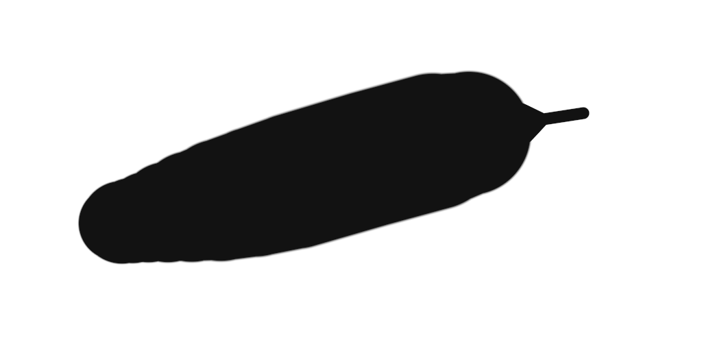

# G-Pen rapid-lift investigation — 2026-09-20

The reported symptom is a **thin, straight, constant-width tail that remains
after a rapid lift**, not just an uneven edge. The cause is confirmed: the app
receives nonzero, repeated pressure on pen-up and has no release-specific
pressure reconstruction to turn the last low-pressure segment into a point. It was observed with the physical
Wacom pen in the primary `art.capycanvas` app on the 9504 × 6336 photo, G-Pen
2048 px, at 17.164% zoom. The installed APK was verified byte-for-byte against
the qualified `2f69114d` build. Current source/report baseline is `ac47268e`.

This report distinguishes that release problem from two additional geometry
problems found with controlled pressure ramps. The recent `39e9cba3` sparse
contact change affects those geometry problems; it is **not sufficient evidence
to date the persistent thin-tail problem to that commit**. The same captured
pressure/position pattern can produce a flat tail with the older generator too.

## Physical input explains the thin segment

The first physical capture contains four complete strokes. Position reports
arrive approximately every 4 ms, while pressure often repeats for two reports
and changes approximately every 8 ms. During a fast lift, substantial motion
therefore occurs at the same last nonzero pressure.

For the second stroke, the last samples are:

| Kernel time (s) | Raw X | Raw Y | Pressure / 8191 | Contact |
| --- | ---: | ---: | ---: | --- |
| 337616.941554 | 9907 | 17098 | 7133 / 8191 = 0.870834 | down |
| 337616.946351 | 10094 | 18028 | 7133 / 8191 = 0.870834 | down |
| 337616.949290 | 10259 | 18975 | 925 / 8191 = 0.112929 | down |
| 337616.954491 | 10404 | 19917 | 925 / 8191 = 0.112929 | down |
| 337616.957418 | 10404 | 19917 | 0 | up |

The last two moving points are approximately **90.94 physical display pixels
apart**, with identical pressure. The other three captures have corresponding
repeat-pressure movements of approximately 70.97, 79.24 and 78.53 pixels.
These distances use the device's reported calibration; they are independent of
canvas zoom. The zero-pressure release repeats the last position in all four.

G-Pen maps pressure through a 16-sample approximation to
`0.01 + 0.99 * pressure^1.2`. At pressure 925 / 8191 the resolved diameter is
about 8.30% of nominal: approximately **170 document pixels / 29 display
pixels** for this brush and zoom. Connecting the repeated low-pressure poses
therefore draws a visible thin tube.

There is another input boundary: Android's
[TouchInputMapper](https://android.googlesource.com/platform/frameworks/native/+/0fa903349f312d84af88a944e25c595a1f293c06/services/inputflinger/reader/mapper/TouchInputMapper.cpp#2025)
constructs pointer-up from the preceding cooked pointer coordinates. Those
coordinates include pressure. Kernel pressure zero therefore must not be
assumed to mean `MotionEvent.getPressure()` is zero on `ACTION_UP`.
The application's `CanvasSurfaceView.send` currently forwards that value
unchanged for stylus moves and releases.

The shared engine records release as another stroke point. It has no
release-specific pressure reconstruction. `DabGenerator::append` skips
zero-distance input for this brush, and `finish` only emits a pending spatial
endpoint. It neither reconstructs the falling pressure between sensor updates
nor revises an already emitted finite-width terminal contact. G-Pen has no
configured end-distance taper. Uniform coverage also cannot erase a wider
contact by subsequently depositing a smaller one at the same position.

## Controlled replay and counterfactuals

The host GPU renderer was held fixed while switching only the generator between
`df3940d5` and current. A separate full `CanvasEngine` GPU probe varied prediction
on/off and input grouping (1, 4 or 64 points per frame). Five abrupt-release
patterns, six configurations each, produced **byte-identical finished images
within each input pattern**. This excludes prediction and frame grouping as the
cause in those tested host cases; it is not a universal driver qualification.

The physical trace was also replayed on white, preserving its relative geometry
and brush size. Kernel-zero release and Android-style repeated-pressure release
were compared explicitly, rather than treating the two input streams as equal.

| Second physical stroke, fixed current GPU renderer | Contacts | Terminal radius in scaled diagnostic image |
| --- | ---: | ---: |
| Old generator, repeated nonzero up pressure | 41 | 9.049 px |
| Current generator, repeated nonzero up pressure | 14 | 9.049 px |
| Current generator, kernel-zero up pressure | 14 | 1.091 px |
| Current generator, diagnostic 8 ms release envelope | 14 | 1.091 px |
| Current generator, diagnostic 16 ms release envelope | 15 | 1.091 px |

The repeated-pressure cases reproduce the persistent narrow tube. A bounded
release envelope produces a pointed ending in this fixture without restoring
dense stamping. These are **offline counterfactuals**, not a shipped live fix or
an artistic acceptance result. The 16 ms variant also exposes edge scalloping;
a longer window is not automatically better.

Captured physical motion replayed with repeated nonzero release pressure:

Same motion with the diagnostic 8 ms release envelope:

Both images use the same current GPU renderer and 14 contacts. They are scaled
geometry replays on white, not screenshots of a deployed smoothing fix.

The diagnostic envelope replaces only the modeled release pressures: take the
sample at/before 8 or 16 ms before the final moving sample, then cap subsequent
pressure by a monotone ramp to zero at that final position. Raw samples remain
available in the capture. This prototype has not been integrated with the live
finalization boundary, cancellation, replay/history or other brushes.

The subsequent five **actual app input streams** were also replayed, including
their measured nonzero up pressure. Their current contact counts are
19, 8, 9, 10 and 7; the 8 ms release-envelope versions use exactly the same
counts, with modeled terminal pressure zero in every case. The old generator
uses 22, 14, 15, 19 and 17 contacts. This extends the feasibility result beyond
the earlier kernel-trace counterfactual. It still does not qualify live
finalization or make a frame-rate claim.

## Additional geometry defects

`39e9cba3` introduced `append_swept`, replacing dense pressure-dependent distance
resampling for contact brushes. It can omit the last full-pressure pose before
a release. Its path-bend branch retains the previous input point; its pressure
branch only emits the new point. The resulting long segment starts narrowing
before the actual pressure transition.

In a 128 px brush fixture with a brief release, the retained full-pressure
contact is at x=857.6; full-pressure inputs at x=879.2 and x=900.8 are skipped;
the next contact at x=922.4 has radius 28.234. Narrowing consequently begins
43.2 px before the last full-pressure input. Old/current upper-edge disagreement
reaches 23.934 px. Preserving the preceding pressure breakpoint in a diagnostic
copy confirms the lost vertex, but is not a complete shape fix.

The unchanged `contact.wgsl` also chooses the contact parameter using a
perpendicular center-line projection that does not account for changing nib
radius. For the same straight linear-radius sweep, radius 64 → 1 over 160 px,
one span versus 64 subdivisions differs by **3.792 px at the upper edge**.
This is a subdivision-dependence defect in the shared evaluator. Dense contacts
previously hid much of it; the longer spans expose necks and scallops.

The current `brush.rs` is identical to `39e9cba3`; the contact shader is identical
before and after that change. The latest material executor refactor `2f69114d`
changed neither. Holding the renderer fixed isolates these two geometry issues
from that refactor.

| Pressure fixture | Old contacts | Current contacts | Maximum upper-edge disagreement |
| --- | ---: | ---: | ---: |
| Gradual release, 128 px | 122 | 112 | 0.966 px |
| Fast release, 128 px | 84 | 21 | 1.425 px |
| Brief release, 128 px | 46 | 15 | 23.934 px |
| Gradual release, 18 px | 637 | 41 | 0.028 px |
| Sparse input, 128 px | 123 | 9 | 0.950 px |
| Same linear sweep, 64 subdivisions / one span | 65 | 2 | 3.792 px |

These are differences from the old output, not errors against a physical ground
truth. Edges use the interpolated gray-128 crossing on white, x=500..943 in the
1024 × 256 fixtures. The linear row uses manual geometry, not the generators.
The 18 px case has no pixels differing by more than eight RGB code values; do
not generalize the large-brush defect magnitude to every brush size.

## Recommended simplification

Implement release handling once in the shared modeled-input/provisional-tail
path, so live feedback, finalization and replay use the same geometry policy.
Treat contact release as an explicit boundary even when its supplied pressure
repeats a prior sample. Preserve raw device pressure rather than globally
overwriting every platform's up events.

For rapid falling pressure, reconstruct a monotone release over the existing
short replaceable suffix. Start by evaluating the existing 8 ms lag; the traces
establish why a pressure-update interval matters. Avoid a generic causal
low-pass filter: it keeps pressure higher during release and cannot infer a
missing endpoint. If a user control is useful, expose one brush-level **lift
smoothing** amount, with a disabled setting for literal sensor behavior. Reuse
the existing tail and taper machinery instead of adding a second brush engine
or platform-specific G-Pen implementation.

The algorithm must not change points already finalized. Extending its window
beyond the existing lag requires an explicit retention policy; the offline
16 ms experiment is not evidence that this can be done without a larger live
correction region. Existing end-distance taper replays the complete stroke at
pen-up; reusing that whole-stroke replay would conflict with the latency goal.

Keep sparse contacts, preserve pressure breakpoints, and correct the shared
varying-width sweep independently. Test subdivision invariance, repeated
release coordinates, nonzero up pressure, sparse falling-pressure input,
stationary dots, deliberate light lines, pen cancellation, and replay/history.
Qualify the 12 contact presets before shipping a shared shader change.

The bounded pressure work is proportional to the retained samples, not canvas
pixels. At the observed approximately 250 position samples/s, 8 ms contains
about two sample intervals. The physical fixture uses 14 contacts before and
after the 8 ms counterfactual, versus 41 with old dense sampling. This supports
a low-overhead direction; it is **not a measured FPS claim**. Performance and
artistic acceptance still require a live implementation on the Wacom.

## Evidence and limits

Machine-readable results are in
[the measurement record](measurements/gpen-taper-regression-20260920.json).
Local raw artifacts are under `artifacts/wacom-gpen-taper-20260920/`: original
physical input, screenshots, Android replay injector, host GPU probes,
per-contact CSVs, source snapshots, and diagnostic APKs. Its README contains
reproduction instructions. No runtime fix is included in this investigation.

A temporary APK logged actual app-boundary pen samples, with a native library
byte-identical to the qualified installed build. After a separately labeled
synthetic control, the user made **five further physical strokes**. All five
`ACTION_UP` records repeat the last move's exact position and nonzero pressure:
0.418020, 0.437798, 0.591991, 0.574411 and 0.426077. Every last moving interval
also repeats pressure, covering 36.75, 62.23, 78.41, 83.10 and 68.27 physical
pixels respectively. `app-physical-final.log`, `app-physical-strokes.json` and
`app-physical-summary.json` preserve these measurements. This directly confirms
the Android input boundary; the earlier kernel capture alone could not.

The diagnostic APK is not a performance measurement build. The normal
`integrated.apk` was restored after capture. All temporary production-source
logging edits were reverted; no runtime fix was shipped.

Initial constant-pressure performance replays could not cover this case. The
existing lift test supplies zero pressure at a new position; it does not model
Android's repeated final position/pressure. The new observations require that
case in future qualification. The 1% minimum brush size is another endpoint
limit (20.48 document px for a 2048 px brush), but it is much smaller than the
observed 11.3%-pressure tail and does not alone explain it.
