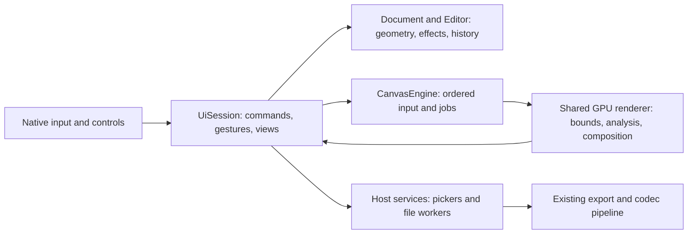

# Photo editing M5–M6: retained transforms, tone and color

[Developer guide](README.md) · [Remaining roadmap](photo-editing-roadmap.md) · [Research](../history/photo-editing-research.md)

Status: **proposed for review**. Code baseline: `da5b399ada27f7d97927456e5975fb9298308d32` from `origin/main`. This is an implementation specification, not evidence that the features work. The audit inspected code, schemas, shaders, host adapters and existing tests; it did not run builds, device journeys or benchmarks.

The first complete delivery covers **GTK, Web and Android**. Apple (macOS/iPadOS) and Windows receive explicit follow-up work and must continue to compile against shared changes.

## Read and execute

| Document | Purpose |
| --- | --- |
| This document | Scope, design decisions, shared constraints and completion criteria. |
| [Retained geometry](photo-editing-m5-m6-geometry.md) | M5 behavior, model, rendering, history and editing contracts. |
| [Liquify scope boundary](photo-editing-m5-m6-liquify.md) | Preserve the current baked tool; future live Liquify is an effect layer/filter outside this delivery. |
| [Tone and color](photo-editing-m5-m6-color.md) | M6 algorithms, Properties metadata, precision editing, resources and gradients. |
| [Editing and delivery workflows](photo-editing-m5-m6-workflows.md) | Sampling, Histogram, Info, comparison, effect presets and export. |
| [Execution packets](photo-editing-m5-m6-execution.md) | Ordered, bounded tasks, ownership, required tests, host journeys and qualification. |

The linked designs are normative proposals. Existing paths and symbols identify integration points; names explicitly marked **new** are proposed contracts. An implementer may rename a new private helper but may not change behavior, persisted meaning, limits or public transport without updating this specification and obtaining review.

## What the code audit changes about the plan

The audit followed document state and persistence, input/undo, rendering and readback, filter definitions, host adapters, delivery workers, tests and performance harnesses. Existing history and roadmap text were checked against code rather than treated as evidence of completion.

| Verified baseline | Design consequence |
| --- | --- |
| Projective maps, cubic mesh transforms, interpolation and the transform bar already exist; durable placement is affine. | Extend durable geometry and the existing sampler/session; do not rebuild a transform tool. |
| Layer multi-selection and root/subtree normalization already exist. | Reuse selection and add one atomic target plan, rather than a second selection model. |
| Content-bound requests/caching exist, but CPU scans assume source rectangles and do not measure actual mask products. | Replace the production scan with GPU reductions in the same lifecycle; include Trim/Reveal consumers. |
| Current Liquify resamples color and rejects Reconstruct; stroke-start backing is temporary. | Preserve the current baked tool. Defer the XF-5 remainder and implement future live Liquify as an effect layer/filter in a separate effort. |
| Merge/Frequency Separation already schedule bounded bakes, but flatten appearance. | Reuse scheduling for explicit transform baking while preserving raw paint/material and masks. |
| Properties has shared controls and gestures, but hosts special-case Curves navigation and ordinary scrubs often issue separate Set actions. | Add shared pages/metadata and route touched controls through the existing gesture lifecycle. |
| Every Color property already has Use Current Color; runtime effects already support curve/gradient tables. | Keep completed controls; add only missing calibration/resource behavior. |
| Histogram currently uses full-image CPU inspection; exact stack insertion-point composition and bounded GPU local-tone guides already exist, including Web. | Replace inspection with a shared query/reduction path and reuse the existing guide/scope machinery. |
| Filter previews, bounded profile/export libraries and worker row resampling already exist. | Extend them for single-effect presets and output sharpening; add no second browser, store framework or resampler. |
| Web/Android capture preview and final export separately; GTK already freezes a source. | Standardize one frozen export owner and prepared artifact across all three hosts. |
| Windows notices/checkable menus and Apple's six-preset Liquify count are already implemented. | Do not assign stale roadmap items as new work; follow-up packets address the actual missing M5–M6 surfaces. |

The feature documents identify the corresponding files and replacement obligations. The execution document defines independent numerical tests, native journeys and hardware gates; none was run as part of this documentation audit.

## What this delivery includes

| Research IDs | Complete outcome |
| --- | --- |
| P-8 | Asynchronous pixel-tight bounds for transforms and image commands, including retained source alpha, raster overrides and mask coverage. |
| P-10, XF-6 | Retained projective and mesh geometry on photo and paint layers; continued painting through affine placement; explicit, undoable Apply Transform to Pixels. |
| XF-4 remainder | Existing layer multi-selection drives group and multi-layer transforms; pivot/reference point, snapping, nudge and Transform Again. |
| XF-3 remainder | Shape-preserving Warp split lines, retained Warp re-editing and existing grid/tangent controls. |
| P-6, P-7 | Shared Properties pages and parameter UI metadata; reusable gesture, picker and numeric control contracts. |
| ADJ-1, ADJ-4, BAR-5 | Black/gray/white and White Balance pickers, targeted Curves, per-channel Levels and explicit Auto Levels. |
| ADJ-2 | Hue/Saturation by hue range and Colorize using stable Oklab hue sectors. |
| ADJ-3 | A live GPU Histogram panel, histograms inside Levels/Curves, and clipping preview. |
| ADJ-5 | Invert, luminance Threshold, Desaturate, Photo Filter, Selective Color, Channel Mixer and imported 3D Color Lookup. |
| ADJ-6 | Shadows/Highlights, Clarity and Dehaze as reversible effects. |
| ADJ-10 | Local presets and copying for one effect's settings, with cross-document paste and explicit color-space semantics. |
| VIEW-2, BAR-5 | View-only Effects, Proof and SDR comparison, including a draggable split and momentary comparison. |
| VIEW-3, BAR-6 | Info panel and document color samplers with before/current values. |
| IO-3 | Additional export size modes, shared recipe editing, output sharpening, file-size calculation and quick re-export. |
| T-3 | Shared soft bounds/slider mapping and an increased finite Gaussian range. Large-radius pyramid/lens blurs remain M7. |
| T-7 | Numeric Curves points, shared keyboard nudging and Log HDR EV readouts. |
| T-14 | Multi-stop and reflected gradients, stable dithering and per-gradient Oklab/Linear light/Classic interpolation. |

**Scope decision:** the XF-5 remainder is deferred. Existing baked Liquify remains supported; this effort adds no retained Liquify, Reconstruct/Reconstruct All, displacement planes or Liquify-specific format/pipeline work. Long-term live Liquify will be an effect layer/filter alongside the baked tool, not an attached layer-placement deformation. M5–M6 completion below means this revised delivery scope; it does not close the deferred epic item.

M7 matting, Blend If, mask density/live feather, advanced blurs and noise reduction are outside this delivery. M8 content-aware tools, batch processing, automatic subject selection, stack/merge algorithms and History panel are outside it. Perspective crop, Pattern fill, Puppet Warp, lossy WebP and SDR AVIF are not silently added. Existing defects are included only when they prevent the specified journeys or would be exposed by a replaced path.

## Design decisions

These decisions bound the implementation packets. Use these defaults to begin; material-rendering and photographic-quality checks remain implementation checkpoints for the dependent work.

| Decision | Proposed behavior and reason |
| --- | --- |
| **D1. Retained transform model** | A paint/photo layer has an outer affine/projective transform and an optional retained Warp mesh. Do not add a displacement variant, input basis, field grid or future Liquify placeholders. This supports re-editing without a general transform stack, nested documents or a second layer tree. |
| **D2. Explicit destructive boundary** | Normal painting remains supported through invertible affine placement. Color writes on a nonlinear/projective result, including the existing baked Liquify brush, require **Apply Transform to Pixels** first. No paint contact silently bakes retained geometry or discards editability. |
| **D3. Multi-layer limits** | Free, Uniform and Distort work on selected roots and supported group descendants. Warp edits one paint/photo target. Groups containing generator effects or saved Selection Layers are refused; ordinary adjustment effects remain in document coordinates. Refuse the entire unsupported selection, never silently transform only some members. |
| **D4. Liquify scope is settled** | Keep the existing baked brush and its history behavior. A future live version will be a separate effect layer/filter. Neither its implementation nor its feasibility prototype is a dependency of this effort. |
| **D5. Pixel operations stay bounded** | Bounds, statistics, local guides, deformation and baking use existing renderer scheduling, region work and publication machinery. Read back small results. No full-canvas copies, pixel loops or waits on input/UI owners. |
| **D6. One Properties model** | Pages replace hard-coded host Curves channel lists. Active page/point/picker state lives in shared session state; only effect values enter document history. Retain native curve/gradient widgets and shared numeric controls. |
| **D7. Statistics show their precision** | A bounded live Histogram preview may be approximate. Settled histograms scan all covered source pixels on the GPU. Auto waits for a current full-source result; it never consumes a preview or stale result. |
| **D8. Presets copy a recipe** | Preserve exact embedded programs, numbers and tagged color definitions. Interpret untagged numeric adjustments in the destination working space; the existing renderer converts tagged colors for evaluation. Do not promise identical appearance across spaces or silently rebind programs. |
| **D9. Comparison is view state** | Before/After changes neither history nor visibility. Effects comparison bypasses adjustment effects but keeps generated fills, geometry and masks. Proof/SDR comparisons use the existing view transforms. |
| **D10. Samplers belong to the document** | Sampler positions and readout choices save with the drawing and follow image geometry commands. Sampled values and active UI selection are transient; samplers never allocate retained image copies. |
| **D11. Gradients share one definition** | Tool, fill and map reuse stop validation, interpolation and dithering. Preserve the earlier decision: Oklab by default, with per-gradient Linear light and Classic choices, independent of document Blending. |
| **D12. Export extends its worker** | Use the existing bounded delivery resampler after explicit snapshot readback. Add output sharpening there. Calculate file size on demand from the actual encoded output, with cancellation and reuse; no unreliable thumbnail extrapolation. |

The linked specifications define the restrictions, formulas and transitions behind this table. Mapped wet-material parity and the photographic quality of new local adjustments require prototypes before their dependent implementation packets proceed. A failed gate requires a reviewed revision; it is not permission to add an arbitrary graph, hidden rasterization, host policy or a CPU canvas fallback.

## Architecture and ownership

- **`layer-core`:** persisted geometry, effects, gradient definitions, sampler records, validation and reversible edits. No GPU resources, widgets or host timing.
- **`layer-ui`:** commands, target selection, eligibility, state transitions, pages, picker/curve gestures, comparison, analysis requests, preset/export drafts and all UI text. Extend existing `UiAction` routes and published views.
- **`layer-engine` / `layer-render`:** typed work and ordered publication. Carry immutable source identity, generation, target and cancellation through the existing contracts.
- **`layer-render-wgpu`:** bounded native/display evaluation, GPU reductions and exact export/snapshot parity. Extend the existing transform sampler, source residency, region compositor, local-tone work and staging readback.
- **`layer-color`:** tagged color conversion and the existing bounded file-delivery pipeline. Its export row processing runs on file workers; it is not a CPU canvas renderer.
- **Hosts:** present published state; capture native timing/input; perform file/clipboard transport and worker lifecycle. They do not choose transform eligibility, picker math, histogram bins, page contents, export dimensions or undo boundaries.

### State boundaries

| State | Owner and lifetime |
| --- | --- |
| Retained geometry, interpolation, effect values/resources, gradients, sampler definitions | Document/project; reversible edits and existing history budgets. |
| Pivot, active transform targets, last repeatable transform, active property page/curve point, armed picker, comparison | Per-document session; never saved as artwork or added as history merely by selecting a control. |
| Sampler numeric results, histogram/Auto results, local guides, GPU bounds, display previews | Derived caches keyed by input identity/revision, format, geometry, scope and relevant values. Cancel/drop on stale generation. |
| Effect preset library | Local user library using existing storage service patterns; embedded copies in documents remain self-contained. |
| Copied effect recipe | Window-level application clipboard, independent of the existing pixel clipboard; survives a tab switch. |
| Export draft, frozen source snapshot, prepared output | One export owner/job; released on cancel, owner close or invalidation. |

### Minimality requirements

1. Extend existing types where their meaning survives; replace them where the meaning changes. Remove superseded production branches and fixtures in the same integrated change.
2. Use the existing transform transaction, document history, async publication, `EffectAction::Gesture`, canvas action bar, Properties controls, panel registry, filter picker and export draft. Add no second transaction manager, property-expression language, layer graph, filter node editor or generic job framework.
3. Preserve the affine/identity rendering and input fast paths. A document without these features must not scan new tables, traverse new maps, allocate analysis resources or rebuild host controls per frame.
4. Share a shader implementation across live, exact, thumbnail, preview and export paths. Independent test oracles are intentionally separate; duplicate production pixel algorithms are not.
5. New metadata is finite and validated. No arbitrary conditional UI expressions, unbounded resource arrays, implicit image bindings or stringly typed host policies.
6. Follow the pre-release format rule. Update current project/effect/preset schemas and their fixtures together; add no old-format readers or migration system. Coordinate version changes through one integration owner.
7. Keep current user settings, documents and profiles out of tests. Each native journey uses a private display/profile/application ID and reserved devices.
8. A numeric drag, curve/gradient drag, sampler move, multi-layer transform, Auto action, preset paste or completed bake has one intended undo boundary. Cancellation restores the original; navigation/page changes create none.

## Frontend fit

The canvas bar remains a compact projection of shared Tool Options. Transform, pivot, snapping, Warp splitting, picker prompts, comparison and sampler actions use that surface. Existing hide/reappear rules, non-modal input ownership, touch targets and overflow apply. Handles drag immediately under the [drag convention](../ui/drag-and-reorder.md).

Properties remains the place for adjustment controls. Pages select channels/ranges; they do not open separate dialogs. Histograms sit above Levels/Curves and in a normal dockable Histogram panel. Info is a normal dockable panel. Use the Photo workspace's existing panel groups; do not create a separate photo-editing workspace or rearrange a user's custom layout.

The repository's [GTK review rule](../ui/README.md#rules-for-ui-changes) still applies: build and validate GTK UI, then obtain user approval before porting unless that checkpoint has explicitly been waived. The first-delivery scope includes the subsequent Web and Android work; an unfinished port is not a completed feature.

## Integration and completion

Execute the [packets](photo-editing-m5-m6-execution.md) in dependency order. A packet is a bounded assignment, not automatically a commit. Commit only the complete integration units defined there, with all consumers building and the relevant tests passing. Report failures, unverified hosts and current measurements; historical passing tables do not qualify a changed build.

M5–M6 is complete for the first delivery only when:

- Every scope row above has its specified user journey on GTK, Web and Android, including light/dark, narrow layouts and applicable mouse/touch/pen input.
- Shared semantic and GPU oracle tests pass, including cancellation, stale work, undo/redo, save/reopen, source eviction and format/color variants.
- Modified code paths meet their applicable [performance targets](../PERFORMANCE_TARGETS.md) under the [measurement rules](../performance/measuring.md). Unmet or unmeasured rows remain explicit open gates; existing unrelated failures are recorded separately.
- Apple/Windows shared consumers compile, capabilities accurately describe what their hosts can present, and their bounded follow-up packets are retained.
- Replaced paths are deleted, current guides describe the final behavior, and every task has evidence rather than a completion assertion.

When implementation lands, move lasting contracts into the relevant architecture, rendering, document, filter and UI guides, update the remaining roadmap, and delete these implementation plans. Keep audit inventories and raw results in `artifacts/`.
