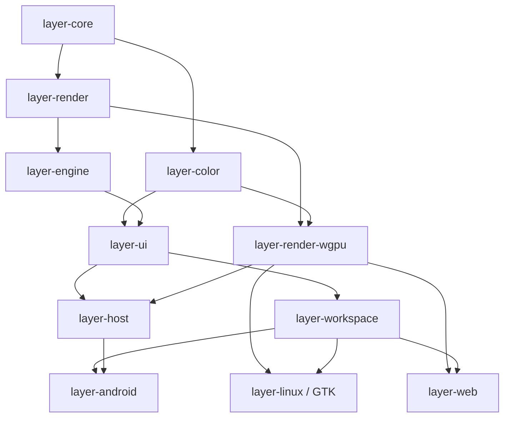

# Rust edit-to-build profiling

Measured on 2026-09-25 at `2572660b6a26ab731e5703060e323f439a8e61ed`,
on a Threadripper PRO 9995WX (96 cores / 192 threads, 502 GiB RAM), with
Rust/Cargo 1.96.0, LLVM 22.1.2, wasm-bindgen 0.2.128, cargo-ndk 4.1.2,
and Android NDK 29.0.14206865 / API 29. These are local machine measurements,
not portable estimates for a laptop or CI runner.

## What was measured

`layer-core` has no first-party dependencies. Its `color::srgb_decode`
implementation was temporarily edited from threshold `0.04045` to `0.04046`
and back. This changes compiled behavior, rather than just touching a file or
adding a comment. The harness restores the original source. Do not run the
intermediate binaries to evaluate color correctness.

Each platform/configuration gets an excluded warm-up, a no-change build, and
three timed edits. All builds run sequentially, offline and locked, against the
existing `target` cache. Warm-up includes any missing dependencies or initial
incremental cache creation. Measured edits must not compile third-party crates.
Cargo HTML timing reports retain crate start times and frontend/codegen phases.
Wall time includes Cargo and final linking. Crate times overlap because Cargo
pipelines compilation; summing them overstates the elapsed time.

All measured configurations keep `opt-level=3`, release assertions/overflow
behavior, and the existing LTO setting. Overrides apply only to our workspace
packages, leaving third-party release dependencies unchanged.

The normal GTK command and Web launcher use `release`. Android Gradle invokes
`cargo ndk ... build --release` even for a debug APK. The separate Web
distribution profile, `web-release` (ThinLTO and one code generation unit), is
not the launcher's default and is outside these measurements.

Web's `wasm-bindgen` finishing step is timed separately. Android measurements
cover the Rust `.so` build for each ABI, excluding Gradle/Kotlin, APK packaging,
installation and emulator startup. The Android launcher already chooses the
connected device ABI; directly invoking Gradle without `-PcapyAbi` builds both
arm64-v8a and x86_64.

## Measured results

Seconds, median of three edits. Every cell below excludes the warm-up.

| Configuration (all opt-level 3) | GTK | Web Rust | Android arm64 | Android x86_64 |
| --- | ---: | ---: | ---: | ---: |
| Current release, debug=1 | 45.06 | 62.51 | 63.07 | 58.92 |
| Incremental, 16 units, debug=1 | 9.22 | 6.31 | 7.74 | 7.34 |
| Incremental, default 256 units, debug=1 | 7.38 | 6.30 | 4.98 | 5.01 |
| Incremental, default 256 units, debug=0 | 6.09 | 5.08 | 4.89 | 5.44 |

Web additionally needs `wasm-bindgen`: median 2.18 s for current release,
2.12 s for incremental/16 units, 2.07 s for incremental/256 units, and
1.91 s without our crates’ debug information. Thus the recommended 16-unit
configuration takes about **8.4 s** through bindgen, versus **64.7 s** today.

Android’s two-ABI Rust build is sequential in cargo-ndk 4.1.2. Summing the
per-ABI medians projects **122.0 s → 15.1 s** with 16 units, or **10.0 s**
with 256 units. This is a projection from separate ABI runs, not a measured
Gradle/APK build. The existing device launcher already selects one ABI.

| Configuration | GTK range | Web Rust range | arm64 range | x86_64 range |
| --- | ---: | ---: | ---: | ---: |
| Current release | 44.87–45.84 | 60.09–64.93 | 60.67–64.67 | 57.90–60.58 |
| Incremental / 16 | 9.17–9.34 | 6.16–6.48 | 7.34–7.82 | 7.02–7.50 |
| Incremental / 256 | 7.38–7.50 | 6.25–7.05 | 4.97–5.02 | 4.94–5.02 |
| Incremental / 256 / debug=0 | 6.00–6.65 | 5.07–5.09 | 4.75–5.06 | 5.36–5.53 |

No-change Cargo builds were 0.10–0.16 s. The Web script still invokes
bindgen on a no-change build. Creating the optimized incremental caches took
roughly the same order of time as a full application rebuild; these are
warm-edit gains, not promises for the first build of a new profile/toolchain.

### Per-crate times

Current release compilation, including code generation and any linking inside
that invocation. Build-script runs add approximately 0.01–0.02 s per edit.
Dashes mean the crate is not in that platform’s build.

**Current release**

| Crate | GTK | Web Rust | Android arm64 | Android x86_64 |
| --- | ---: | ---: | ---: | ---: |
| layer-core | 4.45 | 3.99 | 4.03 | 3.83 |
| layer-color | 2.62 | 2.55 | 2.46 | 2.42 |
| layer-render | 0.32 | 0.27 | 0.27 | 0.26 |
| layer-engine | 1.20 | 1.10 | 1.06 | 1.03 |
| layer-render-wgpu | 10.09 | 7.00 | 9.97 | 9.90 |
| layer-ui | 12.48 | 11.43 | 12.26 | 12.17 |
| layer-workspace | 4.97 | 4.00 | 5.28 | 5.00 |
| layer-host | — | — | 22.49 | 20.12 |
| layer-linux | 26.64 | — | — | — |
| layer-web | — | 45.94 | — | — |
| layer-android | — | — | 27.65 | 25.49 |

**Optimized incremental, 16 units**

| Crate | GTK | Web Rust | Android arm64 | Android x86_64 |
| --- | ---: | ---: | ---: | ---: |
| layer-core | 1.76 | 1.58 | 1.57 | 1.64 |
| layer-color | 0.42 | 0.40 | 0.38 | 0.41 |
| layer-render | 0.09 | 0.08 | 0.09 | 0.09 |
| layer-engine | 0.26 | 0.24 | 0.23 | 0.24 |
| layer-render-wgpu | 4.95 | 0.85 | 4.93 | 4.69 |
| layer-ui | 2.43 | 2.41 | 2.32 | 2.38 |
| layer-workspace | 0.61 | 0.48 | 0.65 | 0.64 |
| layer-host | — | — | 0.77 | 0.76 |
| layer-linux | 3.18 | — | — | — |
| layer-web | — | 2.75 | — | — |
| layer-android | — | — | 1.66 | 1.58 |

The usual release critical path is `core → color → ui → workspace → GTK/Web`;
Android instead waits for `core → color → ui → host → android`. These are
scheduling paths: consumers can start from dependency metadata before all its
code generation finishes. For example, GTK’s first release sample started core
at 0.14 s, color at 3.16 s, ui at 4.96 s, workspace at 13.73 s and the app at
18.71 s, finishing at 44.84 s. The renderer runs alongside the UI branch.
With 16-unit incremental builds its native code generation becomes the longer
branch, which is why reducing only core’s own compile time misses the main issue.

## Dependency graph

Arrows point from prerequisite to consumer. Redundant direct dependencies are
omitted from this diagram; the table below lists the complete first-party edges.



| Crate | Direct first-party dependencies |
| --- | --- |
| layer-core | None |
| layer-color | core |
| layer-render | core |
| layer-engine | core, render |
| layer-render-wgpu | core, color, render |
| layer-ui | core, color, engine, render |
| layer-workspace | ui, render |
| layer-host | core, engine, render, render-wgpu, ui |
| layer-linux, layer-web | core, color, engine, render, render-wgpu, ui, workspace |
| layer-android | core, color, engine, render, render-wgpu, ui, workspace, host |

`layer-ffi` and `layer-bench` are not on these app build paths. Web omits
`layer-workspace`'s `native` feature; GTK and Android enable it. Different targets
and features have separate compiled artifacts; a warm GTK build cannot warm
the Web/Android target libraries.

## Options and projection

1. **Enable optimized incremental development builds with 16 code generation
   units.** This is the first change to make. It achieved GTK 9.22 s, Web 8.43 s
   including bindgen, and Android 7.74/7.34 s per ABI. Budget approximately
   **9–10 s GTK, 8–9 s Web, and 7–8 s Android per ABI** for similar small body
   edits on this machine once caches are warm. Keep `opt-level=3` and `debug=1`.
   This changes compiler caching and code partitioning, so it still needs runtime
   qualification; matching the unit count does not guarantee identical binaries.

2. **Isolate the renderer’s changing shader-cache identifier.**
   `layer-render-wgpu/build.rs` hashes all of `layer-core/src` into
   `CAPY_SHADER_GENERATION`. A core edit therefore also changes a compiled
   constant in the renderer. In a diagnostic experiment, excluding core from
   that hash reduced the 16-unit renderer rebuild from about 4.9 s to 1.1 s,
   and whole builds to **6.87 s GTK** and **5.56 s Android arm64**. Ranges were
   6.59–7.28 s and 5.34–5.63 s, respectively, across three edits. This temporary
   change was restored; it is **not a correct production optimization**, because
   it weakens shader-cache invalidation. A candidate implementation would retain
   complete invalidation but move the frequently changing token behind a small
   separately compiled boundary, avoiding regeneration of a large renderer code
   unit. A reasonable engineering target is **6–8 s GTK and 5–6 s Android**,
   conditional on a correct prototype reproducing these savings. Web already
   avoids this native cache path and showed no equivalent renderer cost. No
   further Web speedup is projected from this change.

3. **Use 256 code generation units if runtime qualification allows it.**
   This already measured 7.38 s GTK, 8.37 s Web including bindgen, and about
   5 s per Android ABI, with debug information retained. It is the fastest
   simple configuration with useful profiling information, but gives coarser
   assurance of matching current release performance; see the runtime results.

4. **Reduce debug information selectively.** With 256 units, removing it from
   our crates reduced GTK to 6.09 s and Web to 6.99 s including bindgen. Android
   did not show a convincing gain. Losing source-level profiling information is
   a poor default trade for performance work. `line-tables-only` is a possible
   middle ground, but was not measured. Debug information for external crates
   was retained in this experiment, so these are not all-dependencies-stripped
   results.

5. **Refactor only measured compilation bottlenecks.** `UiSession<R>` and
   `CanvasEngine<R>` instantiate substantial generic code in their consumers.
   Backend-independent operations could become ordinary shared functions to
   reduce repeated code generation. Separating stable model types from large
   implementations can narrow future invalidation, but merely moving Rust
   modules into different files does not change crate dependencies. These are
   larger engineering projects without a measured speedup here; do not add
   their hypothetical gains to the projections above.

Increasing Cargo jobs or caching more external crates is not the first target:
no external crates rebuilt in any measured sample, the host already exposes
192 logical CPUs, and substantial work lies on dependency/metadata chains.
GTK already uses LLD; Web uses Rust’s Wasm linker and Android uses the NDK
linker. Do not assume a linker replacement fixes time attributed to the final
crate: that invocation includes substantial Rust/LLVM work too.

Separate instrumented `opt-level=3`/16-unit builds measured the actual
`run_linker` phase at **0.47 s GTK, 0.83 s Web, 0.53 s Android arm64 and
0.46 s Android x86_64**. These used `-Ztime-passes` through a diagnostic rustc
wrapper and are excluded from the repeated-build tables. Instrumentation can
invalidate compiler caches, so its whole-build time is not comparable to the
main samples. The initial GTK diagnostic failed to forward Cargo’s jobserver
descriptors; it was discarded and repeated with descriptor forwarding fixed.
The linker timings above use only the corrected run. There is little room for
a linker swap to compete with the measured incremental-compilation savings.

For a permanent workflow, a separate profile could start with:

```toml
[profile.dev-perf]
inherits = "release"
opt-level = 3
incremental = true
codegen-units = 16
debug = 1

# Preserve the existing compilation mode for vendored third-party crates too.
[profile.dev-perf.package."*"]
incremental = false
```

The benchmark instead used named workspace-package overrides inside the
existing release output directory to preserve cached third-party artifacts.
A new profile needs its own initial warm-up. Wire the selected profile through
the GTK launcher, Web build script and Android Gradle Rust task; Android must
also declare the selected profile as a Gradle task input. Keep release and
`web-release` available for final performance/distribution qualification.
No launcher or production profile was changed in this investigation.

The projections cover this small function-body edit, not arbitrary changes to
public types, trait implementations, generics, Cargo features or the compiler.
Those can invalidate much more cached work. The results do not establish
sub-second optimized application rebuilds or APK deployment times.

## Runtime qualification

The existing `layer-engine --example hot_path` benchmark was built in all four
configurations, copied to separate binaries, then run in shuffled, interleaved
order on the same pinned CPU (logical CPU 7). One warm-up round was excluded;
each configuration has 11 measured runs. These are median million operations
per second, with change from current release in parentheses:

| Configuration | Queue push/pop | Stroke resampling | 32-map brush dynamics |
| --- | ---: | ---: | ---: |
| Current release | 137.67 | 5.618 | 3.004 |
| Incremental / 16 / debug=1 | 136.11 (−1.14%) | 5.657 (+0.68%) | 2.989 (−0.49%) |
| Incremental / 256 / debug=1 | 135.81 (−1.35%) | 5.655 (+0.65%) | 2.891 (−3.75%) |
| Incremental / 256 / debug=0 | 135.40 (−1.65%) | 5.578 (−0.73%) | 2.954 (−1.66%) |

Individual runs were noisy and the ranges overlap. This does not establish a
statistically significant regression or exact equivalence. It supports choosing
16 units over assuming that any `opt-level=3` binary is interchangeable. No
browser, Android-device or GPU frame-time comparison was performed; qualify
those workloads before changing the profile used for authoritative performance
comparisons. Keep the ordinary release/distribution profiles available.

## Reproduction

Run from a quiet checkout on a temporary branch. Do not edit files or run other
builds concurrently. The script performs temporary source edits and restores
them on normal exit, build failure, Ctrl-C or SIGTERM; SIGKILL cannot be handled.

```sh
python3 tools/build/profile-rust-incremental.py --repeats 3
python3 tools/build/profile-rust-incremental.py \
  --modes incremental-cgu16 --repeats 3 \
  --output artifacts/rust-incremental-cgu16
```

Use `--platforms gtk web android-arm64 android-x86_64` to select targets.
Results, generated Cargo override files, raw logs and interactive Cargo HTML
reports go into the ignored output directory. `results.json` contains each
wall time, Cargo command and timed compilation unit. Use a different output
directory for each experiment to retain previous results.

Underlying commands:

```sh
cargo build --offline --locked --release -p layer-linux --timings
cargo build --offline --locked --release -p layer-web \
  --target wasm32-unknown-unknown --timings
ANDROID_NDK_HOME="$HOME/Android/Sdk/ndk/29.0.14206865" \
  cargo ndk -t aarch64-linux-android --platform 29 \
  build --offline --locked --release -p layer-android --timings
# Replace the target with x86_64-linux-android for the emulator ABI.
```

Cargo documents [profile controls](https://doc.rust-lang.org/cargo/reference/profiles.html)
and [timing report interpretation](https://doc.rust-lang.org/cargo/reference/timings.html).
The [rustc code generation reference](https://doc.rust-lang.org/rustc/codegen-options/index.html#incremental)
explains why incremental builds can change optimization decisions even at
`opt-level=3`. Runtime performance must be qualified before making a new profile
the basis for performance comparisons.
