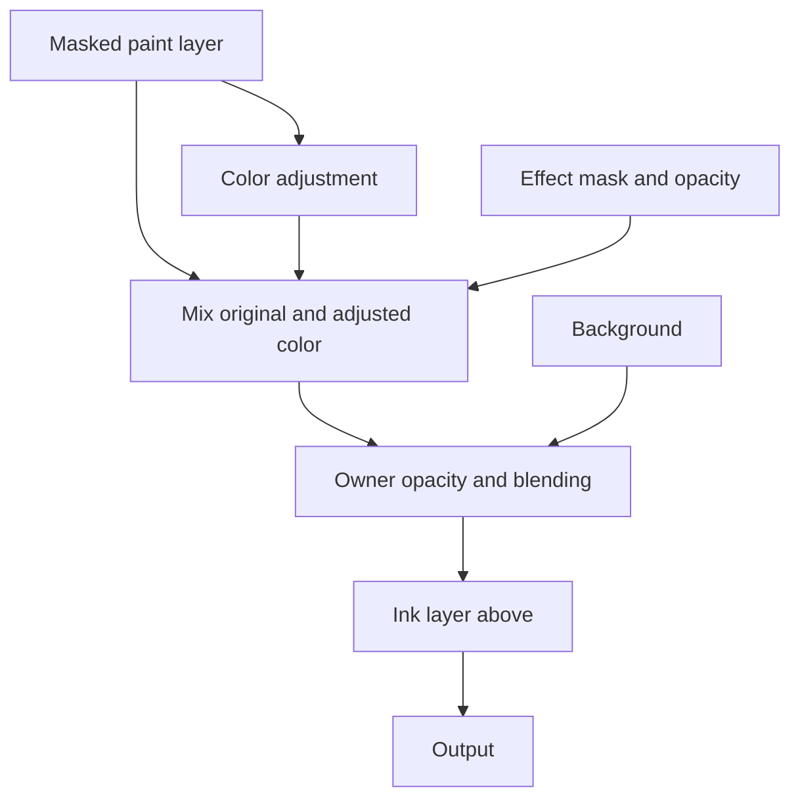
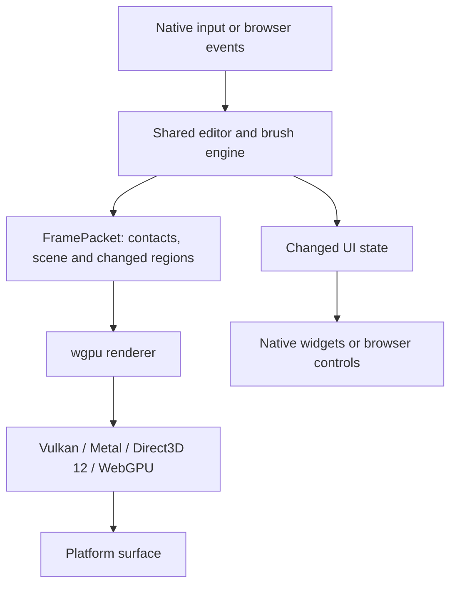

# Building the Capy Canvas engine

[Technical documentation](README.md) · [Project introduction](../README.md)

We wanted a painting engine that could keep up with large brushes, wet paint and
layered drawings on a tablet. The ambition is 120 frames per second and beyond.
It also has to run on Linux, Windows, Apple devices, Android and in a browser.
That combination shaped the design: shared Rust for the editor and a shader-based
brush and rendering stack built on `wgpu`.

This whitepaper follows those decisions through the engine. The linked subsystem
guides describe the implementation contracts. Current results, including the
remaining misses, live in the [performance tables](PERFORMANCE_TARGETS.md#where-we-stand).

## Brush engine

A small brush can stamp pixels on the CPU without much trouble. A brush thousands
of pixels wide changes the cost. Add color pickup or wet paint and each mark
depends on the image left by the previous one. Moving that image between the CPU
and GPU during the stroke would spend time transferring pixels we already have.

We split the work at that boundary. The CPU interprets pen pressure, tilt and the
path, then sends batches of brush contacts to the renderer. Shaders evaluate the
pixels. `CanvasEngine` owns the input and brush rules, and `WgpuRasterizer` owns
the GPU execution. The [render contract](../crates/layer-render/src/lib.rs)
carries the batches and changed regions between them.

For pencils, charcoal and ink, the GPU sweeps a contact footprint between poses.
The CPU retains a new pose when the path bends or pressure and orientation change
enough to need one. A straight, steady stroke needs fewer records. Bristle
brushes also use this swept path, with individual hairs contributing to the mark.

The paper stays still. Its height field is sampled in canvas coordinates;
pressure determines which parts of the tooth receive pigment, while tilt changes
the contact. Going over the same area deepens the same grain. Ink tracks the
coverage already deposited by the current stroke and adds the increment, keeping
successive contacts part of one continuous mark.

Wet brushes need another kind of state. They carry paint and read existing color,
and those dependencies impose an order on the GPU passes. The renderer retains
the layer pixels and brush state in textures as the stroke advances. Watercolor
has pigment and wetness behavior, but it isn't a general fluid simulation. Each
brush pays for the state its model needs.

Prediction draws temporary contacts ahead of the last real sample. Those marks
have replaceable preview state. Real input replaces them; predictions don't
become committed paint or saved artwork.

The [brush guide](internals/brushes.md) covers input, execution and replay. The
[contact model](internals/contact-brush-engine.md#model) and
[painterly paint state](reference/painterly-paint-state.md) describe the two
families in more detail.

## Incremental composition

Brush speed is only part of the problem. A drawing can have hundreds of layers,
many holding just a few marks. Reserving a full-canvas image for every layer
would spend most of the memory on empty space.

Paint lives in sparse 256 × 256 GPU texture pages. The renderer allocates pages
where painting needs them, with additional coverage or material state where a
brush requires it. Masks, composition results and filter intermediates have
their own storage. Sparse paint pages save memory, but they don't make a large
document free.

Every edit identifies the regions it changes. The compositor tracks which
results depend on those regions and retains the rest. A stroke updates its paint
pages and the affected composition above them. Moving an unrelated layer can
leave an expensive filter's cached input intact.

The view has a separate job. At a reduced zoom, eligible layer stacks compose at
the requested display resolution. At native resolution, the compositor can
retain a bounded viewport window and reuse its overlap during a pan. These
display results never replace the document's full-resolution backing. Export
evaluates the artwork for its requested output.

We keep the canvas in GPU resources through painting, composition and
presentation. There is still readback: committed edits capture changed tiles for
history and persistence, and exports, thumbnails and color samples need their
own requests. Mapping and compression run on workers. Ordinary view movement
doesn't copy a full canvas to the CPU.

That distinction matters on tablets too. Unified memory means the processors
share physical RAM; textures still have access rules and synchronization costs.
A redundant copy still consumes memory and bandwidth.

See [stored pixels and the viewport](internals/rendering.md#stored-pixels-and-the-viewport),
[incremental composition](internals/rendering.md#incremental-composition) and
[GPU resources](internals/rendering.md#gpu-resources-and-unified-memory).

## Live effects

An effect can process the layers below it or belong to one layer. An attached
chain receives its owner's masked content, runs from bottom to top, then hands
the result to the owner's opacity, blending and outer clipping. An unattached
effect processes the lower stack through Pass Through groups, stopping at the
nearest isolated scope.

That turns composition into a dependency graph. A masked color adjustment needs
both the original input and the adjusted result. At Normal blending, the effect
mask and opacity determine their mix:

Changing the effect mask invalidates the result and its dependents. It doesn't
require repainting the input layer. A spatial filter can also spread color and
coverage beyond the original marks, which expands the regions the renderer must
track.

Pointwise filters only need the input at the current pixel. Compatible chains
can run in one shader invocation, passing each result straight to the next
operation. Ordinary aligned effect masks can be sampled there too. We avoid an
intermediate texture write after every adjustment. Binding limits or incompatible
operations split the chain into separate passes.

A blur needs neighboring pixels. Its passes retain intermediate GPU images and
declare how far they read beyond the output region. The renderer follows those
dependencies upstream to prepare enough input. Some effects need the entire
finite input domain, and memory limits still apply. The same caching idea helps,
but a large blur has a different cost from a color adjustment.

[Filters](internals/rendering.md#filters) defines the layer behavior;
[shader fusion and intermediate images](internals/rendering.md#shader-fusion-and-intermediate-images)
explains how the renderer executes it.

## Color and original images

Color storage, blending and display are separate decisions. Layer pixels use
linear, premultiplied document RGB. SDR documents can blend in Perceptual or
Linear light, with Perceptual as the default. Floating-point HDR documents use
Linear light. A working space such as Display P3 or ProPhoto RGB defines the
primaries; it doesn't decide how two layers blend.

Brush mixing is a further choice. Mixing brushes offer Oklab, Linear light and
Classic mixing independently of the document's blending. An artist can change
how wet paint mixes without changing every layer's appearance.

An HDR drawing retains values above SDR white. Its saved SDR rendition controls
how those values appear on ordinary screens and in SDR exports, while preserving
the HDR pixels. Showing HDR on screen also depends on the host, display and
operating-system support.

Imported photos retain source image data and their color interpretation, with
paint stored over that base. That keeps the original available while painting
and using live adjustments. Rasterizing or destructively resampling the source
can replace that base, so retaining an original isn't a promise that every edit
leaves it untouched.

The `.capy` package stores authored data and lossless resources: layers, masks,
effect settings, source images, profiles and saved selections. Built-in effects
are identified by stable IDs and parameter values; custom effects carry their
authored programs. GPU layouts and cached rendering results don't belong in the
artwork. Neither do workspace preferences or undo history.

The [blend-space reference](internals/rendering.md#blend-space) explains the color
boundaries. [Editable projects](internals/documents.md#editable-projects) and the
[package contract](reference/capy-package.md) cover what survives saving.

## Native apps and shared core

We wanted the same brush to behave the same way on every platform, without
reimplementing it for each one. The editor's tools, document rules, undo history
and UI behavior live in shared Rust. A client supplies native controls, input
capture, window management and file access. In the browser, the core compiles to
WebAssembly.

`wgpu` provides the common GPU interface. Each native client keeps its own UI
toolkit:

| Client | Controls | Canvas |
| --- | --- | --- |
| Linux | GTK4 and libadwaita | Vulkan, presented in a Wayland subsurface |
| Windows | WinUI 3 | Direct3D 12 through a SwapChainPanel |
| Android | Jetpack Compose | Vulkan |
| macOS | AppKit | Metal through CAMetalLayer |
| iPadOS | UIKit | Metal through CAMetalLayer |
| Web | DOM | WebGPU |

Native input and controls must keep running while rendering is busy. Native
hosts use ordered queues and render workers, and file encoding or image decoding
runs off the input path. The web client schedules interactive rendering through
browser animation callbacks. It shares the engine, but its event-loop scheduling
is different.

Input adapters retain the pen samples supplied by the platform, including event
history, predictions and corrections where available. Sharing the brush engine
doesn't remove those platform differences. Nor does it prove identical latency.
We measure that on the device.

The shared UI session applies commands and reports which parts of the interface
changed. Those notifications let hosts update existing controls while preserving
active edits. Workspace changes have separate undo history from artwork. Native
focus, accessibility and widget lifetimes stay with the host.

The [architecture guide](architecture.md) follows an input event through the
main types. [Platform integration](platforms/README.md) covers host differences
and the [workspace guide](ui/README.md) explains shared UI behavior.

## Extending the engine

For a new effect, start with the
[Tent Blur example](../examples/filters/tent-blur/README.md). Its JSON definition
declares parameters, controls and sampling requirements. WGSL shaders prepare
the weights and apply the blur. This kind of effect can be added without writing
a Rust kernel or registering a new built-in filter ID.

The loader validates a candidate package and its GPU resources before replacing
the published catalog. GTK and Windows can load custom packages through
`CAPY_FILTERS_DIR`; Apple uses bundle resources. Web and Android use the embedded
catalog. There isn't an in-app shader editor, and adding a new brush engine is
source work in `layer-engine` and `layer-render-wgpu`.

Some filters need specialized controls and parameter preparation. Curves and
Gradient Map use Rust to prepare exact curve segments and gradient stops for
their shaders to evaluate. Their implementation reaches beyond a JSON definition
and shader pair.

The [runtime filter contract](reference/runtime-filters.md#definitions-and-ownership)
describes filter programs; [loading custom packages](reference/runtime-filters.md#use-without-rebuilding)
covers host setup. For brushes, see [changing a brush](internals/brushes.md#changing-a-brush).
The [package map](../README.md#package-layout) links to the source entry points.

## Measuring the result

Fast shader execution alone doesn't tell us what drawing feels like. Input can
wait in a queue, a native control can block, or completed canvas updates can
arrive unevenly. We measure moving frames, completion gaps and input response on
reference hardware, alongside GPU cost.

The tablet targets are 60, 90 and 120 frames per second at increasing canvas
sizes. Brush-size requirements vary by the amount of work the brush performs.
Passing one brush or one host doesn't qualify the others. Several workloads
still miss their targets.

[Performance targets](PERFORMANCE_TARGETS.md) records the current results;
[measuring performance](performance/measuring.md) defines the checks. Source
changes follow the [developer guide](development/README.md) and the
[tests for the affected system](development/testing.md).
