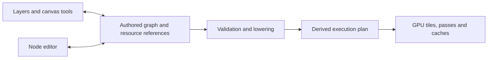

# One authored graph for layers and nodes

[Design history](README.md)

Research date: 2026-10-02. Code baseline: `b8487f2fc`.
This assessment combines shared Rust and GPU compositor inspection with primary
product documentation. The proposed semantics, implementation stages and
additional acceptance gates are recommendations, not an adopted specification,
an implementation or measured results. The
[format foundation](capy-format-foundation.md#should-the-file-already-be-a-general-node-graph)
records the questions this research addresses. The current
[authored model](../reference/authored-model.md) specifies the file/editor ownership
boundary, and the [package contract](../reference/capy-package.md) specifies the
wire format. This research does not establish runtime qualification.

**Recommendation: one authoritative authored graph, with layers and nodes as
views of it, explicit stack semantics and a deliberately limited first
implementation.** A layer panel can fully edit ordinary stack compositions and
expose meaningful controls for more general graphs. It cannot honestly represent
every graph as a reorderable list.

Keep the authored graph separate from the runtime execution plan. Painting
continues to modify retained raster resources incrementally; adopting nodes does
not imply replaying strokes, allocating an image per node, or recompiling shaders
during drawing.

**Artist workflows support this direction, with important limits.**

| Evidence from documented workflows | Implication for Capy |
| --- | --- |
| Blender's compositor combines foreground and background explicitly, handles alpha interpretation, and can animate compositing parameters. Its manual demonstrates constructing transparency and fading text over a background. [Alpha Over](https://docs.blender.org/manual/en/4.4/compositing/types/color/mix/alpha_over.html). | Images, coverage and compositing operations need defined contracts. An opacity control is also a potential animation target. |
| Blender Geometry Nodes distinguishes fields, calculations evaluated in a consumer's context, from already evaluated data. The same field can produce different results in different contexts. [Fields](https://docs.blender.org/manual/en/latest/modeling/geometry_nodes/fields.html). | Sharing a node does not always mean sharing its evaluated pixels. Coordinate domain, instance and time can change the result. |
| Blender preserves repeated geometry as instances; realizing instances increases memory and makes subsequent processing individual. Its text-to-curves workflow likewise shares repeated glyph geometry. [Instances](https://docs.blender.org/UATEST/manual/en/dev/modeling/geometry_nodes/instances.html), [String to Curves](https://docs.blender.org/UATEST/manual/en/4.5/modeling/geometry_nodes/utilities/text/string_to_curves.html). | Repeated motifs, symbols and text should retain editable source identity. Per-instance changes must be distinguished from editing the shared definition. |
| Graphite explicitly presents layers and nodes as interchangeable document views, with canvas tools modifying the graph. However, it describes raster editing as experimental and traditional keyframe animation as roadmap work. [Features](https://graphite.art/features/). | Graphite demonstrates the interaction model, but does not establish that demanding painting, masking and animation workflows are solved. |
| Substance Designer turns node chains into reusable graph instances, exposes selected parameters, and supports multiple outputs. Instances can use different resolutions, bit depths and tiling settings. [Instances](https://experienceleague.adobe.com/en/docs/substance-3d-designer/using/substance-graphs/graph-instances-sub-graphs), [Parameters](https://experienceleague.adobe.com/en/docs/substance-3d-designer/using/substance-graphs/manage-parameters/exposing-a-parameter), [Outputs](https://experienceleague.adobe.com/en/docs/substance-3d-designer/using/substance-graphs/nodes-reference-for-substance-graphs/atomic-nodes/output). | Reusable effects need stable interfaces and instance-local parameters. Output identity and evaluation context belong in the model from the start. |
| Designer's Tile Sampler uses images to control pattern placement, scale, rotation, color and masking. [Tile Sampler](https://experienceleague.adobe.com/en/docs/substance-3d-designer/using/substance-graphs/nodes-reference-for-substance-graphs/node-library/texture-generators/patterns/tile-sampler). | A painted mask controlling a procedural pattern is a practical illustration workflow. Procedural inputs cannot be limited to scalar sliders. |
| Krita combines paint, groups, masks, filters and transforms. Its alpha inheritance uses the combined coverage below within a group. After Effects supports nonadjacent and shared alpha/luma mattes, independently of transform parenting. [Krita layers](https://docs.krita.org/en/user_manual/layers_and_masks.html), [After Effects mattes](https://helpx.adobe.com/after-effects/desktop/work-with-transparency-and-compositing/work-with-track-mattes-and-traveling-mattes/track-mattes-and-traveling-mattes.html). | Clipping, masks, parenting and being below something are distinct relationships. Capy must preserve its own semantics rather than assuming these products agree. |
| Inkscape stacks editable path effects, including roughening and repeated arrangements. Krita distinguishes shared clone frames from independent duplicate frames. [Live Path Effects](https://inkscape-manuals.readthedocs.io/en/1.3/live-path-effects.html), [Animation timeline](https://docs.krita.org/en/reference_manual/dockers/animation_timeline.html?highlight=keybinds). | Vector source editing and cel identity need to survive procedural processing and reuse. Animation requires more than a clock input. |

These sources document supported workflows, not their prevalence among Capy's
users. Artist testing remains necessary.

For **near-term painting and illustration**, the essential capabilities are
existing paint fidelity, editable masks, clipping, isolated/pass-through groups,
adjustments, transformations, reusable effect groups, exposed controls, and
painted inputs to procedural patterns.

For **graphic design**, editable paths, booleans, fills, strokes, repetition,
symbols and text are substantive requirements. Preserve text strings,
shaping/layout inputs and font dependencies upstream of conversion to outlines
or pixels. An image-only graph would make this unnecessarily difficult.

For **animation**, establish stable parameter and occurrence identities now.
Cel exposures, holds, independent versus linked drawings, keyframes,
interpolation, local time mapping, scrubbing and onion skins need a later
dedicated design. Simulation, arbitrary feedback, 3D scenes and generalized
material channels are speculative extensions for this decision.

**The authored representation should give stacks a first-class meaning.**

A workable starting point is a typed, hierarchical graph containing:

- **Sources:** retained paint, imported images, masks and eventually paths/text.
- **Operations:** transforms, filters, generators, blends and coverage operations.
- **Occurrences:** a particular use of content, with its own placement, mask and
  overrides.
- **Structured stack/group nodes:** an ordered sequence of identified
  occurrences or compositing operations.
- **Reusable definitions and instances:** stable input/output ports and exposed
  parameter IDs.
- **Named outputs:** references to graph results with explicit composition and
  delivery context.

The ordered inputs of a stack should be its sole authored ordering. Do not also
save an independently authoritative layer array or parent/order tree. The layer
panel derives its rows from those inputs; the node editor edits the same
structure.

Keep three kinds of relationships distinguishable: resource references, authored
evaluation dependencies, and derived execution dependencies. A reusable
definition, its occurrences and its cached GPU results are different identities.

Paint remains authoritative retained raster data at a source node. Wetness and
other material state remain part of paint semantics. There is no requirement to
turn every historical brush contact into an editable node.

The major alternatives have these tradeoffs:

| Approach | Assessment |
| --- | --- |
| Separate authoritative layer and node models | Familiar implementations initially, but synchronization, undo and save ambiguity grow with every cross-model feature. Reject. |
| Keep layers authoritative, attach effect graphs | Lower initial cost and sufficient for many filters, but awkward for shared mattes, cross-layer processing and multiple outputs. Reasonable fallback if the unified prototype fails. |
| Structured authored graph with stack operations | Recommended. Preserves familiar editing while permitting explicit sharing and branching. Requires careful edit semantics and lowering. |
| Unrestricted graph of RGBA images | Superficially simple, but inadequate for pass-through behavior, editable vectors/text, field context and persistent paint state. Reject as the universal model. |

**Layer behavior must be defined before choosing a serialization schema.**

| Edge case | Recommended contract |
| --- | --- |
| Layer order | Order belongs to a stack's ordered inputs. Reordering changes that sequence, never node IDs. Node-editor layout has no compositing meaning. |
| Clipping | Preserve Capy's current base-and-clipped-stack behavior as a structured operation. Ordinary clipping resolves according to stack position. Explicit shared mattes use separate named connections and remain attached when rows move. |
| Isolated groups | Evaluate children over transparency, then apply the group's mask, opacity and blend against the enclosing backdrop. |
| Pass-through groups | Evaluate children with an explicit incoming backdrop `B`. Preserve `B + opacity × mask × (group(B) − B)` in the applicable blend domain. A clipped pass-through group remains isolated, matching current Capy. |
| Backdrop-dependent effects | Give the operation an explicit backdrop input or a defined stack scope. Everything below cannot mean whichever image the scheduler most recently produced. Scope includes adjustments, blending and sampling queries. |
| Masks | Distinguish scalar coverage, alpha extraction and luminance-derived coverage. Specify default coverage outside bounds, inversion, placement and application stage. Mask-before-filter and mask-after-filter are different operations. |
| Shared inputs | Share source identity; reuse evaluated results only when contexts match. Hiding a source's direct contribution must not stop its evaluation as another layer's matte. |
| Multiple outputs | Select an output when showing its layer projection. Different crops, working contexts or delivery transforms can require different evaluations. Evaluate only requested outputs and their dependencies. |
| Grouping | Node encapsulation preserves all boundary connections. A compositing group introduces isolation/pass-through semantics and may change appearance. These need distinct commands or clearly distinct behavior. |
| Reordering/deleting | Layer commands operate on occurrences and stack slots. Removing one occurrence must not delete a shared source still used elsewhere. Direct deletion of a connected producer requires an explicit reconnect/removal transaction, not silent consumer deletion. |
| Instance overrides | Bind overrides to stable exposed parameter IDs. Renaming or rearranging controls must not retarget them. Editing the definition affects all instances; changing an occurrence affects only that occurrence. Deep internal overrides can wait. |
| Mixed color spaces | Preserve source profiles and convert at defined boundaries. Specify working primaries, transfer function, blend domain, precision and alpha association. Coverage and other data channels must not receive color transforms. |
| Coordinates | Separate source-local pixels, composition coordinates and display coordinates. Declare units, bounds, pixel centers, sampling footprint and edge behavior. Pattern coordinates must not shift when the viewport changes. |
| Time and cycles | Instantaneous evaluation and definition expansion must be acyclic. Time sampling is explicit. Feedback requires a separate delayed-state/solver contract with initialization, seeking, invalidation and storage limits. |

Capy already implements the crucial pass-through formula and clipped-group
exception in its
[shared stack traversal](../../crates/layer-render-wgpu/src/scene/stack.rs).
These are compatibility requirements for behavior, not optional refinements.

Blender's simulation zones illustrate why a clock is insufficient: results
depend on previous frames, playback caches them, and baking permits out-of-order
rendering. That requires a different contract from an ordinary image dependency.
[Simulation zones](https://docs.blender.org/manual/en/5.0/modeling/geometry_nodes/simulation/simulation_zone.html).

For graphs that cannot be represented as a simple stack, the layer panel should
show **the selected output's compositing structure**, with an arbitrary subgraph
represented as one named result row. That row can expose its parameters, input
references and editable source targets. It should not fabricate an ordering
among its internal branches.

For example, if one painted mask drives both a patterned fill and a blur, show
those uses as references to the same mask. If those branches feed a custom mixing
network, show that network as one result at its enclosing stack position. Moving
the result moves that occurrence; editing its internal connections requires the
node view.

An arbitrary output with no stack structure may have only one result row.
Reorder is unavailable where no ordered relationship exists. Switching views
must never flatten, duplicate or discard authored content.

Painting also needs an unambiguous destination. Preserve today's shared
drawing-target rules for recognized layer structures; do not guess which
upstream source to mutate in an arbitrary multi-input graph.

**The existing compositor provides a plausible implementation route, but also
exposes the work still required.**

The inspected implementation is more advanced than a simple full-stack renderer:

| Actual code at the research baseline | Finding |
| --- | --- |
| [`Document` and `Layer`](../../crates/layer-core/src/lib.rs), [`LayerProperties`](../../crates/layer-core/src/layers.rs) | Authored state is still a front-to-back layer vector with parent references. Layers retain raster revisions, source images, masks and effect instances. |
| [`FramePacket`](../../crates/layer-render/src/lib.rs) | Frames borrow layer metadata and incremental dab batches, including damage, restoration and publication flags. |
| [`scene/scale/graph.rs`](../../crates/layer-render-wgpu/src/scene/scale/graph.rs) | The renderer already derives expressions for sources, opacity, combination and effects. It balances normal source-over runs and retains selected branches within a budget. |
| [`scale/sources.rs`](../../crates/layer-render-wgpu/src/scene/scale/sources.rs), [`scale.rs`](../../crates/layer-render-wgpu/src/scene/scale.rs) | Source levels retain page validity. Painting and retired prediction footprints invalidate affected regions; placement and sampling affect damage propagation. |
| [`effects.rs`](../../crates/layer-render-wgpu/src/effects.rs), [`windows.rs`](../../crates/layer-render-wgpu/src/scene/windows.rs) | Compatible pointwise effects fuse. Spatial effects declare support; bounded windows include halos. Oversized global dependencies can be rejected. |
| [`refinement.rs`](../../crates/layer-render-wgpu/src/scene/scale/refinement.rs), [`raster.rs`](../../crates/layer-core/src/raster.rs) | Exact refinement advances in bounded page batches. Immutable sparse raster revisions support history and asynchronous publication. |

This is a useful foundation, not a general authored-graph implementation. Source
caches remain keyed largely by layer identity; effect chains and scope discovery
depend on stack traversal; changed expression structure can invalidate broad
output regions. Arbitrary fan-out, instances and multiple outputs need additional
dependency and context handling.

The proposed lowering contract is:

1. **Validate and identify the requested result.** Resolve ports, types,
   instances, output context and cycles. Build reverse dependencies and stable
   semantic identities. Cosmetic edits such as names or node positions must not
   invalidate pixels.
2. **Derive execution work.** Expand structured operations into evaluation
   dependencies, then select tiles, scales, kernels, fusion boundaries and cache
   candidates. Preserve compositing order. Balance only operations whose algebra
   permits it; floating-point and approximation differences still need testing.
3. **Propagate both demand and damage.** Requested output regions propagate
   backward to required inputs. Changed source regions propagate forward to
   affected outputs. Pointwise operations preserve regions; blurs expand them;
   transforms map them conservatively; global statistics can invalidate an
   entire dependent output. Each input port needs its own dependency mapping.
4. **Reuse by evaluation identity.** A cache key needs semantic revision, input
   revisions, parameters, instance context, color/alpha contract, coordinate
   grid, time and quality level. A shared source evaluated at two scales or
   against two backdrops is not automatically one reusable result. Metadata keys
   should not retain old raster histories.
5. **Schedule under one accounted memory allowance.** Charge sources,
   intermediates, branches, halos, command buffers, in-flight allocations,
   captures and previews. Track consumer lifetimes before recycling textures.
   Under pressure, evict optional caches, recompute cheap branches or stream
   windows. Preserve authoritative paint and pending captures.
6. **Prioritize fresh input.** Live dabs update the existing paint resource and
   invalidate downstream consumers. Predictions remain temporary. Smudge and wet
   paint read explicitly ordered source generations; they must not become
   accidental self-referential graph cycles. Structural edits during a stroke
   need a defined transaction boundary.

The display component at the research baseline uses a **608 MiB allowance**,
with additional separately admitted storage, including optional complete display
levels. It is not a total application-memory ceiling. General graphs must not
multiply that allowance per output or viewer. One full 9504 × 6336 RGBA32Float
image alone is about **0.90 GiB**; retaining four such node outputs is about
**3.6 GiB**, before painting resources. These are storage calculations, not
performance measurements.

Shader preparation also needs an explicit publication boundary. Uniform changes
should reuse pipelines; topology or program changes should prepare a candidate
plan off the input path and publish it only when ready and still current. Native
compilation workers and asynchronous WebGPU preparation already exist in
[`startup.rs`](../../crates/layer-render-wgpu/src/startup.rs). However,
[`Deferred::compile`](../../crates/layer-render-wgpu/src/deferred.rs) can wait
natively or take over synchronously in the browser. Graph editing must not
accidentally exercise that path during motion.

Large validation, compilation, decoding and pixel copying must stay off UI/input
callbacks. Browser planning must be bounded and yield, or move to a worker when
it cannot meet that bound. Asynchronous preparation must retain revision
consistency: an old preview cannot silently become the result of a newer edit.

**These workflow stress tests should decide whether the design succeeds.**

| Journey | Required observable result |
| --- | --- |
| Paint flats, add two clipped shading layers and a clipped adjustment; move and delete the base; undo everything. | Current clipping behavior and coverage survive. References and drawing targets remain valid. |
| Put Multiply paint and an adjustment in nested pass-through groups; scrub group opacity and paint its mask. | Matches the backdrop interpolation contract in Linear and Perceptual blending. Clipped pass-through remains isolated. |
| Use one hidden text or painted matte for three differently transformed occurrences. | All consumers update; hiding its direct image does not disable the matte. Each samples the intended coordinate space. |
| Paint a mask controlling pattern density, then edit the motif and exposed spacing. | Painted source remains editable; unchanged branches stay reusable; patterns remain stable through zoom and export. |
| Place two instances of a reusable effect group with different overrides; rename/reorder its exposed controls. | Overrides remain attached by identity. Editing the definition updates both without overwriting local values. |
| Group a network with external inputs and two outputs, ungroup it, then undo. | Connections and identities survive; encapsulation alone preserves appearance. |
| Combine an sRGB image, wide-gamut source, translucent HDR paint and scalar mask. | No double conversion, gamma-encoded mask or alpha fringe; exact output respects declared color semantics. |
| Blur and warp content across tile boundaries and outside the canvas; change the blur radius during a stroke. | Correct halos and old/new damage bounds; no seams, missing pixels or stale tiles. |
| View one output while another exports and Navigator/node previews are open. | Shared work is reused where valid; optional consumers cannot stall painting or duplicate unbounded caches. |
| Animate a group parameter and two time-offset instances; later add linked cels and seek backward. | Stable targets, deterministic requested-time results and correct shared versus independent edits. |
| Attempt immediate feedback and recursive group instantiation. | Rejected before publication. Any future delayed feedback obeys an explicit state contract. |
| Repeatedly connect/disconnect branches under memory pressure, then resume painting during refinement. | No device loss, leaked reservations, stale publication or growing retained memory. |

Existing GPU fixtures already cover balanced branches, sparse damage,
pass-through fading and filter halos. Their assertions provide useful starting
oracles; this research inspected them without executing them. See
[composition tests](../../crates/layer-render-wgpu/src/scene/scale/tests.rs) and
[effect tests](../../crates/layer-render-wgpu/src/scene/scale/effect_tests.rs).

**Performance qualification must compare equivalent work and preserve the
repository's existing distinctions.**

| Requirement at the research baseline | Low | Mid | Top |
| --- | ---: | ---: | ---: |
| Reference device | TCL TAB 11 Gen 2 | Wacom MovinkPad 11 | Wacom MovinkPad Pro 14 |
| Canvas | 4248 × 2832 | 6000 × 4000 | 9504 × 6336 |
| Brush completed-update target | 60/s | 90/s | 120/s |
| Display-paced floor | 57 fps | 85.5 fps | 114 fps |
| Maximum p99 gap | 33.3 ms | 22.2 ms | 16.7 ms |
| CPU engineering budget | 4 ms | 3 ms | 2 ms |
| GPU engineering budget | 12 ms | 8 ms | 6 ms |

These come from the [performance targets](../PERFORMANCE_TARGETS.md) and
[measurement rules](../performance/measuring.md). Those guides own the current
requirements; the table records the criteria used for this assessment.
Engineering budgets do not substitute for completion and presentation
measurements.

The repository already records target misses. Its pinned localization comparison
on 2026-10-01 PDT / 2026-10-02 UTC compares baseline `271918681` with source tree
`e56742a57787e6bf8dd6da3f4fecadcc718657a6`, using release builds. That record
qualifies the tested low-tier G-Pen stroke but leaves the mid-tier G-Pen target
unmet. The exact rates, completion gaps, workload settings and artifact hashes
remain in the [low-tier evidence](../performance/low-tier.md#pinned-localization-comparison)
and [mid-tier evidence](../performance/mid-tier.md#pinned-localization-comparison).
Those records explicitly do not qualify subsequent builds. Slider UI cadence
also does not establish fresh effect-preview cadence without revision pairing.

The comparison matrix should include:

- Today's stack versus an equivalent authored graph using identical sources,
  settings and brush input.
- Top, middle and bottom painting in 2-, 8-, 16- and 32-layer compositions.
- Masks, clipping, pass-through groups, pointwise chains, finite-radius filters
  and global dependencies.
- Fit, 100% and magnified views; navigation, parameter scrubbing and reorder.
- Shared versus duplicated branches, multiple requested outputs, and
  constrained-cache runs.
- Cold graph edits, warmed painting, pen-up publication, undo and resumed input
  during refinement.

Use release/benchmark builds of the same profile, the tier Sony photo, default
workspace, contained brush footprints, thermal status zero, warm-up plus at least
three 5–10-second gestures. Use the tier's guaranteed brush sizes from the
[performance targets](../PERFORMANCE_TARGETS.md). Alternate matched
baseline/candidate runs to expose drift. Reserve devices and use the
[repository's device runner](../development/devices.md).

Record CPU work, GPU completion, fresh-input completion, presentation, settling
and input latency separately. Memory diagnostics should separately capture PSS,
allocator allocated/reserved bytes and system headroom; do not add overlapping
measurements or use diagnostic runs to qualify frame rate.

The following additional **project gates are proposed**, subject to agreement
before prototyping:

- **Correctness:** exact composition matches the current reference within each
  operation's established tolerance; unchanged native raster bytes remain
  unchanged. Display approximation stays within existing fixture limits, with
  added adversarial high-frequency cases.
- **Work preservation:** ordinary painting causes no topology rebuild, shader
  compilation or raster replay introduced by the authored model. Unrelated
  branches receive no pixel work. Instrument changed pixels, cache hits, decodes,
  dispatches and pipeline creation.
- **Regression bound:** reject a repeatable throughput loss or CPU/GPU p95
  increase above 5% on equivalent workloads, and reject a p99 response-latency
  increase above 1 ms. If noise prevents resolving those bounds, the result is
  inconclusive. Passing tier rows must remain passing.
- **Memory:** retain existing component ceilings; no monotonic growth through
  repeated edit/undo/output-switch cycles. Initially bound additional peak
  accounted renderer storage to `max(16 MiB, 5% of baseline)` for equivalent
  documents.
- **Responsiveness:** retain the repository's pen-down, preview and undo limits,
  including the 100 ms p95 filter-preview target. Pending refinement must not
  delay resumed drawing by more than the stated one-frame aim. See
  [responsiveness](../performance/responsiveness.md).
- **Qualification:** a baseline miss remains a miss even if the graph matches
  it. Record every affected result with device, commit, profile, date and artifact
  reference in the tier tables.

Calibrate kernel costs using the
[existing raster workloads](../development/gpu-raster-benchmarks.md) and
investigate costs above 1.5 times the calibrated estimate. Full-screen-filter
exceptions still require arithmetic and evidence that no valid approximation
exists. Architectural reasoning alone provides neither qualification nor a
waiver.

**Implementation should proceed through explicit decision gates.**

1. **Specify semantics first.** Define stack/group operations, ports, contexts,
   identities, overrides, deletion and layer projection. Work through the stress
   tests as concrete document examples. Keep the file schema provisional.
2. **Prototype equivalent stack lowering.** Translate existing documents into
   the candidate authored representation and lower them to existing kernels and
   incremental execution. Compare pixels, work counters and memory. Do not begin
   by replacing the renderer.
3. **Prototype the cases that justify a graph.** Shared painted matte, reusable
   parameterized group, two output contexts and a backdrop-dependent group.
   These expose whether sharing, cache identity and layer editing actually work
   together.
4. **Qualify performance and host behavior.** Run matched reference-device
   measurements, then affected journeys on GTK, Web, Android, Apple and Windows,
   in both themes for UI. Include compilation pending, cancellation, undo,
   save/reopen and memory pressure. Apply the
   [checks for the change](../development/testing.md).
5. **Replace the authored model only after those gates pass.** Keep one
   authoritative model, one undo contract and explicit persistence conversion.
   Remove superseded authority at cutover. Add richer vector/text and animation
   features in later stages; do not introduce speculative simulation machinery
   now.

The unresolved risks are chiefly context-sensitive reuse, non-stack editing
ergonomics, damage propagation through arbitrary operations, and responsiveness
during graph changes. Those require prototypes and artist journeys. This
research includes no implementation changes, builds, device journeys or new
performance measurements.
