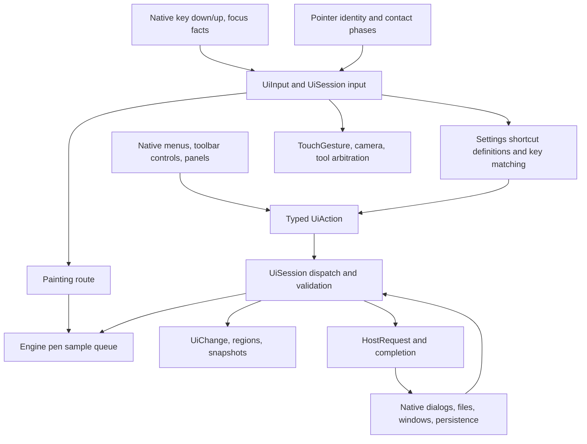

# Command search, shortcut presets, and device input audit

Research checkpoint: **2026-09-25**, repository **`741a7f60`**. This is an
implementation investigation and a starter reference for preset design; it does
not implement a command bar or change input behavior.

## Findings and recommended direction

Capy Canvas already has the right execution foundation: typed `UiAction`s,
shared `UiSession::dispatch`, command state, configurable shortcuts, and native
hosts that forward input. Build command search on that foundation. Extend it
with an explicit catalog of user-facing actions, context-aware bindings, and a
lifecycle for temporary and continuous interactions. Keyboard keys, toolbar
buttons, touch gestures, pen controls, and handheld controllers should resolve
to the same semantic operations.

The search UI is the smaller part of this work. Faithful editor presets require
distinguishing a tap, a hold, a toggle, a drag modifier, a relative adjustment,
and an absolute parameter value. They also require preserving physical Ctrl
versus Command, tool context, focus, and press/release ownership. A file of
replacement key chords alone cannot express these conventions.

Most useful early work:

1. Catalog all existing user-facing actions and their availability, including
   actions outside `CommandId`; expose searchable results through shared state.
2. Add the command bar to all six hosts, with a visible button as well as a
   configurable keyboard trigger, native text entry, and accessible results.
3. Add common missing semantic operations: relative brush adjustments,
   temporary eyedropper/eraser/navigation, and active-target layer operations.
4. Introduce contextual and held bindings; migrate existing settings without
   overwriting user choices. Add touch and controller mappings through this
   resolver.
5. Ship named, versioned, explicitly partial editor-inspired presets after
   validating their supported behavior on real hosts and devices.

Navigation: [current architecture](#1-current-application-architecture),
[proposed model](#2-proposed-shared-command-and-binding-model),
[editor shortcut tables](#3-cross-editor-common-shortcut-inventory),
[held modifiers](#4-held-modifier-keys-separate-from-ordinary-shortcuts),
[all current commands](#5-complete-current-capy-command-catalog),
[presets](#6-preset-packaging-and-compatibility-policy),
[implementation work](#7-implementation-work-packages-and-acceptance-criteria),
[sources](#source-register).

## Reading this audit

The cross-editor tables put **actions in rows and editors in columns**. They
cover high-frequency drawing, painting, selection, navigation, document,
layer, vector, pixel-art, and touch workflows. The complete current Capy
`CommandId` inventory is included separately. This is not a claim to enumerate
every command in every edition of every creative application: niche commands,
plugins, user customizations, animation suites, and OS shortcuts are unbounded.
Unverified cells remain explicit research items rather than guessed defaults.

Notation:

| Cell | Meaning |
| --- | --- |
| `Primary` | Ctrl on Windows/Linux; Command on macOS/iPadOS **where the source documents that substitution**. Literal `Ctrl` remains distinct. |
| `Alt` | Option on Apple where documented. |
| `A / B` | Alternative bindings or tools sharing a family; accompanying text explains differences. |
| `hold …` | Active only while held; tool/mode restoration is required on release. |
| `ND` | No default listed in the cited shortcut reference; does **not** mean the feature is absent. |
| `NI` | Corresponding Capy operation/input route not implemented in the inspected code, or an explicitly documented external omission. |
| `VERIFY` | Needs verification in the relevant installed release/platform; no default asserted. |
| `UI` | Available through an interface control/gesture rather than a verified key binding. |
| `CA` | Capy typed action exists but is outside the built-in shortcut catalog; a custom action may bind it, subject to parameters/context. |
| `—` | Not applicable to the stated context. |

Unless specified, desktop keys use Windows conventions. Do not mechanically
translate every Ctrl into Command: e.g. Apple document switching can use
literal Control. Letter keys assume a compatible keyboard layout. Version and
layout qualification is part of a preset, not a footnote to discard.

Primary documentation and official tutorials are linked beside the tables and
in the [source register](#source-register). Sources were read on the checkpoint
date. Current web manuals sometimes retain older examples; legacy material is
labeled. Browser text extraction loses Affinity's modifier icons; the combinations
reported here were checked against the official HTML's key classes and separate
`x-osx`/`x-win32` branches. Tutorials help identify workflows; they are not evidence
that a personal binding is a factory default.

## 1. Current application architecture

### 1.1 Execution and input flow

The chart deliberately has a separate high-rate pen path. Pressure, tilt,
coalesced history, predictions, corrections, and camera revision belong to the
stroke pipeline, not thousands of searchable command invocations.

| Component / source | What it does now | Implication |
| --- | --- | --- |
| [`CommandId`, `CommandState`, `UiAction`](../../crates/layer-ui/src/lib.rs) | `CommandId::ALL` has 125 entries, including retired compatibility IDs; labels, icons, toggle classification and platform availability are shared. `UiAction` also includes nested action families and internal measurement/completion events. | Reuse command metadata, but neither enumerate every `UiAction` as a search result nor assume `CommandId` is the complete user action catalog. |
| [`UiSession`](../../crates/layer-ui/src/session.rs): `input`, `dispatch`, `command_flags`, `invoke`, `refresh_commands` | Input arbitration, action execution, current enablement/selection, region publication, idle checks, host requests and many history boundaries. `dispatch(Invoke)` checks command enablement again. | Search should invoke this route and preserve execution-time validation. Add disabled reasons; an `enabled` boolean alone does not explain why a result cannot run. |
| [`shortcuts.rs`](../../crates/layer-ui/src/shortcuts.rs) | `KeyChord { key, command, shift, alt }`; `ShortcutAction::Action(Box<UiAction>)` and special `Pan`; commands, three tool families, every catalog brush, fixed brush sizes, custom actions. | Useful seed catalog; no general context predicates, device bindings, sequences, or hold/update/end protocol. |
| [`application_menu.rs`](../../crates/layer-ui/src/application_menu.rs): `ApplicationMenu`, `application_menu` | Eight shared menus plus a Primary aggregate return live `ContextMenu` trees. Layer/selection/workspace entries adapt existing models; Filter includes the full live effect catalog without thumbnails; `with_shortcuts` adds current binding hints. | An existing seed for searchable actions beyond `CommandId`. Reuse this policy and evolve common descriptors; avoid maintaining a separate copy of menu labels, enablement and actions. |
| [`interaction.rs`](../../crates/layer-ui/src/interaction.rs) | `UiInput::Key` contains logical key, pressed/repeat, modifiers, editing and optional divider; `Pointer` has ID, phase, kind, button and position. `Interaction` stores keys and one `pan_key`. | Key identity lacks scan code/location/device; pointer button collapses to Primary/Pan/Other. Ctrl and Command share a boolean. |
| [`settings.rs`](../../crates/layer-ui/src/settings.rs) | Version 1 settings persist `BTreeMap<String, Vec<KeyChord>>` and custom definitions; search/capture/conflict/replace/reset UI already exists. | Reuse editing machinery and persistence requests; create a migration for richer bindings. Existing preference search does not execute arbitrary commands. |
| [`tools.rs`](../../crates/layer-ui/src/tools.rs) | Tool/subtool memory; separate cycling families for ink, paint and blend. | Preserve exact-tool selection versus family cycling. `P` is a family, not exclusively Pencil. |
| [`art_layers.rs`](../../crates/layer-ui/src/art_layers.rs), [`color.rs`](../../crates/layer-ui/src/color.rs), [`effects.rs`](../../crates/layer-ui/src/effects.rs) | Numerous typed operations not represented by a `CommandId`, including duplicate/group, color swap, masks, effect parameters. | Need catalog adapters and target resolution, not duplicate implementations. |
| [`operation.rs`](../../crates/layer-ui/src/operation.rs), [`selection_tools.rs`](../../crates/layer-ui/src/selection_tools.rs), [`figures.rs`](../../crates/layer-ui/src/figures.rs), [`rulers.rs`](../../crates/layer-ui/src/rulers.rs) | Tool-specific state and hard-coded modifier interpretation; previews and commit/cancel paths. | Lift binding policy into the resolver while keeping geometry and document validation in these shared implementations. |
| [`camera.rs`](../../crates/layer-ui/src/camera.rs) and session `scroll` / `gesture` / `touch` | Direct camera operations and two-contact pan/scale/rotate; wheel can pan, Ctrl zoom, Shift horizontal-pan; gestures reject incompatible active work. | Continuous navigation already exists but is not a configurable gesture-to-action catalog. |
| [`layer-host`](../../crates/layer-host/src/lib.rs), [`layer-ffi`](../../crates/layer-ffi/src/lib.rs), platform bridges | Action/input transport, render ownership and state publication. `HostRequestKind` includes document, settings, workspace, fullscreen, windows and links. | Keep dialogs/files/device APIs native. Search must tolerate asynchronous completion and revalidate the destination document. |

### 1.2 Existing keymap behavior and limitations

- Defaults are addressed by strings such as `command.Undo`, `tools.ink`,
  `brush.<id>`, `size.<value>`, `canvas.pan`. Command shortcut IDs are currently
  derived from Rust debug variant names, while action serialization uses snake
  case. Future stable catalog IDs need explicit aliases/migrations.
- Maximum four alternatives per shortcut and 128 custom definitions. Explicit
  user bindings suppress colliding new defaults. Two explicit definitions may
  not share a chord, even if their intended tools would be mutually exclusive.
- `shortcut_match` constructs definitions and searches them on key events. A
  larger catalog and controller axis stream should use compiled indexes with
  invalidation on settings/context changes, not rebuild this list per sample.
- Only Undo/Redo built-ins allow keyboard repeat. Custom definitions have a
  repeat flag. Continuous brush-size changes need a deliberate repeat/delta
  policy rather than arbitrarily repeating every action.
- Modifier-only bindings and Escape are rejected by shortcut capture validation.
  Space is accepted as a printable character. Escape remains a reserved cancel
  path despite a default CancelTransform entry. This distinction must survive
  migration and be explained in the editor.
- Text editing, settings, popups and customization block ordinary canvas
  shortcuts. Polygon Enter/Delete handling runs before the general block check;
  audit this ordering when adding a new modal search surface.
- Pressed logical strings and one `pan_key` are tracked; key release clears pan
  and blur clears transient state/cancels work. This is not sufficient for two
  physical devices holding the same key, overlapping temporary tools, or a
  logical key name changing between press and release.
- Web explicitly reserves F5/F11/F12 and Primary+W/T/N/R/L/Q/P without Alt
  (including Shift variants). More OS/browser/layout conflicts need capability
  reporting. A key in the file is not proof that a browser will deliver it.
- Native text Cut/Copy/Paste/Select All is distinct from artwork operations.
  `PasteImage` exists; generic artwork Cut/Copy is not implied by the text menu.
  Mask copy/paste is also a separate operation.

### 1.3 Host integration audit

This is code inspection, not a claim of physical-device validation. All hosts
have key and pointer routes; none has a general user-configurable controller
binding layer in the inspected application code.

| Host | Entry points | Existing behavior / migration concerns |
| --- | --- | --- |
| GTK | [`input.rs`](../../apps/layer-linux/src/input.rs), [`workspace.rs`](../../apps/layer-linux/src/workspace.rs), `documents` modules | GDK key normalization and capture controller; native editor guards; document keys before shared keymap; pen-button filtering and native hold timer. Some native sheets return before key-release forwarding: release cleanup must not depend on the original widget retaining focus. |
| Web | [`app.js`](../../apps/layer-web/app.js), [`drawing-tabs.js`](../../apps/layer-web/drawing-tabs.js), [`preferences.js`](../../apps/layer-web/preferences.js) | `event.key`, Ctrl-or-Meta, composition/editing guards; consumes shared `handled`; blur cancellation. Pointer Events retain pen identity. Document shortcuts also use `event.code`, so logical/physical policy is already inconsistent across surfaces. |
| Android | [`MainActivity.kt`](../../apps/layer-android/app/src/main/java/art/capycanvas/MainActivity.kt), [`CanvasSurfaceView.kt`](../../apps/layer-android/app/src/main/java/art/capycanvas/CanvasSurfaceView.kt) | Activity/dialog key forwarding; Unicode normalization, repeat, editing flag; MotionEvent samples, touch hold, pause/focus blur. Header/tabs/palettes can consume first. Shared key forwarding currently returns no consumed result to Activity, which still calls `super.dispatchKeyEvent`: verify duplicate/native activation in new bindings. |
| macOS | [`MacInput.swift`](../../apps/layer-apple/macOS/Input/MacInput.swift), [`MacMetalCanvas.swift`](../../apps/layer-apple/macOS/Canvas/MacMetalCanvas.swift) | NSEvent keyDown/keyUp, modifier refresh, wheel/magnification/rotation; Cmd and Ctrl collapse. Native menu accelerators need duplicate-dispatch tests. |
| iPadOS | [`PencilInput.swift`](../../apps/layer-apple/iOS/Input/PencilInput.swift), [`MetalCanvas.swift`](../../apps/layer-apple/iOS/Canvas/MetalCanvas.swift) | UIPress keys, Pencil samples/corrections, native touch/trackpad; literal Ctrl+Tab interception for drawings. No `UIPencilInteraction` tap/squeeze binding found. `GameController` import in [`SelectionControls.swift`](../../apps/layer-apple/Shared/Editor/SelectionControls.swift) reads `GCKeyboard`, not gamepad commands. |
| Windows | [`CanvasWindow.cpp`](../../apps/layer-windows/CanvasWindow.cpp), [`native/src/actions.rs`](../../apps/layer-windows/native/src/actions.rs) | Native key normalization, scan-code-assisted translation, native-control guards, pointer samples. Records held key names by virtual key so release identity survives Shift/layout changes. Ctrl is the shared command bit. Sends input and marks non-editing keys handled without waiting for a shared result; audit propagation with new contexts. |

### 1.4 Current gestures, buttons, and contextual keys

| Surface / device | Current shortcut or interaction | Connection to command system |
| --- | --- | --- |
| Canvas keyboard | Hold Space then pointer drag | Special `canvas.pan`/`pan_key`; not a general temporary Hand action. |
| Canvas mouse | Pan-button route; wheel pan, Ctrl+wheel zoom, Shift+wheel horizontal | `PointerButton::Pan` / direct `scroll`/camera; physical mouse buttons are host mappings. |
| Canvas touch | Two fingers pan/pinch/rotate; Hand tool permits one-finger pan | Shared `TouchGesture`; no tap-undo/redo recognizer. Three contacts do not become a three-finger command. |
| Canvas touch hold | Stationary single-touch color picker | Native hold/slop sends `ColorPickerHold`; shared picker validates an unclaimed contact. |
| Canvas pen | Tip/eraser strokes and hover; side buttons ignored | Explicit [input contract](../internals/input.md); side-button transitions must not split strokes or start mouse navigation. Future mappings require an explicit contract change. |
| Brush/toolbar sliders | Direct controls and bookmarks | Typed absolute parameter actions and gesture transactions; not equivalent to relative keyboard/device adjustment. |
| Polygon selection | Enter completes; Backspace/Delete removes last point | Hard-coded `selection_key`; not an independent bindable catalog entry for point deletion. |
| Selection start | Shift add; Alt subtract; Shift+Alt intersect; command bit replace | Shared effective mode; freezes operation at gesture start. |
| Rectangle/ellipse selection in progress | Newly pressed Shift constrains ratio; newly pressed Alt draws from center | Start modifiers are separated from geometry modifiers. Press timing changes meaning. |
| Selection brush | Shift forces add when Alt absent; Alt reverses configured subtract state | Separate painted-selection semantics, not ordinary marquee intersection. |
| Transform handles | Shift axis lock / 15-degree rotation / aspect; Alt scale from center | Shared drag-pose computation. Shift forces aspect preservation; it does not invert an enabled aspect lock. |
| Figure/ruler drawing | Shift geometric constraint | Shared geometry; not brush-size adjustment. |
| Escape | Cancel gesture, leave Quick Mask, dismiss/close context UI | Several owners and priorities; introduce explicit modal precedence for search. |
| Focused divider | Arrow keys nudge | `UiAction::NudgeDivider`, separate from moving artwork. |
| Text/native numeric controls | Clipboard, cursor movement, selection, arrows, Enter/Escape | Native ownership; retain IME/dead-key and accessibility behavior. |
| Document tabs | Native adjacent-document controls; Web Alt+PageUp/PageDown, Ctrl+Alt+D selector, Ctrl+Alt+W close | Host-owned paths outside normal keymap. Web focused tabs also have arrows/Home/End, Delete, Shift+F10, Ctrl+Shift+arrows reorder, Ctrl+Z/Shift+Z order history. |
| Layer/palette/workspace rows | Selection/range modifiers, rename, context menu and focused control keys | Nested typed actions plus host focus handlers; catalog them by surface, not as global canvas bindings. |
| Reorderable UI | Target/device-dependent hold and drag | Must follow [drag convention](../ui/drag-and-reorder.md), including saved palette and Customize Title Bar exceptions; presets must not globally redefine these gestures. |

The [drag inventory](../ui/drag-inventory.md) remains the detailed gap tracker.
In particular, a pen is not a mouse for row arbitration; ordinary tile bodies
require hold for all devices, explicit handles/title bars drag immediately,
touch/pen row bodies preserve scrolling until hold, and mouse holds never open
a context menu. Those constraints also apply to retained drawers/toolbars.

## 2. Proposed shared command and binding model

All names below are proposals, not existing APIs.

### 2.1 User action catalog

Evolve the existing shared menu/command metadata into one descriptor registry
in `layer-ui`, adapting `CommandId` and selected nested actions. Each descriptor
needs:

- Stable ID, localized label, category, aliases/search terms, description and
  optional icon; search synonyms such as lasso/freehand selection and mirror/flip.
- Typed parameter schema, ranges/units/defaults, target requirements, capability
  requirements, and `available(context)` returning a reason when disabled.
- Execution kind: instant, toggle/set, momentary override, continuous gesture,
  or host request. A toggle also needs an explicit setter for deterministic
  controllers/macros; repeated “toggle eraser” is not “hold eraser.”
- Repeat and history policy; supported origins; whether it is searchable,
  bindable, available on toolbars/radials, and safe to preview.
- Current shortcut/device hints and checked state from the same resolver used
  to execute it. Keep private measurement, drag bookkeeping, restoration and
  request-completion messages out of search and user preset files.

Resolve `active layer`, `selected layers`, `active mask`, current tool and current
document at invocation, not when a preset was saved. Stable resource references
are needed for user brushes. A serialized `LayerAction { id: 42, … }` is not a
portable “duplicate current layer” binding. Descriptors can adapt existing
`DuplicateSelected` today; ID-only operations need active-target wrappers.

An initial menu-search prototype can flatten `ApplicationMenu::ALL`, keeping
menu paths, live enablement and existing typed actions. Deduplicate by semantic
identity and parameters, not label. This does not cover every tool, brush or
parameter action and does not create stable preset IDs; use it to validate the
search UX while moving menu and search projections onto shared descriptors.
Do not rebuild every live menu tree on each keystroke: index descriptor text and
refresh context-dependent state when the relevant document/UI revision changes.

### 2.2 Command bar behavior

Expose a shared model for open/query/results/selection, but use each host's
native text field, focus, keyboard, scrolling, screen reader and virtual keyboard.
Index catalog text once, rank exact/prefix/token/fuzzy matches, and cap result
work. Search must not scan documents, render thumbnails, compile filters, or
perform device I/O on each keystroke.

Include applicable disabled results with a short reason. Return concrete
parameter entry when necessary: e.g. “Brush size → 20 px,” “Select brush → …,”
“Add effect → ….” Do not invent an unrestricted text-to-`UiAction` parser.
Continuous actions should expose a persistent tool or adjustment dialog from
search; pressing Enter cannot represent an indefinitely held trigger.

On open, remember document/tool/focus context, settle or reject incompatible
active gestures through existing policies, and give text input ownership.
Up/Down selects, Enter invokes, Escape closes, Tab follows accessible focus;
IME composition must not invoke a result. Revalidate context immediately before
execution and never silently apply to another drawing if it changed while the
bar was open. Restore focus and release transient input correctly on close.

Use a proposed Capy default such as Primary+Shift+P only after host reservation
checks; retain a menu/toolbar button and allow rebinding. This is a recommendation,
not a shipped default. Search for “shortcut,” “gesture,” or “device” should also
find the relevant binding settings. Recent actions can be local and bounded;
no network/AI service is necessary for command search.

#### 2.2.1 Command bar presentation and interaction plan

Use Blender's [Menu Search][bl-search] as the main workflow reference: summon a
compact search popup, type part of an action name, use arrows/Enter or click to
execute. Its manual also describes menu-location information and a separate
developer operator search. The accessible reference is the versioned 3.5 manual;
this comparison does not assert a fresh visual inspection of Blender's latest
release. [Krita Search Actions][kr-action-search] confirms the drawing-app use
case (Ctrl+Enter); use it as a secondary reference, not the visual specification.
[VS Code][vsc-command] supports the familiar Primary+Shift+P entry convention.
[Raycast][ray-search] illustrates immediate text matching, while its
[action panel][ray-actions] demonstrates right-aligned shortcuts and progressive
disclosure. [Figma Actions][figma-actions] supplies a visible toolbar entry as
well as a keyboard trigger. The design below is Capy's proposal, not a claim
that those products share its exact appearance, ranking or timings.

**Opening and placement.** A single shortcut press opens the bar and focuses
search; no hold is needed. Propose Primary+Shift+P on native desktop and optional
F3 for Blender-style access, both rebindable. Validate OS/browser delivery before
shipping: the current Web reservation rules reject Primary+Shift+P, and function
keys can have system meanings. Choose a verified Web alternative during host
integration, retain a visible “Search commands…” menu/toolbar control on every
host, and do not advertise an unavailable shortcut. Space retains canvas pan.
Repeated key-down must not open multiple bars or close the newly opened one.

Use one transient surface at the upper center of the active editor window,
roughly 520–600 logical pixels wide on desktop, bounded by available space. Keep
its top/search field anchored as results change. Touch uses the same search/list
model with native touch-sized rows and keyboard-aware positioning; compact
windows use the available width and a shorter list. A visible dismiss control
remains available without a keyboard. Opening by keyboard/controller preserves
the last valid editor context; pointer/touch activation captures the context
before its button takes focus. Pointer hover does not silently retarget commands.

**Minimal result rows.** Show an action name and, when assigned and usable, one
effective shortcut at the right. Reuse a small monochrome action icon where it
helps recognition; a toggle's checkmark can occupy that gutter. Add a short
qualifier only to distinguish otherwise ambiguous results, such as artwork Undo
versus palette-order Undo. Full menu paths, descriptions and disabled reasons
belong to the selected-result detail line, not a second line on every row. Do
not show command IDs, capability/category badges, all alternative bindings,
thumbnails, counts or per-row configuration buttons. A footer provides compact
keyboard guidance when relevant; a needed explanation replaces that hint rather
than growing a details pane. No tabs or category filter toolbar in the first UI.

Aim for 6–8 visible desktop results with native scrolling and larger rows/fewer
visible items on touch. An empty query shows at most five recently executed,
currently available commands, with a small stable set of common commands as the
first-use fallback. Reopening starts a fresh query. Cap the result viewport;
ordinary filtering must not repeatedly resize or slide the surface around.

**Search and selection.** Match labels and curated aliases with word-prefix and
fuzzy matching; e.g. “lasso” and “freehand selection” can find the same action.
Exact label/alias matches win; context and recent use refine comparable matches.
Use a stable tie-break, and freeze ordering for an unchanged query/context so
late history updates do not move an item under the user. Search existing public
commands, tool/brush choices, effects and named adjustments. General queries
must not be overwhelmed by every brush variant; prefer the general command and
expand choices when requested, while allowing a specific brush name to match.

The first result is selected; arrows move selection, Enter or a tap/click
activates, Escape dismisses the root bar. Selecting an unavailable match explains
why; Enter does not execute a different row. Keep strongly matching unavailable
commands discoverable, but omit them from empty-query suggestions. Hide retired
and private actions entirely. Mouse hover changes selection only on actual
pointer movement, so a stationary cursor cannot steal keyboard selection.
Outside press dismisses and is consumed, including its matching release, so it
cannot start a stroke or activate the underlying control. Preserve native text
editing, IME composition, screen-reader selection announcements and focus return.

**Execution and additional input.** Validate then dispatch through the shared
catalog. Close after accepting a simple invocation and restore the appropriate
editor focus. Normal visible action results provide feedback; use an existing
status notice only when the outcome would otherwise be unclear. Errors stay
readable; asynchronous actions hand off to their normal dialog/progress owner.
Preserve the originating document and focused history domain through execution.
If an active stroke or operation cannot safely yield, decline opening without
committing or canceling it implicitly; give a concise reason.

An action needing one value or choice opens a second step inside the same
surface: e.g. “Brush size” followed by a value and unit, or “Select brush” followed
by brush names. Show its current value and validate before applying; Escape
returns to the previous search without changes. Complex configuration opens the
existing native dialog. Hover and arrow browsing do not preview document edits.
Held actions remain cataloged/bindable; search runs an explicit persistent
counterpart where provided, never an indefinitely active temporary hold.

**Visual finish and motion.** Use Capy's existing theme colors, type scale,
icons, spacing and native dialog/popover styling, including the dialog exception
in [corner policy](../ui/squircle-corners.md). Use a quiet opaque surface, subtle
border/shadow and restrained selection color with readable contrast in both
themes. Keep the artwork recognizable behind it. Avoid adding live canvas blur
or new visual effects to the command-bar rendering path.

Prototype a 100–140 ms ease-out entrance with opacity and at most 4–6 logical
pixels of translation, and an 80–100 ms exit. These are tuning targets, not
measured results or mandatory overrides of native motion conventions. Input is
accepted immediately; dispatch never waits for animation. Results do not stagger,
bounce or animate their ranking. Selection changes immediately; a short color
transition may soften feedback without delaying the indicator. Respect reduced
motion and native animation settings, and support interruption/reopening cleanly.

**Speed and acceptance.** Keep normalized search text/indexes cached in Rust;
bound matching/publication work, reuse native rows and discard stale query
responses. Matching uses local metadata, with no deliberate typing debounce,
network lookup, file/device access or effect-preview generation. Host text entry
must remain responsive even while an older result computation is pending.

Initial measurable targets on representative supported hardware: warm opener to
interactive first paint p95 at most 50 ms; query-to-presented-results p95 at most
50 ms, with next-frame feedback as the normal goal; bounded matching itself p95
under 5 ms for the agreed large catalog fixture. Measure cold open separately,
including keyboard appearance on mobile, and refine budgets from baseline host
measurements. These budgets concern command-bar response, not the duration of
exporting a document or performing an expensive command. Validate 60/120 Hz
frame pacing, fast typing/backspacing/arrows/Enter, large catalogs, both themes,
text scaling, reduced motion, IME and real touch/pen focus transitions. A quick
open-type-Enter sequence must never lose input or execute stale results.

### 2.3 Contextual binding resolution

Separate **binding** from **invocation**. A binding records a trigger, context
predicate, semantic action/arguments and activation behavior. Suggested trigger
types: key chord; key sequence; held key set; pointer-button chord; recognized
touch gesture; native Pencil gesture; device button; relative encoder delta;
absolute axis. Transport (USB/Bluetooth) is device metadata, not action identity.

Keep logical key plus physical code/location, distinct Ctrl/Meta/Alt/Shift,
AltGr/dead-key/composition state, device ID and source control ID. A platform
`Primary` alias resolves at matching time; do not destroy physical modifiers
when normalizing. Specify whether bindings follow characters or key positions.

Precedence should be deterministic:

1. OS/native text/IME and accessibility ownership.
2. Existing active gesture's owner and its release/cancel route.
3. Modal search/dialog/capture context.
4. Focused control/panel context.
5. Active tool/operation/target context.
6. Canvas/document context, then application defaults.

Within an applicable scope, prefer explicit user override and a more-specific
trigger; reject equal-priority overlapping bindings. A conflict is an
intersection of contexts and trigger lifecycles, not just identical strings.
Same `B` in a brush field and in text entry is not necessarily a conflict.
Display shadowing, reserved keys and conflicting gestures before saving.

#### 2.3.1 Tool classification and binding inheritance

The planned shortcut scopes use behavior categories, tool/submode exceptions,
and capabilities. Individual brush presets inherit their owning tool's bindings;
they do not require individual shortcut profiles. A binding to *select* a named
brush remains a supported, separate use case.

The existing [`ToolFamily`](../../crates/layer-ui/src/tools.rs) values Ink, Paint,
and Blend define P/B/J cycling. The 13 `ToolGroup` values organize media such as
Pencil, Watercolor and Oil. Preserve both purposes. Introduce explicit semantic
shortcut classification rather than deriving input behavior from a displayed
category name, icon, brush asset name or rendering-engine implementation.

| Planned behavior category | Included tools | Typical contextual operations |
| --- | --- | --- |
| Drawing and painting | Pen, pencil, marker, pastel, paint, watercolor, oil, airbrush, decoration | Size/opacity, temporary sampler or eraser, straight-line constraint |
| Erasing | Eraser tools | Size/opacity, temporary return to drawing |
| Blending | Blend and smudge | Size, strength, pickup/mixing |
| Warping | Liquify modes | Size, strength, reverse effect |
| Selection | Rectangle, ellipse, lasso, polygon, wand, color, brush, tonal | Add/subtract/intersect, geometry constraints, complete/cancel |
| Fill and gradient | Bucket, lasso fill, linear/radial gradient | Tolerance/source, direction and angle constraints |
| Shapes and rulers | Figures and drawing rulers | Proportions/angle, center placement, construction points |
| Move and transform | Move, scale, rotate and related operations | Nudge, constraints, snapping, apply/cancel |
| Color sampling | Visible-artwork and layer eyedroppers | Sampling source and destination slot |
| Navigation | Hand and temporary pan/zoom/rotate modes | Navigation constraints and view reset |

The operations above describe the intended scopes, including future actions;
they are not claims that all these operations are implemented today. Future
domains such as editable vector paths or text can add categories when those
tools exist.

Within the eligible canvas scope, inherit defaults in this order:
**canvas → behavior category → tool/submode → active operation**. This is the
specificity order within the focus/ownership rules in section 2.3. An active
gesture retains its release/cancel owner. Explicit user changes are applied to
the selected scope; the editor must explain any more-specific override rather
than silently assuming a parent edit replaces every child rule.

Use exceptions only where behavior differs: polygon selection has remove-last-
vertex; rectangle/ellipse selection has geometry constraints; selection brush
has size and painted-selection semantics. Pencil inherits Painting, with an
optional exact-tool override if a preset needs a distinct behavior. A new pencil
brush asset inherits this automatically without adding a resolver rule.

Capabilities describe the currently available operations/parameters independently
of category: adjustable size, opacity, flow, hardness, mixing, sampling, geometry
constraints, and so on. Selection brush can support size while remaining in
Selection. A painting preset whose tip lacks a hardness control does not acquire
one through category inheritance. Reuse applicability and numeric bounds from
[`tool_settings.rs`](../../crates/layer-ui/src/tool_settings.rs), selection/tool
schemas and shared validation. Define capabilities semantically; never infer
them solely from whether a toolbar control happens to be visible.

A contextual binding combines trigger, activation kind, category/tool predicate,
required capability, operation phase and semantic action/arguments. For example,
a future size-step binding can require `adjustable_size` and resolve to the active
tool's parameter, while an Alt hold can mean temporary sampling in Painting,
subtract-before-contact in Selection, or center placement during a marquee.
Track the effective tool, underlying tool for temporary restoration, editing
target (artwork/mask/selection), and gesture phase separately. Quick Mask is an
editing target, not another complete brush category. Before-contact and during-
drag modifiers must remain distinct; holding a modifier is not a toggle.

The shortcut editor will expose scopes such as “All painting tools,” “All
selection tools,” and “Polygon selection,” show inherited versus overridden
bindings, and show unsupported capabilities. Search uses the same applicability
facts to explain availability. Category/capability metadata is established in
stage A; contextual matching, inheritance resolution and held behavior ship in
stage C. Presets and hardware mappings consume that same model.

### 2.4 Held modes and continuous transactions

Use `Begin(token) → Update(token, value/delta) → End(token)` or `Cancel(token)`.
The token owns originating device/contact, document, context and transient
override. Releases route to that owner even after focus/tool/modifiers change.
Cancel all owned tokens on blur, device disconnect, suspend, pointer cancel or
document retirement. Make cancellation idempotent.

Temporary tools should be composable overlays on base tool state, not repeated
select/restore commands. Example: hold Space, then Alt, release Space, release
Alt. The resolver determines the remaining applicable override from held inputs;
it must not restore stale state from a stack in the wrong order. A new explicit
tool choice while a temporary override is held needs a defined base-tool policy.
Release removes the temporary mode, not artwork created while it was active.

For continuous parameter changes, preview updates coalesce to one undoable
transaction where appropriate. Camera navigation should retain its current
history policy. Brush/device changes during a stroke need a defined safe-boundary
policy; preserve pen sample identity and never synthesize tip up/down merely
because a barrel button changed. Touch thresholds/timing/capture stay native;
shared recognition state, validation, action resolution and history stay Rust.

### 2.5 Devices and feasibility

| Device/input class | Existing/reusable path | Additional work | Preset implication |
| --- | --- | --- | --- |
| Bluetooth/USB keyboard, keyboard-emulating keypad/remote/foot pedal | Ordinary native key events already work when delivered | Preserve repeat/up events; document inability to identify the original device after OS remapping | Fastest first release; no Bluetooth pairing UI needed for normal keyboard delivery |
| Tablet ExpressKeys and dial mapped by vendor driver to keys/wheel | Key/wheel adapters | Verify distinct increments, focus, held modifiers and cancellation | Offer suggested driver mappings without promising raw-device support |
| Raw HID keypad/dial/controller | No generic app route found | Native discovery/capabilities, stable control IDs, connect/disconnect, permission flow and adapter tests | User mapping by capabilities, not a hard-coded product name |
| Gamepad/handheld controller | No app gamepad command mapping found | Host API adapters; button edges, stick dead zones, axis curves, repeat, reconnect | Map button to action; axis to parameter/navigation session |
| Proprietary BLE remote, e.g. Tabmate-style device | No protocol integration found | Establish documented protocol/SDK and supported OSs before implementation | Do not infer interoperability from “Bluetooth”; keyboard fallback only if the device actually provides it |
| Pen barrel/eraser | Tip/eraser identity preserved; side buttons intentionally ignored | Explicit opt-in policy, extra button identity, hover/contact rules; update input contract | Separate physical eraser end, barrel hold, barrel click and ordinary mouse secondary click |
| Apple Pencil double tap / squeeze | No corresponding interaction handler found | `UIPencilInteraction` adapter, capability and OS preferred-action handling | Map discrete tap/squeeze events; preserve accessibility/user preference |
| Touchscreen gestures | Two-contact navigation and touch-hold picker | Tap/hold recognition and arbitration, undo/redo, configurable finger gestures | Gesture presets need alternatives reachable without multiple fingers |
| Trackpad / mouse extra buttons / high-resolution wheel | Some native camera routes | Distinguish wheel units, indirect gestures, button IDs, acceleration and simultaneous inputs | Never assume touch and trackpad gestures have identical native delivery |
| MIDI / stream deck-style integrations | No app integration found | Optional adapters or local extension API with typed invocations and bounded parameter rates | Lower priority; do not design catalog around synthetic keystrokes |

Hardware grounding: Wacom documents driver-configurable [ExpressKeys][hw-wacom]
and rings; Clip Studio documents [tool rotation and temporary tool assignment][hw-tabmate].
Apple supplies [Pencil interactions][hw-pencil]. Browser [WebHID][hw-webhid]
and [Web Bluetooth][hw-webble] have limited availability and different device
models; neither is a universal replacement for native HID/gamepad APIs.
Standard Bluetooth HID keyboards normally arrive through keyboard events.

## 3. Cross-editor common shortcut inventory

The following tables are researched reference data for future presets. **They
are not current Capy bindings unless the Capy column says so.** Tool selection,
held modifiers and pointer gestures are separate tables intentionally.

### 3.1 Documents, history, clipboard and discovery

Sources: [Photoshop reference][ps-keys]; Krita [File][kr-file], [Edit][kr-edit],
[navigation/search][kr-nav]; Clip Studio [menus][csp-menu]; GIMP
[File][gi-file], [Edit][gi-edit], [command search][gi-search]. Capy is from
`shortcuts.rs`, `document_tabs.rs` and host document adapters.

| Action | Capy now | Photoshop desktop | Krita desktop | Clip Studio Paint Studio Mode | GIMP 3 |
| --- | --- | --- | --- | --- | --- |
| Search/execute command | NI | Primary+F (Discover; broader search) | Ctrl+Enter | ND | UI: Help → Search and Run |
| New drawing | Primary+N; reserved Web | Primary+N | Ctrl+N | Primary+N | Ctrl+N |
| Open | Primary+O | Primary+O | Ctrl+O | Primary+O | Ctrl+O |
| Save | Primary+S | Primary+S | Ctrl+S | Primary+S | Ctrl+S |
| Save as | Primary+Shift+S | Primary+Shift+S | Ctrl+Shift+S | Primary+Shift+S; alternatives in source | Ctrl+Shift+S |
| Export as | Primary+Shift+E | Primary+Alt+Shift+W | ND | ND | Ctrl+Shift+E |
| Repeat export | NI as separate command | ND | ND | ND | Ctrl+E |
| Incremental save | NI as separate command | ND | Ctrl+Alt+S | ND | ND |
| Incremental backup | Recovery is separate, no binding | ND | F4 | ND | ND |
| Import image as content/layer | Primary+Shift+O | UI: Place | UI | UI | Ctrl+Alt+O |
| Close drawing | Primary+W; Web Ctrl+Alt+W host path | Primary+W | Ctrl+W | Primary+W | Ctrl+W |
| Close all drawings | ND | VERIFY | Ctrl+Shift+W | ND | Ctrl+Shift+W |
| Next/previous drawing | Host paths; Web Alt+PageDown/Up | Ctrl+Tab; previous platform-dependent | VERIFY | Ctrl+Tab / Ctrl+Shift+Tab; Apple exceptions | VERIFY |
| New app window | Primary+Shift+N where available | ND | UI | ND | — |
| Undo artwork | Primary+Z | Primary+Z | Ctrl+Z | Primary+Z | Ctrl+Z |
| Redo artwork | Primary+Shift+Z / Primary+Y | Primary+Shift+Z (modern mode) | Ctrl+Shift+Z | Primary+Y / Primary+Shift+Z | Ctrl+Y |
| Undo/redo workspace layout | Primary+Alt+Z / +Shift | — | — | — | — |
| Cut artwork | NI in inspected catalog | Primary+X | Ctrl+X | Primary+X / F2 | Ctrl+X |
| Copy artwork | NI in inspected catalog | Primary+C | Ctrl+C | Primary+C / F3 | Ctrl+C |
| Copy merged/visible | NI | Primary+Shift+C | Ctrl+Shift+C | ND | Ctrl+Shift+C |
| Paste image/content | Primary+V (`PasteImage`) | Primary+V | Ctrl+V | Primary+V / F4 | Ctrl+V |
| Paste in place / at view or cursor | NI as separate command | Primary+Shift+V (in place) | Ctrl+Alt+V (cursor) | Primary+Shift+V (shown position) | Ctrl+Alt+V (in place) |
| New image from clipboard | NI as separate command | New dialog uses clipboard size; VERIFY | Ctrl+Shift+N | UI | Ctrl+Shift+V |
| Preferences | Primary+, | Primary+K | UI | Primary+K | UI |
| Edit keyboard bindings | Primary+Shift+? | Primary+Alt+Shift+K | UI | Primary+Alt+Shift+K | UI |
| Edit held modifiers/gestures | NI as general editor | UI/tool-specific | Separate Canvas Input Settings | Primary+Alt+Shift+Y (edition-dependent) | UI/input controllers |

Do not map “new layer” to “new document”: Fresco uses Primary+N for a layer.
Do not map workspace or tab-order Undo onto document Undo merely because all
three can use Z in different contexts. GIMP 3's documented paste creates a new
layer; older floating-selection instructions need version qualification.

### 3.2 Navigation and visibility

Sources: [Photoshop][ps-keys], Krita [navigation][kr-nav] and [View][kr-view],
[Clip Studio menus][csp-menu] and [navigation][csp-nav], [GIMP View][gi-view].

| Action | Capy now | Photoshop | Krita | Clip Studio Paint | GIMP 3 |
| --- | --- | --- | --- | --- | --- |
| Choose Hand tool | H | H | ND; navigation binding | H | ND; navigation binding |
| Temporary pan | hold Space | hold Space | hold Space / middle drag | hold Space | Space / middle drag (preference-sensitive) |
| Zoom in/out step | Primary+= / Primary+- | Primary++ / Primary+- | + / - | Primary+Num+ / Primary+Num-; punctuation alternatives | + / - |
| Fit drawing in viewport | Primary+0 | Primary+0 | VERIFY | Primary+0 | Ctrl+Shift+J |
| Actual pixels / 100% | NI as dedicated command | Primary+1 | VERIFY | Primary+Alt+0 | 1 |
| Choose Zoom tool | NI as dedicated tool | Z | ND | / | Z |
| Rotate view interactively | Two-touch/native gesture; no held-key binding | R | hold Shift+Space | R / hold Shift+Space | Shift+middle-drag |
| Rotate view left/right step | `RotateLeft/Right`, ND | ND | 4 / 6; Ctrl+[ / Ctrl+] | - / ^ (layout-sensitive) | VERIFY |
| Reset view rotation | NI as separate shortcut command | Esc with Rotate View tool | 5 | UI reset; Ctrl+@ resets display | VERIFY |
| Mirror view horizontally | `FlipHorizontal`, ND | ND | M | ND | VERIFY |
| Mirror view vertically | `FlipVertical`, ND | ND | ND | ND | VERIFY |
| Hide panels / canvas-only | Tab | Tab | Tab | Tab | Tab |
| Fullscreen/window mode | F11 on supported desktop; unavailable Web binding | F cycles display modes | Ctrl+Shift+F | Shift+Tab hides title/menu | F11 |
| Show rulers | `ShowRulers`, ND; drawing rulers | Primary+R | ND | Primary+R | Ctrl+Shift+R |
| Snap to drawing ruler/assistant | `SnapRulers`, ND | Different guide system | Ctrl+Shift+L (assistant) | Primary+1; special ruler Primary+2 | — |
| Toggle grid | NI as equivalent global command | Primary+' | Ctrl+Shift+' | UI; snap Primary+3 | Ctrl+Shift+T |
| Soft proof | Primary+Alt+P | Primary+Y | Ctrl+Y | VERIFY | VERIFY |
| Gamut warning | Primary+Shift+Y | Primary+Shift+Y | Ctrl+Shift+Y | VERIFY | VERIFY |

“Rotate view,” “rotate selected pixels,” and “rotate brush tip” require different
IDs. The same is true of mirroring the view and destructively flipping artwork.
Krita Ctrl+Y is proofing, whereas Capy and CSP also use that chord for Redo.

### 3.3 Selecting tools

Sources: [Photoshop][ps-keys], [Krita brush][kr-brush] and [migration guide][kr-ps],
[Krita selection tools][kr-select], [CSP tools][csp-tools], [GIMP tools][gi-tools].
`ND` for a Krita brush-engine behavior is not a missing painting capability.

| Action / tool | Capy now | Photoshop | Krita | Clip Studio Paint | GIMP 3 |
| --- | --- | --- | --- | --- | --- |
| Ink pen | P family | —; P is vector Pen | Brush preset via B | P family | K |
| Pencil drawing | P family | B family | Brush preset via B | P family | N |
| Paint brush | B family | B family | B | B family | P |
| Airbrush | B family | Brush option | Brush preset | B family | A |
| Decoration/spray | B family | Brush preset | Brush preset | B family | Brush dynamics/preset |
| Erase | E tool | E tool | E toggles brush erase mode | E tool | Shift+E |
| Blend/smudge | J family | ND for Smudge | Brush engine/preset | J family | S |
| Liquify/warp | J family | Primary+Shift+X (filter) | Transform modes | J family | W (Warp Transform) |
| Freehand/lasso selection | M | L family | ND | M family | F |
| Rectangle selection | `RectangleSelect`, ND | M family | ND | M family | R |
| Ellipse selection | `EllipseSelect`, ND | M family | ND | M family | E |
| Polygon selection | `PolygonSelect`, ND | L family | ND | M family | Free Select tool F |
| Contiguous/magic-wand selection | W | W family | ND | W | U |
| Similar-color selection | `ColorSelect`, ND | UI Color Range | ND | Auto-select configuration | Shift+O |
| Paint selection | `SelectionBrush`, ND | W family / selection brush varies | Selection-mask painting | M family (selection pen) | Quick Mask painting |
| Move content | O | V | T | K (layer); O (Object) | M |
| Transform content | Primary+T | Primary+T | Ctrl+T | Primary+T | Shift+T unified; Shift+S scale |
| Color sampler | I | I | Ctrl temporary; ND permanent here | I | O |
| Fill/bucket | F | G family | ND | G family | Shift+B |
| Gradient | G | G family | ND | G family | G |
| Figures/shapes | U | U family | Tool-specific, ND | U family | Different tool/path workflow |
| Drawing ruler | Shift+U | I family measurement ruler | Assistant tool, ND | U family | Shift+M measurement |
| Crop | NI as matching dedicated command | C | VERIFY | UI | Shift+C |
| Clone | NI as matching dedicated command | S | Clone brush preset | Copy stamp subtool | C |
| Heal | NI as matching dedicated command | J family | Filter/brush workflow | UI/subtools | H |
| Dodge/burn | NI as matching dedicated command | O family | Filter brush | UI/subtools | Shift+D |
| Text | NI as matching tool in this catalog | T | VERIFY | T family | T |
| Vector path Pen | NI as matching editable-path tool | P | VERIFY | Vector brush/Object workflow | B |
| Next tool in family | Repeat P/B/J presses | Shift+tool key by preference | Not equivalent | Repeat shared tool key | Tool-group behavior, VERIFY |
| Temporary alternate tool | NI general lifecycle | hold tool key, spring-loaded preference | Specific sticky bindings | hold tool key | Tool-specific modifiers |

### 3.4 Brush, pencil, eraser and color context

Sources: [Photoshop][ps-keys], [brush cursor controls][ps-cursor], [color sampling][ps-color], [Krita brush][kr-brush], [Krita migration guide][kr-ps],
[CSP optional shortcuts][csp-optional] and [operation modifiers][csp-modifiers],
[GIMP paint modifiers][gi-paint]. Brush-size units/step curves differ: reproducing
the key without its stepping behavior will not reproduce muscle memory.

| Action while painting | Capy now | Photoshop | Krita | Clip Studio Paint | GIMP 3 |
| --- | --- | --- | --- | --- | --- |
| Smaller/larger brush | NI relative shortcut; absolute sizes bindable | [ / ] | [ / ] | [ / ] preset steps | VERIFY default stepping |
| Continuous size drag | UI slider; NI canvas modifier binding | Alt+right-drag Windows; Ctrl+Option+drag Mac | hold Shift+drag | hold Ctrl+Alt+drag | VERIFY |
| Harder/softer brush | Parameter-specific UI; ND | Shift+[ / Shift+] | Brush-engine parameter | Subtool-specific, ND | VERIFY |
| Brush opacity steps | Absolute `SetBrushOpacity`, CA | Digits; 0=100% | I / O (direction verify in preset) | Primary+[ / Primary+] | VERIFY |
| Brush flow percentage | Tool setting, CA where exposed | Shift+digits | Engine-specific | Separate density, not opacity | Engine-specific |
| Brush density down/up | Tool setting, CA where exposed | Not same as flow | Engine-specific | Primary+Shift+O / Primary+Shift+P | Engine-specific |
| Previous/next tool/preset | SelectBrush/SelectToolGroup, CA; no general relative action | , / . | / swaps last/current | , / . tool group | VERIFY |
| Temporary color sample | Touch hold / I persistent; NI keyboard hold | hold Alt | hold Ctrl | hold Alt | hold Ctrl for common paint tools |
| Temporary erase with current brush | NI general hold | hold ~ | E is toggle, not hold | C chooses transparent color, not hold | Eraser selection / tool-specific |
| Swap primary/secondary color | `ColorAction::Swap`, CA; ND | X | X | X | X |
| Reset black/white | D only for mask target | D | D | ND | D |
| Paint transparent | UI color slot; binding adapter needed | ~ held erase | E erase-mode toggle | C toggle transparent | Eraser tool |
| Straight segment from prior point | NI as generic paint shortcut | Shift+click | hold V for line | Shift+drag | Shift+click |
| Constrain straight-line angle | Figure/ruler Shift; paint NI | Shift behavior depends on stroke | Line tool constraints | Shift line behavior | Ctrl+Shift constrains line |
| Adjust brush tip rotation | Tool parameter, CA where exposed | Left/Right; Shift for larger step | Engine-specific, ND | Subtool-specific, ND | VERIFY |
| Open brush settings | Tool/settings UI; ND | F5 | VERIFY | UI | UI |
| On-canvas brush/color popup | Color picker UI; no equivalent generic radial | Right-click brush popup | Right-click popup palette | Right-click sampler default | Right-click context menu |
| Precise/crosshair cursor | UI preference; ND | Caps Lock | VERIFY | VERIFY | VERIFY |
| Sample clone source | NI clone-specific action | Alt+click in Clone | Tool-specific | Alt+click in Copy stamp | Ctrl+click in Clone |

### 3.5 Selection, mask, transform and layer context

Sources: [Photoshop][ps-keys]; Krita [selections][kr-select], [Edit][kr-edit],
[migration guide][kr-ps]; CSP [menus][csp-menu], [modifiers][csp-modifiers];
GIMP [Select][gi-select], [Layers][gi-layer], [selection modifiers][gi-selection].
Transform/mask details use [Scale][gi-scale], [Rotate][gi-rotate],
[Show Mask][gi-show-mask] and [Disable Mask][gi-disable-mask].

| Action | Capy now | Photoshop | Krita | Clip Studio Paint | GIMP 3 |
| --- | --- | --- | --- | --- | --- |
| Select all pixels | Primary+A | Primary+A | Ctrl+A | Primary+A | Ctrl+A |
| Deselect | Primary+D | Primary+D | Ctrl+Shift+A | Primary+D | Ctrl+Shift+A |
| Reselect | Primary+Shift+D | Primary+Shift+D | VERIFY | Primary+Shift+D | ND |
| Invert selection | Primary+Shift+I | Primary+Shift+I | VERIFY | Primary+Shift+I / Shift+F7 | Ctrl+I |
| Quick Mask | Q | Q | UI global selection mask | UI | Shift+Q |
| Show/hide selection outline | `SelectionOutline`, ND | Primary+H hides extras | Ctrl+H | ND | Ctrl+T |
| Add to selection | hold Shift at start | hold Shift | hold Shift | hold Shift | hold Shift before start |
| Subtract selection | hold Alt at start | hold Alt | hold Alt | hold Alt | hold Ctrl before start |
| Intersect selection | hold Shift+Alt at start | hold Shift+Alt | hold Shift+Alt | hold Shift+Alt | hold Ctrl+Shift before start |
| Replace selection temporarily | command bit at start | Default new-selection mode | hold Ctrl | Tool configuration | Default replace mode |
| Square/circular marquee | Shift after start | Shift during drag | Tool-specific; VERIFY | Tool-specific; VERIFY | Shift after start |
| Marquee from center | Alt after start | Alt during drag | Tool-specific; VERIFY | Tool-specific; VERIFY | Ctrl after start |
| Move marquee during creation | NI Space modifier; pan is separate | hold Space during drag | VERIFY | VERIFY | Alt behavior depends on selection state |
| Complete polygon | Enter / CompleteSelection | Return / double click | Shift+click / double click; tool-dependent | VERIFY | Enter / close polygon |
| Remove polygon's last point | Backspace/Delete | Backspace/Delete | VERIFY | VERIFY | Backspace |
| Cancel selection gesture | Esc / CancelSelection | Esc | Esc | Esc | Esc |
| Fill selected pixels foreground | Shift+Backspace | Alt+Backspace/Delete | Shift+Backspace | Alt+Backspace/Delete | Ctrl+, |
| Fill selected pixels background | NI dedicated background-fill shortcut | Primary+Backspace/Delete | Backspace | ND | Ctrl+. |
| Clear artwork selection | ClearLayer exists; scope differs, ND | Delete/Backspace | Delete | Delete/Backspace | Delete |
| Fill dialog | No equivalent dialog command | Shift+F5 | UI | UI | UI |
| Apply transform | Enter | Enter | Enter | Enter | Enter |
| Cancel transform | Esc | Esc | Esc | Esc | Esc |
| Constrain move axis | Shift in transform | Shift | Tool-specific | Shift | Tool-specific |
| Rotate transform in steps | Shift (15°) | Shift | Tool-specific | Shift | VERIFY: Rotate manual conflicts on Ctrl versus Shift; 15° |
| Scale from center | Alt in transform | Alt | Tool-specific | VERIFY release/tool | Ctrl toggles Around center in Scale tool |
| Nudge artwork 1 / large step | NI generic keyboard nudge; divider arrows differ | Arrows / Shift+arrows | Tool-specific | Arrows / Shift+arrows | Move-tool behavior, VERIFY |
| New layer | `AddLayer`, ND | Primary+Shift+N | Insert | Primary+Shift+N | Ctrl+Shift+N |
| Duplicate selected layer | `DuplicateSelected`, CA | Primary+J | Ctrl+J | ND in menu list | Ctrl+Shift+D |
| New layer from selected pixels | NI matching clipboard operation | Primary+J | Ctrl+Alt+J | UI | Copy/paste |
| Cut selection to new layer | NI | Primary+Shift+J | Ctrl+Shift+J | UI | Cut/paste |
| Group selected layers | `GroupSelected`, CA | Primary+G | Ctrl+G | Primary+G | UI |
| Ungroup | `Ungroup { id }`, CA | Primary+Shift+G | UI | Primary+Shift+G | UI |
| Merge down | NI user command in inspected action enums | Primary+E | Ctrl+E | Primary+E | ND |
| Merge visible | NI user command | Primary+Shift+E | Ctrl+Shift+E flattens | Primary+Shift+E | Ctrl+M |
| Clip to below | `Clip { id, value }`, CA | Primary+Alt+G | Ctrl+Shift+G creates clipping group | Primary+Alt+G | Different group/mask workflow |
| Lock alpha | `AlphaLock { id, value }`, CA | / (layer context) | UI | UI | UI |
| Layer above/below | UI, active-target wrapper needed | Alt+] / Alt+[ | VERIFY | Alt+] / Alt+[ | PageUp / PageDown |
| Raise/lower layer | `RaiseLayer/LowerLayer`, ND | Primary+] / Primary+[ | VERIFY | ND | UI |
| Rename layer | `BeginRename { id }`, CA/native editor | UI | VERIFY | UI | UI |
| Solo layer | `SoloSelected`, CA | Alt+eye click | VERIFY | UI | Shift+eye click |
| Load layer opacity as selection | Context actions; ND | Primary+thumbnail click | Ctrl+thumbnail click | UI | Alt+thumbnail click |
| Add / subtract / intersect opacity selection | Context actions; no generic chord | Primary+Shift / +Alt / +Shift+Alt with thumbnail | Ctrl+Shift / Ctrl+Alt / Ctrl+Shift+Alt with thumbnail | UI | VERIFY |
| Swap mask colors | `SwapMaskColors`, ND | X while mask targeted | X while mask targeted | X | X |
| Disable / show mask only | `EnableMask` / `ShowMask`, CA | Shift / Alt+mask-thumbnail click | UI | UI | Ctrl+Alt / Alt+mask-thumbnail click |

The semantics of “clear” need explicit review before a preset is enabled.
`ClearLayer` is not automatically a selection-limited Delete operation; polygon
Delete removes a vertex. Likewise selection extraction and whole-layer
duplication cannot share a descriptor solely because another editor uses J.
GIMP's Rotate page names Ctrl in its key-modifier section and Shift beside its
15-degree option. That conflict needs an installed-build check; the Scale page
unambiguously specifies Shift to toggle aspect and Ctrl to toggle center scaling.

### 3.6 Tablet-first editors and mobile keyboards

Sources: Procreate [current keyboard page][pc-keys] and [gestures][pc-gestures],
[Fresco keyboard page][fr-keys], [Sketchbook hotkeys][sb-keys]. Procreate's current
page explicitly distinguishes newer iPadOS behavior; this table does not reuse
the older 5.2 keyboard sheet. Sketchbook's cited iOS version has **NI keyboard
hotkeys**; its Android column below is not an iOS claim.

| Action | Capy now | Procreate iPad, current manual | Fresco iOS / Windows | Sketchbook Android |
| --- | --- | --- | --- | --- |
| Undo | Primary+Z; touch tap NI | Cmd+Z; two-finger tap | Primary+Z | Ctrl+Z / Back |
| Redo | Primary+Shift+Z; touch tap NI | Cmd+Shift+Z; three-finger tap | Primary+Shift+Z | Ctrl+Y / Ctrl+Shift+Z / Forward |
| Repeated touch undo/redo | NI | Hold two/three fingers | VERIFY | VERIFY |
| Brush | B family | B; again opens brushes | P pixel, H live, V vector | VERIFY |
| Last brush | No relative command | VERIFY | B | S |
| Eraser | E | E; again opens brushes | E | VERIFY |
| Selection tool | M | S | L lasso | VERIFY |
| Transform | Primary+T | V | Primary+T | VERIFY |
| Brush smaller/larger | Relative NI | [ / ]; Cmd finer, Shift coarser | VERIFY | VERIFY |
| Color sample | Touch hold or I | Modify button / gesture settings | I | Alt / I |
| Swap current/previous color | Color swap CA; semantics differ | X | VERIFY | VERIFY |
| Quick/radial menu | NI generic QuickMenu | Space | VERIFY | Corner shortcuts / marking UI |
| Modify button from keyboard | NI | Option on newer iPadOS; M on ≤17 | Touch Shortcut is different | — |
| Open Layers | Panel action; ND | L | UI | UI |
| Open Colors | Panel action; ND | C | Windows F6; iOS ND | UI |
| Copy all visible | NI | Cmd+A, **not Select All** | VERIFY | VERIFY |
| Duplicate layer/selection | CA for layers | Cmd+J | VERIFY | UI |
| Deselect | Primary+D | Cmd+D | Primary+D | Ctrl+D |
| Clear layer/selection | ClearLayer ND; scope review | Cmd+Backspace; three-finger scrub | Primary+Shift+Delete | UI |
| New layer | ND | UI | Primary+N | UI |
| Layer lock | CA | UI | Primary+L | UI |
| Layer visibility | CA | UI | Primary+, | UI |
| Nudge transform 1 pixel | NI generic nudge | Arrows in Transform | Windows arrows; iOS ND | VERIFY |
| Nudge 10 pixels | NI | VERIFY | Windows Shift+arrows; iOS ND | VERIFY |
| Export | Primary+Shift+E | Share UI | Alt+Shift+S; Primary+Shift+S quick export | UI |
| Canvas-only | Tab | Cmd+0 / four-finger tap | Shift+F | Tab / T |
| Mirror view horizontal/vertical | Commands ND | UI | Shift+H / Shift+V | UI |
| Pan/zoom/rotate | Two-touch gesture | Two-finger drag/pinch/twist | Touch; Windows Space/R/zoom keys | Touch |
| Fit view | Primary+0 | Quick pinch | VERIFY | Ctrl+0 |
| Clipboard menu | Native text menu only; artwork menu gap | Three-finger swipe down | VERIFY | UI |
| Shape recognition after stroke | NI equivalent | Draw and hold QuickShape | VERIFY | Predictive stroke differs |

### 3.7 Affinity, vector and pixel-art workflows

Sources: [Affinity Photo 2][af-photo], [Affinity Designer 2][af-designer],
[Illustrator][ai-keys], [Aseprite upstream keymap][ase-keys]. Affinity **2** is a
versioned inspiration target; this table makes no claim about a newer unified
Affinity product. Aseprite values below are from upstream `main` as read on the
checkpoint, and must be pinned to a release before shipping a preset.

| Action | Capy now | Affinity Photo 2 | Affinity Designer 2 | Illustrator desktop | Aseprite upstream |
| --- | --- | --- | --- | --- | --- |
| Paint/pencil | B/P families | B brush; Y pixel | B vector brush; N pencil | B brush; N pencil | B pencil |
| Eraser | E | E | E in Pixel persona | Shift+E | E |
| Move/select objects | O | V | V | V | V |
| Edit nodes/direct selection | NI equivalent | P family | A | A | — |
| Vector Pen/path | NI equivalent | P family | P | P | — |
| Eyedropper | I | I | I | I | I |
| Fill/gradient | F / G | G family | G fill | G gradient; K live paint | G bucket / Shift+G gradient |
| Rectangle | U figure; choose subtype | U family | M | M | U family |
| Ellipse | Figure subtype | U family | M family | L | Shift+U family |
| Line | Figure subtype | Pen workflow | Pen workflow | Backslash | L |
| Freehand selection | M | L | L Pixel persona | Q selects points | Q |
| Rectangle / ellipse marquee | Commands ND | M family | M Pixel persona | Object selection differs | M / Shift+M |
| Hand / Zoom tool | H / zoom-tool NI | H / Z | H / Z | H / Z | H / Z |
| Text | NI equivalent tool | T | T | T | T |
| Rotate objects | Transform UI | Transform UI | Transform UI | R | Selection handles |
| Reflect objects | Operation-dependent | Transform UI | Transform UI | O | Shift+H / Shift+V (selection) |
| Scale tool | Primary+T transform | Transform UI | Transform UI | S | Selection handles |
| Free transform | Primary+T | VERIFY modifier details | VERIFY modifier details | E | Ctrl+T selects content for transform |
| Tool-family cycling | P/B/J | Shared letter; preference | Shared letter; preference | Tool-specific | Shared letter |
| Brush smaller/larger | NI relative | [ / ] | [ / ] brush context | [ / ] relevant brushes | - / + (also =) |
| Previous/next palette color | UI | UI | UI | UI | [ / ]; also 9 / 0 |
| Swap colors | CA | Shift+X; X active selector | Shift+X; X active selector | Shift+X; X active fill/stroke | X |
| Default colors | Mask D only | D | D | D | ND |
| No fill/stroke | Color slot UI | / | / | / | Transparent color workflow |
| Duplicate | Layer CA | Primary+J | Primary+J | Alt+drag | Ctrl+J new layer via copy |
| Group / ungroup | CA | Primary+G / Primary+Shift+G | Primary+G / Primary+Shift+G | Primary+G / Primary+Shift+G | Layer/group commands |
| Join paths | NI equivalent | Node UI | Node UI | Primary+J | — |
| Object forward/back | Layer commands ND | Primary+] / Primary+[ | Primary+] / Primary+[ | Primary+] / Primary+[ | Layer Up/Down changes active layer |
| Lock / unlock selection | Layer CA | Primary+L / Primary+Shift+L | Primary+L / Primary+Shift+L | Primary+2 / Primary+Alt+2 | VERIFY |
| Hide / show selection | Layer CA | Show all Ctrl+Alt+Shift+H Win; Ctrl+Cmd+H Mac | Same as Photo | Primary+3 / Primary+Alt+3 | Shift+X layer visibility |
| Outline preview | NI equivalent | — | Cmd+Y Mac; Windows VERIFY | Primary+Y | — |
| New animation frame | NI | — | — | — | Alt+N |
| Previous/next frame | NI | — | — | — | Left / Right |
| First/last frame | NI | — | — | — | Home / End |
| Play animation | NI | — | — | — | Enter |
| Onion skin | NI | — | — | — | F3 |
| Timeline visibility | NI | — | — | — | Tab |
| Export spritesheet | NI | — | — | — | Ctrl+E |

Affinity's HTML distinguishes literal Control from platform Primary: its Mac
brush-size drag uses Control+Option, while its center scaling uses Command;
Windows uses Ctrl+Alt and Ctrl respectively. Aseprite's `[`/`]` color-index changes
conflict directly with painter brush-size expectations. Illustrator's Ctrl+J
joins paths; mapping it to layer duplication in a vector-tool context would be
incorrect. Animation bindings belong to a future animation context, not global
canvas keys in today's app.

### 3.8 Adjustments and repeated filters

Sources: [Krita adjustment filters][kr-adjust], [CSP menus][csp-menu],
[Procreate keyboard][pc-keys], [GIMP filter keys][gi-filters]. Capy's
[`EffectAction`](../../crates/layer-ui/src/effects.rs) and
[`filter manifest`](../../assets/filters/manifest.json) provide the current
operation inventory. An adjustment layer and a destructive pixel correction
are different operations even when their controls have similar names.

| Action | Capy now | Krita | Clip Studio Paint | Procreate | GIMP 3 |
| --- | --- | --- | --- | --- | --- |
| Levels | `Insert { effect: "levels" }`, CA; ND | Ctrl+L | UI; ND in menu list | VERIFY | UI; VERIFY key |
| Curves | `Insert { effect: "curves" }`, CA; ND | Ctrl+M | UI; ND in menu list | UI; ND in keyboard list | UI; VERIFY key |
| Hue / saturation | `Insert { effect: "hue_saturation" }`, CA; ND | Ctrl+U | Primary+U | Cmd+U | UI; VERIFY key |
| Color balance | `Insert { effect: "color_balance" }`, CA; ND | Ctrl+B | UI; ND in menu list | Cmd+B | UI; VERIFY key |
| Desaturate / grayscale | Black & White and saturation effects exist; choose intended semantics | Ctrl+Shift+U | VERIFY | Adjustment UI | UI; VERIFY key |
| Invert pixel colors | NI dedicated action/filter; mask/selection inversion differs | Ctrl+I | Primary+I, labeled Reverse gradient | VERIFY | VERIFY; Ctrl+I instead inverts selection |
| Reapply last filter | NI dedicated repeat-filter command | VERIFY | VERIFY | VERIFY | Ctrl+F |
| Reopen last filter settings | NI dedicated command | VERIFY | VERIFY | VERIFY | Ctrl+Shift+F |

Photoshop's [shortcut reference][ps-keys] verifies Primary+M for Curves. Its
current web Levels/Hue-Saturation instructions do not list their menu chords;
complete those adjustment defaults from a target-version shortcut export before
shipping a Photoshop preset. Do not interpret an unlisted key as a missing
adjustment feature. Search can already expose the named Capy effects through
catalog descriptors without waiting for dedicated `CommandId` variants.

### 3.9 Additional preset candidates and confidence

| Action / research topic | Inkscape | Corel Painter | PaintTool SAI | Figma |
| --- | --- | --- | --- | --- |
| Command search | Command palette; trigger VERIFY for target release/layout | VERIFY | VERIFY | Primary+K Actions |
| Duplicate | Ctrl+D | VERIFY | VERIFY | VERIFY |
| Add/remove object selection | Shift+click | VERIFY | VERIFY | VERIFY |
| Constrain move | Ctrl+drag | VERIFY | VERIFY | VERIFY |
| Align/distribute dialog | Ctrl+Shift+A | — | — | Search “align” |
| Brush | — | B (Painter 12 official tutorial, legacy) | VERIFY | Vector tools, VERIFY |
| Pan | VERIFY | hold Space+drag (legacy tutorial) | VERIFY | VERIFY |
| Rotate page | VERIFY | E (legacy tutorial) | VERIFY | VERIFY |
| Configure shortcuts | Preferences → Interface → Keyboard | Custom key sets | Installed Help/Shortcut Keys needs inspection | In-app keyboard reference |

Evidence: Inkscape's [selector tutorial][ink-select], [duplicate tutorial][ink-dup],
[alignment tutorial][ink-align] and [1.4 release notes][ink-release]; Corel's
[official legacy shortcut tutorial][painter-legacy]; [SAI FAQ][sai-faq];
[Figma Actions documentation][figma-actions]. Inkscape's full key-reference URL
failed retrieval in this research run. SAI's official FAQ points to local help,
but did not supply a verified online default table. These are explicit gaps;
community cheat sheets were not promoted to factory defaults. Expand with
installed-version exports before promising complete presets for these products.

## 4. Held modifier keys: separate from ordinary shortcuts

The word “meta” in this request includes Alt, Shift, Ctrl and Space; technical
`Meta`/Command/Super must also remain separately representable. “Removed on
release” means restoring the temporary mode, not undoing committed work. Some
modifiers change the current drag rather than switch tools, and some effects
are latched at pointer-down until that operation ends.

### 4.1 All-tools navigation and complete modifier-combination checklist

This table enumerates all 15 nonempty combinations of Alt/Shift/Ctrl/Space.
`ND` means no general navigation behavior established by the cited references;
tool-specific meanings follow. Sources: [Photoshop][ps-keys], [Krita][kr-nav],
[CSP][csp-modifiers]. Capy Space activates only an exact unmodified chord at
press; pressing other modifiers after Space does not create new modes.

| Held keys / intended temporary behavior | Capy now | Photoshop | Krita | Clip Studio Paint |
| --- | --- | --- | --- | --- |
| Space | Pan | Pan | Pan | Pan |
| Shift | Tool geometry; no global mode | Tool-dependent | Brush resize | Tool-dependent |
| Alt | Tool-dependent; no global sampler | Sampler with paint tools | Tool-dependent | Sampler with paint tools |
| Ctrl (Command where specified) | Selection replace; no global temporary tool | Temporary Move in relevant tools | Sampler with paint tools | Object with paint tools |
| Shift+Alt | Selection intersect | Selection intersect | Selection intersect | Selection intersect |
| Ctrl+Shift | No general override | Tool-dependent | Tool-dependent | Select layer by click/drag |
| Ctrl+Alt | No general override | Tool-dependent; Mac brush resize uses physical Control+Option | ND global | Brush-size drag |
| Shift+Space | No dedicated mode | ND global | Rotate view | Rotate view |
| Alt+Space | No dedicated mode; OS can own it | Zoom-out conventions need platform verification | ND global | Zoom out |
| Ctrl+Space | No dedicated mode | Zoom in | Continuous zoom | Zoom in; macOS press order caveat |
| Ctrl+Shift+Alt | No general override | Tool-dependent | Tool-dependent | Tool-dependent |
| Shift+Alt+Space | No general override | ND | ND | ND |
| Ctrl+Shift+Space | No general override | ND | ND | ND |
| Ctrl+Alt+Space | No general override | Temporary zoom out, platform-dependent | Discrete zoom (migration guide) | VERIFY |
| Ctrl+Shift+Alt+Space | No general override | ND | ND | ND |

Re-evaluate held sets as modifiers change; do not fire a different action just
because the final key-down happens in a different order. Where an editor/OS
does require order (CSP documents Space before Command for macOS zoom), preserve
that as platform-specific guidance, not a universal resolver rule. Alt+Space,
Cmd+Space and Ctrl+Space can be owned by window managers, Spotlight or input
method switching; verify delivery instead of forcibly intercepting them.

### 4.2 Pencil / paint / eraser held behavior

| Temporary action | Capy now | Photoshop | Krita | Clip Studio Paint | GIMP |
| --- | --- | --- | --- | --- | --- |
| Sample color, restore drawing tool on release | Keyboard NI | Alt | Ctrl | Alt | Ctrl for Pencil/Paintbrush/etc. |
| Resize brush by pointer motion | Keyboard NI | Alt+right drag Windows; Control+Option+drag Mac | Shift+drag | Ctrl+Alt+drag; Dot pen exception | VERIFY |
| Draw straight line | Generic paint NI | Shift | V sticky line | Shift | Shift; Ctrl+Shift angle constraint |
| Temporary erase preserving brush | NI | ~ | E is persistent toggle | C is transparent-color toggle | No equivalent general hold established |
| Temporary move/object | NI | Primary in relevant tools | T selects Move persistently | Ctrl/Command | M selects Move persistently |
| Clone source placement | NI clone action | Alt+click | Clone-engine specific | Alt+click Copy stamp | Ctrl+click |
| Reverse distortion effect | NI equivalent binding | Tool-specific | Tool-specific | Alt+drag in Liquify | Tool-specific |

Sources: [Photoshop][ps-keys], [brush cursor controls][ps-cursor], [color sampling][ps-color], [spring-loaded tools][ps-spring], [Krita freehand tool][kr-brush], [CSP operations][csp-modifiers],
[GIMP paint tools][gi-paint]. A pencil preset within a brush engine is a tool
context; it should inherit brush bindings unless it explicitly overrides them.

### 4.3 Selection and transformation held behavior

| Temporary action and timing | Capy now | Photoshop | Krita | CSP | GIMP |
| --- | --- | --- | --- | --- | --- |
| Add before contact | Shift | Shift | Shift | Shift | Shift |
| Subtract before contact | Alt | Alt | Alt | Alt | Ctrl |
| Intersect before contact | Shift+Alt | Shift+Alt | Shift+Alt | Shift+Alt | Ctrl+Shift |
| Replace before contact | command bit | Default mode | Ctrl | Mode-dependent | Default mode |
| Constrain marquee after contact | Shift newly pressed | Shift | Tool-specific | Tool-specific | Shift |
| Center marquee after contact | Alt newly pressed | Alt | Tool-specific | Tool-specific | Ctrl |
| Move origin during marquee | NI | Space | VERIFY | VERIFY | Tool-specific |
| Constrain transform move | Shift, dominant axis | Shift | Tool-specific | Shift | Tool-specific |
| Preserve transform aspect | Shift forces on; existing lock also applies | Shift behavior depends on modern/legacy preference | Tool-specific | Tool-specific | Shift toggles Keep aspect in Scale tool |
| Scale about center | Alt | Alt | Tool-specific | VERIFY | Ctrl toggles Around center in Scale tool |
| Duplicate while moving | NI equivalent gesture | Alt | VERIFY | Alt in Move layer | Modifier-dependent, VERIFY |

Sources: [Capy selection](../../crates/layer-ui/src/selection_tools.rs) and
[transform](../../crates/layer-ui/src/operation.rs); [Photoshop][ps-transform],
[Krita selections][kr-select], [CSP][csp-modifiers], GIMP [selection][gi-selection]
and [Scale][gi-scale].
Photoshop's current transform modifier depends on its proportional-transform
preference; do not encode a universal “Shift = keep aspect” compatibility claim.

### 4.4 Shapes, vector nodes, pixel tools and touch modifiers

| Temporary action | Capy | Illustrator | Aseprite | Procreate / Fresco |
| --- | --- | --- | --- | --- |
| Square/circle / angle constraint while drawing | Shift for Figure | Shift | Shift | Procreate QuickShape + extra finger |
| Draw shape from center | Selection Alt; Figure equivalence VERIFY | Alt | Ctrl | Tool/gesture-specific |
| Move shape origin while drawing | NI equivalent | Space | Space | Tool/gesture-specific |
| Adjust shape parameters during drag | Tool UI | Up/Down changes sides/points | C corner radius; Alt rotate | Tool/gesture-specific |
| Temporary node conversion/direction edit | NI path editor | Alt/Option; tool-specific | — | — |
| Axis lock during move | Shift transform | Shift | Shift | Fresco Touch Shortcut constrains movement |
| Add/subtract/intersect selection | Shift / Alt / Shift+Alt | Object-selection semantics | Shift / Alt+Shift / Ctrl+Shift | Touch controls |
| Temporary secondary tool from hardware | NI generic lifecycle | Tool-dependent | Alt sampler, Ctrl/Cmd Move, Space Hand | Procreate Modify button is context/gesture-configurable |
| Erase using same brush via off-hand button | NI generic touch modifier | — | — | Fresco primary Touch Shortcut |
| Secondary touch-modifier behavior | NI | — | — | Fresco hold then move to outer state; tool-dependent |

Sources: [Illustrator][ai-keys], [Aseprite keymap][ase-keys], [Procreate gestures][pc-gestures],
[Procreate keyboard][pc-keys], [Fresco interface][fr-ui] and
[official Touch Shortcut explanation][fr-touch]. Provide an accessible latched
alternative to physical holds, but visibly distinguish latch from momentary
activation and clear it predictably.

## 5. Complete current Capy command catalog

This table inventories all **125** entries in `CommandId::ALL`, including **10**
retired tonal-editor entries. It records defaults at the audited revision, not
user overrides or proof that a native accelerator reaches every focused widget.
All callable entries still depend on live `command_flags` and platform support.
Family keys cycle a family; they are not individual default assignments.
`ND` means bindable command with no default chord. Built-in non-command
definitions follow the table.

| Current command ID | Default key | Availability / binding note |
| --- | --- | --- |
| `DrawingBrush` | ND | Live context validation |
| `Sculpt` | ND | Live context validation |
| `SdrRendition` | ND | Color-management capability and live HDR/document state |
| `PreviewSdr` | ND | Color-management capability and live HDR/document state |
| `SoftProofSetup` | ND | Live context validation |
| `SoftProof` | Primary+Alt+P | Live context validation |
| `GamutWarning` | Primary+Shift+Y | Live context validation |
| `Histogram` | ND | Live context validation |
| `ImportImage` | Primary+Shift+O | Live context validation |
| `PasteImage` | Primary+V | Live context validation |
| `DocumentProperties` | ND | Live context validation |
| `AssignProfile` | ND | Live context validation |
| `ConvertColorSpace` | ND | Live context validation |
| `ChangeBitDepth` | ND | Live context validation |
| `RepairSourceProfile` | ND | Live context validation |
| `RasterizeSource` | ND | Live context validation |
| `NewDocument` | Primary+N | Primary chord reserved on Web |
| `OpenDocument` | Primary+O | Live context validation |
| `SaveDocument` | Primary+S | Live context validation |
| `SaveDocumentAs` | Primary+Shift+S | Live context validation |
| `ExportDocument` | Primary+Shift+E | Live context validation |
| `CloseDocument` | Primary+W | Primary chord reserved on Web |
| `Pen` | P via tools.ink | Family cycling; individual command remains bindable |
| `Pencil` | P via tools.ink | Family cycling; individual command remains bindable |
| `Brush` | B via tools.paint | Family cycling; individual command remains bindable |
| `Eraser` | E | Live context validation |
| `Airbrush` | B via tools.paint | Family cycling; individual command remains bindable |
| `Decoration` | B via tools.paint | Family cycling; individual command remains bindable |
| `Blend` | J via tools.blend | Family cycling; individual command remains bindable |
| `Liquify` | J via tools.blend | Family cycling; individual command remains bindable |
| `Lasso` | M | Live context validation |
| `Select` | ND | Live context validation |
| `RectangleSelect` | ND | Live context validation |
| `EllipseSelect` | ND | Live context validation |
| `PolygonSelect` | ND | Live context validation |
| `ColorSelect` | ND | Live context validation |
| `SelectionBrush` | ND | Live context validation |
| `TonalSelect` | ND | Live context validation |
| `TonalDetails` | — | Retired compatibility ID; unavailable and not offered |
| `ApplyTonalSelection` | — | Retired compatibility ID; unavailable and not offered |
| `CancelTonalSelection` | — | Retired compatibility ID; unavailable and not offered |
| `TonalNewBand` | — | Retired compatibility ID; unavailable and not offered |
| `TonalRemoveBand` | — | Retired compatibility ID; unavailable and not offered |
| `TonalSaveBand` | — | Retired compatibility ID; unavailable and not offered |
| `TonalInvert` | — | Retired compatibility ID; unavailable and not offered |
| `TonalLowerOpen` | — | Retired compatibility ID; unavailable and not offered |
| `TonalUpperOpen` | — | Retired compatibility ID; unavailable and not offered |
| `TonalLinkFalloff` | — | Retired compatibility ID; unavailable and not offered |
| `QuickMask` | Q | Live context validation |
| `ReturnToArtwork` | ND | Live context validation |
| `NewSelectionLayer` | ND | Live context validation |
| `SaveSelectionLayer` | ND | Live context validation |
| `Reselect` | Primary+Shift+D | Live context validation |
| `SelectionOutline` | ND | Live context validation |
| `MaskOverlay` | ND | Live context validation |
| `MaskOverlayProtected` | ND | Live context validation |
| `ResetMaskColors` | D | Only enabled with selection-mask target; not global artwork reset |
| `SwapMaskColors` | ND | Live context validation |
| `FillSelectionMask` | ND | Live context validation |
| `ClearSelectionMask` | ND | Live context validation |
| `SelectionBrushPressure` | ND | Live context validation |
| `SelectionNew` | ND | Live context validation |
| `SelectionAdd` | ND | Live context validation |
| `SelectionSubtract` | ND | Live context validation |
| `SelectionIntersect` | ND | Live context validation |
| `SelectionAntialias` | ND | Live context validation |
| `SelectionConstrainAngles` | ND | Live context validation |
| `SelectionFixedRatio` | ND | Live context validation |
| `SelectionFixedSize` | ND | Live context validation |
| `SelectionFromCenter` | ND | Live context validation |
| `CompleteSelection` | ND | Live context validation |
| `CancelSelection` | ND | Live context validation |
| `SelectionVisible` | ND | Live context validation |
| `SelectionEditing` | ND | Live context validation |
| `SelectionReference` | ND | Live context validation |
| `Move` | O | Live context validation |
| `ScaleRotate` | Primary+T | Live context validation |
| `ApplyTransform` | Enter | Live context validation |
| `CancelTransform` | Escape | Escape is also hard-coded cancellation; cannot capture as arbitrary shortcut |
| `TransformAspect` | ND | Live context validation |
| `PlacementOriginalSize` | ND | Live context validation |
| `Hand` | H | Live context validation |
| `Eyedropper` | I | Live context validation |
| `Gradient` | G | Live context validation |
| `Figure` | U | Live context validation |
| `Ruler` | Shift+U | Live context validation |
| `ShowRulers` | ND | Live context validation |
| `SnapRulers` | ND | Live context validation |
| `DeleteRuler` | ND | Live context validation |
| `AutoSelect` | W | Live context validation |
| `Fill` | F | Live context validation |
| `Undo` | Primary+Z | Keyboard repeat allowed |
| `Redo` | Primary+Shift+Z / Primary+Y | Keyboard repeat allowed |
| `ClearLayer` | ND | Live context validation |
| `FillSelection` | Shift+Backspace | Live context validation |
| `SelectAll` | Primary+A | Live context validation |
| `Deselect` | Primary+D | Live context validation |
| `InvertSelection` | Primary+Shift+I | Live context validation |
| `UndoWorkspace` | Primary+Alt+Z | Live context validation |
| `RedoWorkspace` | Primary+Alt+Shift+Z | Live context validation |
| `NewToolbar` | ND | Live context validation |
| `ManageToolbars` | ND | Live context validation |
| `CustomizeWorkspaceUi` | ND | Live context validation |
| `FitCanvas` | Primary+0 | Live context validation |
| `ZoomIn` | Primary+= | Live context validation |
| `ZoomOut` | Primary+- | Live context validation |
| `RotateLeft` | ND | Live context validation |
| `RotateRight` | ND | Live context validation |
| `FlipHorizontal` | ND | Live context validation |
| `FlipVertical` | ND | Live context validation |
| `ToggleTheme` | ND | Live context validation |
| `Settings` | Primary+, | Live context validation |
| `AddLayer` | ND | Live context validation |
| `DeleteLayer` | ND | Live context validation |
| `RaiseLayer` | ND | Live context validation |
| `LowerLayer` | ND | Live context validation |
| `ResetLayout` | ND | Live context validation |
| `ZenMode` | Tab | Live context validation |
| `Fullscreen` | F11 | GTK/Web/macOS/Windows command; default F11 unavailable to Web keymap |
| `NewWindow` | Primary+Shift+N | Primary chord reserved on Web; NewWindow only on native-window hosts |
| `KeyboardShortcuts` | Primary+Shift+? | Live context validation |
| `About` | ND | Live context validation |
| `Website` | ND | Live context validation |
| `SourceCode` | ND | Live context validation |
| `Drawings` | ND | Live context validation |

Additional built-in shortcut definitions from `shortcuts.rs`:

| Definition | Default | Execution |
| --- | --- | --- |
| `tools.ink` | P | `CycleTool(Ink)`: Pen/Pencil |
| `tools.paint` | B | `CycleTool(Paint)`: Brush/Airbrush/Decoration |
| `tools.blend` | J | `CycleTool(Blend)`: Blend/Liquify |
| `canvas.pan` | Space | Momentary `ShortcutAction::Pan` |
| Every `brush.<id>` from `brush_catalog()` | ND | `SelectBrush { id }` |
| Every `size.<value>` from `BRUSH_SIZES` | ND | `SetBrushSize { value }` |
| Up to 128 `custom.*` definitions | User-defined | Serialized `UiAction` or Pan; at most four key alternatives |

### 5.1 User actions beyond CommandId

| Existing action family / examples | Search/binding work required |
| --- | --- |
| `LayerAction`: DuplicateSelected, GroupSelected, DeleteSelected, SoloSelected | Descriptors can directly adapt these; do not add another layer implementation. |
| `LayerAction`: Rename, Lock, AlphaLock, Clip, mask operations, reparenting | Resolve selected/active layer or ask for an explicit target; validate locks/mask compatibility at invocation. |
| `UiAction::SelectBrush`, SetBrushSize, SetBrushOpacity, SetToolSetting | Typed parameter controls; relative adjustment actions; current tool applicability; brush resource identity. |
| `ColorAction`: Swap, Select slot, QuickColor, Brightness, component edits | Separate foreground/background/mask/transparent semantics and contextual hints. |
| `SelectionAction`, selection-mask commands, tonal workflow | Register supported operations; keep retired tonal IDs hidden; expose selection versus mask target. |
| `EffectAction`, FilterPickerAction | Search effect names with typed parameters; preserve preview/commit transactions and resource-loading behavior. |
| WorkspaceCommand, customization and panel visibility | Catalog user operations; keep measurements, pointer phases and internal layout messages private. |
| Document tab and palette order history | Explicit history domain and context; host-local accelerators must move to shared descriptors or register their bindings. |
| Native clipboard, file dialogs, app/window commands | Native focus ownership and asynchronous requests; do not bind internal completion messages. |
| ProofAction / native numeric and parameter controls | Reuse begin/update/end/nudge patterns; catalog meaningful parameter changes without making every pointer sample searchable. |

Concrete host-local examples missing from the global shortcut editor:

| Action | GTK | Web | Android | Apple / Windows |
| --- | --- | --- | --- | --- |
| Next/previous drawing | Ctrl+Tab / Ctrl+Shift+Tab; Ctrl+PageDown/Up | Alt+PageDown/Up | Alt+PageDown/Up | macOS/iPad literal Ctrl+Tab / Ctrl+Shift+Tab; Windows focused tabs use Left/Right |
| Drawing selector | Ctrl+Shift+A | Ctrl+Alt+D | Ctrl+Alt+D | Shared Drawings command has ND; native button |
| Close window versus drawing | Ctrl+Shift+W window | Ctrl+Alt+W drawing | Ctrl+Alt+W drawing | Native lifecycle / VERIFY |
| Focused tab reorder | Native tab/list handlers | Ctrl+Shift+arrows | Ctrl+Shift+arrows | Windows Ctrl+Shift+Left/Right; list Up/Down; Apple UI actions, no bespoke chord found |
| Focused tab close / edge selection | Native tab/list handlers | Delete / Home, End | Forward Delete / Home, End | Windows Delete / Home, End; Apple UI controls |
| Focused palette order undo/redo | Native palette handler | Primary+Z / Primary+Shift+Z / Primary+Y | Palette controller | Native palette handlers |
| Layer rename | Native editor | Native editor | Native editor | Windows F2 on layer name |
| Layer/palette context menu | Native secondary/keyboard | ContextMenu / Shift+F10 where wired | Native context interaction | Windows Application key / Shift+F10 |

Sources: [`documents.rs`](../../apps/layer-linux/src/documents.rs),
[`drawing-tabs.js`](../../apps/layer-web/drawing-tabs.js),
[`palettes.js`](../../apps/layer-web/palettes.js),
[`DrawingTabsController.kt`](../../apps/layer-android/app/src/main/java/art/capycanvas/DrawingTabsController.kt),
[`DrawingTabs.kt`](../../apps/layer-android/app/src/main/java/art/capycanvas/DrawingTabs.kt),
[`PencilInput.swift`](../../apps/layer-apple/iOS/Input/PencilInput.swift),
[`MacEditorCommands.swift`](../../apps/layer-apple/macOS/App/MacEditorCommands.swift),
[`DrawingTabs.h`](../../apps/layer-windows/DrawingTabs.h),
[`LayerRow.cpp`](../../apps/layer-windows/LayerRow.cpp).
“Native handler” is an ownership finding, not an assertion of identical keys on
every OS. Inventory those native equivalents in the future binding manifest so
search can explain their availability and collisions.

macOS adds a context-specific Cmd+N fallback to open a window when no editor is
focused; the ordinary focused-editor File menu comes from the shared catalog.
AppKit owns its fullscreen menu item. Apple menu invocation can reroute Undo/Redo
to palette reorder history. These are concrete reasons for search to carry the
same focused-surface context instead of blindly dispatching artwork Undo.

## 6. Preset packaging and compatibility policy

Store a versioned preset as data: preset ID/revision, inspiration product and
version/OS/layout, required capabilities, bindings with context/activation,
tool-family order, relevant behavior options, and source links. Layer it as
Capy defaults → chosen preset → user overrides → device-specific overrides.
Separate keyboard, canvas gesture, touch, pen and controller sections so an
artist can combine a familiar keyboard layout with a different tablet setup.

Import must preview added/replaced/unavailable bindings, overlapping contexts,
reserved chords, unsupported actions and changed stepping behavior. Preserve
existing user overrides by default, retain aliases for renamed IDs, and make
reset/export/rollback possible. Unknown future actions should remain visible
as unavailable metadata without being executed as arbitrary serialized messages.
Presets are portable preferences, not workspace document IDs or native device
connection secrets.

Suggested initial order, based on Capy's current tool families and the evidence
above (a design recommendation, not usage-market-share research):

| Preset family | Reusable now | Must be implemented/verified before a credible preset |
| --- | --- | --- |
| Capy baseline | Current command defaults and tool cycling | Command search; catalog coverage; explain context-specific history |
| Clip Studio-inspired | P/B/J families, selection conventions, Primary+T | G-family conflict with Capy F fill; held sampler/Object/size; tool-shift timing |
| Photoshop-inspired | B/E, many document/selection chords | V Move, L lasso, brush adjustments, temporary tools, clipboard/merge gaps, modern versus legacy transform |
| Krita-inspired | Shared painting/selection concepts | Ctrl sampler, Shift brush resize, M mirror, Ctrl+Shift+A deselect, erase-mode toggle, Ctrl+Y proof |
| Procreate-inspired touch | Two-touch camera, touch picker | Two/three-finger undo/redo, QuickMenu, keyboard differences, accessibility alternatives |
| Affinity Photo/Designer 2-inspired | Typed tools/layers and parameters | Persona contexts, Control versus Command distinctions, node/path features, brush drag |
| GIMP-inspired | Typed tools, selection and paint concepts | P/N brushes, Shift+E erase, Ctrl subtract, clipboard/merge, selection timing |
| Aseprite-inspired | Some selection/figure/brush operations | Palette-color stepping; pixel-size steps; animation features explicitly unsupported |
| Fresco / Sketchbook-inspired | Mobile tools and gestures | Off-hand modifier/radial UI; platform keyboard differences; marking-menu lifecycle |
| Painter / SAI / Inkscape / Figma-inspired | Partial researched conventions | Complete versioned source exports and validate unsupported domains before shipping |

Search aliases may recognize familiar terminology even before a full preset
exists. Unsupported actions should say why they are unavailable; never silently
substitute a destructive or semantically different command.

## 7. Implementation work packages and acceptance criteria

| Stage | Concrete changes | Completion evidence |
| --- | --- | --- |
| A. Catalog, moderate shared work | Explicit stable IDs/descriptors; adapt callable CommandIds and user-facing nested actions; shared availability reasons, typed targets/parameters and tool category/capability metadata; reuse in existing projections | Coverage ledger has no unexplained omissions; descriptor invocation matches current state/history/requests; ID compatibility and live availability verified; see section 7.1 |
| B. Command bar, moderate shared and six-host work | Shared query/result/selection model; minimal native search/list surface; visible opener and verified key trigger; focus/accessibility; parameter entry; restrained motion | Same command dispatched from search/menu/key/button yields same state/history; no stale or lost-input execution; keyboard/touch usability, minimal-row review and measured response/frame pacing; see section 2.2.1 |
| C. Resolver and held actions, substantial shared work | Context matching, rich physical/logical events, token lifecycle, momentary overrides, relative adjustments, settings migration | Modifier truth tables and overlap conflicts pass; all begin/update/end/cancel paths verified; existing settings and family cycling retained |
| D. Gesture/pen support, substantial native integration | Touch tap/hold arbitration; opt-in pen-button bindings; Pencil interactions; native timing/slop/capture | Real devices do not split strokes, scroll unexpectedly or leave stuck modes; complete cancellation/reconnect matrix |
| E. Controller adapters, device-dependent | Start with keyboard emulation; add HID/gamepad/encoders only where capability is verified | Hardware controls invoke shared actions with correct repeat/axis/transaction behavior; unavailable devices explained |
| F. Presets and editor, substantial data/UX validation | Versioned imports/exports, conflict preview, per-context editor, device overrides, documented coverage | Selected source-release defaults reproduced for supported actions; unsupported rows explicit; user bindings preserved on upgrade |

Stages A/B can ship without waiting for raw Bluetooth support. Stage C should
precede promises of faithful held-modifier presets. No calendar estimate is
justified until supported controller protocols and host UX scope are chosen.

### 7.1 Stage A: shared catalog scope, gaps and exit criteria

The result of this stage is a shared way to enumerate, describe, evaluate and
invoke every supported user action. The command bar can then consume that API
without knowing Rust enum variants or duplicating tool/layer rules. Existing
menus, shortcut definitions and toolbar models should consume the same semantic
metadata while retaining their surface-specific ordering and presentation.

The current gap is fragmented description, not a missing action dispatcher:

| Existing foundation | Gap to close in stage A |
| --- | --- |
| `CommandId` labels, icons, platform checks and live `CommandState` | Partial action coverage; retired entries; no uniform disabled reason or typed parameter/target description |
| Live `ContextMenuItem` trees with action, enabled/selected state and binding hints | Concrete surface projections, sometimes containing captured object IDs; no durable identity for every semantic operation or complete flat inventory |
| Shortcut definitions for commands, tools, brushes, sizes and custom actions | IDs/metadata generated separately; command keys depend on Rust debug names; arbitrary serialized actions include more than a public command interface should expose |
| Tool groups and parameter schemas | No common behavior-category/capability view for action applicability; tool-selection cycling and medium grouping have different purposes |
| Shared dispatch, validation, history and host requests | Catalog invocation needs typed adapters and current-target validation; reuse these execution paths rather than implementing actions again |

Implementation work:

1. **Audit and classify the public surface.** Start with the 125 CommandIds
   (115 non-retired at this checkpoint), all eight application menus, context
   menus, toolbar/customization controls, tool settings and existing shortcut
   definitions. Record each user operation as cataloged or native-owned with
   a specific reason and route. Classify internal measurement, restoration,
   completion and raw-input messages explicitly as private. Examine runtime
   variants such as mask targets and effect/resource menus; a static enum count
   alone is not coverage.
2. **Define explicit identities and descriptors.** Use stable semantic IDs
   independent of enum debug formatting and labels. Retain existing public IDs
   where suitable and provide explicit compatibility aliases otherwise.
   Descriptors contain label/category/search aliases, parameter and target
   schemas, execution kind, repeat/history policy and exposure flags. A semantic
   operation plus typed arguments identifies a choice: selecting a brush or
   adding an effect can enumerate live resources without creating a new enum
   variant per asset. Resource IDs must survive display-name changes.
3. **Provide live action state and tool context.** Separate static descriptors
   from enabled/disabled-with-reason, checked/value state and resolved shortcut
   hints. Publish the ten behavior categories and current capabilities from
   shared schemas. Keep action-menu grouping, tool behavior category, editing
   target and operation phase distinct. Centralize availability predicates so
   menu enablement and catalog reasons cannot drift; execution still validates.
4. **Adapt existing operations and targets.** Reuse `UiAction` dispatch for
   supported commands, nested layer/color/selection/workspace operations,
   effect insertion and parameter setters. Add small active-target adapters
   where existing actions require object IDs. Bindings store semantic targets,
   not whichever layer was selected while configuring them. An invocation
   carries its originating document/context; reject a retired target or changed
   document instead of silently applying to a different one. Preserve explicit
   context-menu targets when an operation was requested for a particular row.
5. **Connect the existing projections.** Make menu/shortcut/toolbar metadata
   resolve through descriptors, retaining menu grouping, native editing and
   focus-specific history ownership. Expose the catalog and live state through
   the existing host/FFI publication mechanisms. Keep current persisted v1
   bindings, alternatives and custom actions compatible; do not silently rewrite
   or discard them because the public catalog is narrower than `UiAction`.
   Native-owned operations need documented scope and routing, not a claim that
   every host can execute them through the shared dispatcher today.
6. **Validate the contract before building search UI.** Add behavioral parity,
   availability, target, ID/compatibility and schema tests using existing session
   fixtures; check host serialization/projections. Establish revision-based
   metadata/state invalidation so consumers do not reconstruct every menu or
   request effect thumbnails to enumerate actions.

Concrete descriptor examples (proposed IDs): `layer.duplicate_selected` adapts
`LayerAction::DuplicateSelected`; `effect.insert` takes a stable effect ID;
`tool.parameter.set` takes a supported parameter ID and typed value, resolving
its bounds and applicability from the active tool. These describe existing
operations. Future relative-size, temporary-tool or controller actions must
not appear as executable until their implementations and lifecycles exist.

Stage A is complete when all of these checks pass:

| Success criterion | Required evidence |
| --- | --- |
| Coverage is accounted for | Every existing user-action source has a descriptor/provider or a named native-ownership exception; all 125 CommandIds are classified; the 10 retired IDs and private messages are absent from public results |
| Semantic identity is consistent | The same operation reached from menu, toolbar and shortcut resolves to the same ID/arguments and state; aliases and resource renames do not create duplicate identities |
| Invocation preserves behavior | Representative simple commands, nested layer actions, parameter changes, effect insertion and asynchronous host requests match current results, errors and history boundaries; focused palette/tab history and text ownership remain correct |
| Availability is truthful | Locked/missing targets, active edits, mask context and unsupported host capabilities give meaningful reasons; invoking stale or disabled entries cannot bypass current validation |
| Parameters and targets are valid | Wrong parameter type/range, unsupported capability and stale explicit target are rejected; an active-target action resolves in the intended document at invocation |
| Classification works across tools | Every current tool/submode has a category; representative brush presets inherit classification; selection-brush size and absent hardness demonstrate capability checks without per-brush keymaps |
| Existing preferences survive | Saved v1 bindings, alternatives, custom definitions and current P/B/J cycling retain behavior; renamed-ID aliases round-trip without resetting user choices |
| Hosts can consume the model efficiently | Shared catalog/state serialization and affected host checks pass; repeated enumeration does no rendering, file/device I/O or filter-preview work; tool/document/resource changes invalidate only relevant cached state |

Stage A does not implement the search overlay (B), contextual/held-key resolver
and relative-adjustment behavior (C), device protocols (D/E), or compatibility
presets (F). It defines enough metadata to support them and exposes existing
supported operations. The stage's reviewable deliverables are the shared
registry/state/invocation interface, adopted projections, compatibility/coverage
records, and passing contract tests.

### 7.2 Acceptance across later stages

Required behavioral tests when implementing (not added by this documentation
change):

1. **Dispatch equivalence:** search, keyboard, toolbar and controller reach the
   same typed command, availability check, document target and undo boundary.
2. **Focus and modal ownership:** typing B/E/Space in search, text and numeric
   fields never changes tools; Enter during IME composition never runs a result;
   Escape closes the innermost owner; native menus do not dispatch twice.
3. **Held lifecycle:** press/release in every modifier order; release after
   focus/tool change; left/right modifiers; two keyboards holding the same key;
   disconnect, blur, suspend and document close. No stuck pan/eraser/resize mode.
4. **Tool timing:** Shift/Alt before selection contact versus after; polygon
   editing; painted selection add/subtract; constrained transforms; temporary
   sampler during brush/eraser/clone contexts.
5. **Input safety and latency:** pen side-button transitions during tip contact,
   eraser identity, coalesced/predicted samples and correction revisions survive;
   touch tap candidates do not produce accidental navigation/strokes; no catalog
   search work on the pen-sample hot path.
6. **History:** one undo step per continuous edit, rollback on cancel, repeated
   Undo policy, and correct artwork/workspace/palette/tab-order history domain.
7. **Layouts/platforms:** QWERTY/AZERTY/QWERTZ, AltGr/dead keys, Caps Lock,
   punctuation, keypad versus main keyboard, browser reservations, Cmd versus
   physical Ctrl, iPad virtual/hardware keyboard, native accessibility.
8. **Preset persistence:** old v1 load; renamed command aliases; retired IDs;
   unsupported actions; conflicting defaults versus overrides; deterministic
   import/export and reset; device reconnection without duplicate mappings.
9. **Physical acceptance:** mouse, touch, pen, keyboard-emulating Bluetooth
   remote, raw controller where supported, plus Pencil tap/squeeze. Injected
   events alone do not prove driver behavior or hardware support.
10. **UI drag convention:** keep all tile/row/handle/palette/title-customization
    exceptions and single-step reorder history intact under every preset.

Existing test seams include `shortcuts.rs`, selection/operation tests and session
tests such as `shortcuts_share_modifiers_editing_guards_and_repeat_policy`,
`shortcut_conflicts_require_explicit_replacement_and_update_menu_hints_immediately`,
and `shortcut_editor_preserves_alternatives_and_owns_search_limits_and_defaults`.
Apple's command coverage tooling and native input tests, Android interaction
tests, Windows input scripts and Web interaction tooling are useful host checks,
but command enumeration alone cannot establish gesture correctness.

### 7.2 Implementation checkpoint: shared catalog and GTK

The first implementation milestone adds `SearchCommands`, bringing the current
enum to 126 entries; the 125-entry inventory above remains the original research
checkpoint. See [the current command-search contract](../ui/command-search.md)
for the catalog providers, typed numeric step, focus/history handling, stable
action identities, legacy shortcut compatibility and remaining input stages.

GTK presents a native popup with shared 560-pixel width, 8/12-pixel spacing and
44-pixel rows. The search entry, one shortcut per result and selected-only detail
line were inspected in light and dark themes. Panel names are qualified and
equivalent nested actions deduplicated. Native popup capture consumes outside
dismissal; GTK owns animation and reduced-motion behavior.

Validation at this milestone:

- `cargo test --locked -p layer-ui -p layer-host`: 663 UI tests and 31 host tests
  passed; one pre-existing hardware-specific host test remained ignored.
- `cargo check --locked -p layer-web --target wasm32-unknown-unknown`: passed;
  the additive state field is transported before enabling the Web opener.
- `bash tools/performance/workspace-motion.sh gtk --native-test=native_command_bar_input --native-storage`:
  repeated keyboard opening, immediate query/submit, disabled commands, numeric
  entry, arrows/Escape, touch activation and outside-dismissal without painting
  passed under isolated Mutter.
- On the isolated 120 Hz GTK run, 20 warm samples measured p95 **13.7 ms** from
  opening to GTK after-paint and **24.6 ms** from query change to after-paint.
  Synchronous query/model/widget updates were **0.56–0.63 ms**. These measure GTK
  paint readiness, not physical display scanout or software-keyboard startup.

The native journeys caught and fixed opener key releases owned by the popup,
stale submit text, ambiguous tool-versus-panel names and irrelevant fuzzy path
matches. Core tests cover active-layer retargeting, live validation, palette
history focus, text-history protection and one-step artwork undo.

Web and Android presentation follow this checkpoint. General held overrides,
controller adapters and compatibility presets remain stages C–F above.

### 7.3 Implementation checkpoint: Web

The Web host now projects the same catalog and search state through a native
HTML dialog. Ctrl/Cmd+K opens it; native text/IME, focus restoration, keyboard
selection, numeric entry and touch activation share the GTK execution path.
Search-only publications retain the editor DOM. Shared width/inset/gap/row
constants and the existing popup palette define the surface; narrow screens
use 48px targets and visual-viewport sizing. The 120ms entrance respects reduced
motion.

Native Wayland Chromium/WebGPU validation passed repeated keyboard invocation,
immediate typing/Enter, numeric parameters, light/dark captures, selected-row
accessibility, touch activation and outside dismissal without a document edit.
Twenty warm queries measured **20.2ms p95 to two animation frames**. This is a
browser frame-readiness proxy, not physical display scanout. A repeated-opening
regression exposed focus left inside a closed dialog; the host now restores
meaningful focus with an explicit canvas fallback.

### 7.4 Implementation checkpoint: Android and native transport

Android now projects the shared command search in a native Compose dialog, using
shared width/inset/gap constants, the editor palette and typography, and 48dp
contact targets. Search has its own native transport revision and small
publication, so typing retains workspace and panel models. Discrete keyboard
changes bypass the continuous-input publication throttle. Parameter navigation
and stale-query handling stay in Rust.

The native dialog window remains stable as result counts change; only the
visible card changes size. This removed per-query WindowManager resizing and
reduced Huion debug-build warm query-to-draw p95 from roughly 68–84ms to
**20.5ms** in the final 20-sample sequence after 20 warm-up queries. The measured endpoint
is Android's UI draw callback, not physical display scanout. The card preserves
its top margin and adapts to the soft keyboard using native IME insets.

Regression coverage includes the lightweight open/query/close packet, full
model recovery after command execution, delayed text events during parameter
entry, keyboard opening and immediate commit, numeric validation, native focus,
menu opening, both default chords, touch/stylus activation, outside-contact
capture and portrait layout. Light/dark and keyboard-visible captures were
reviewed on the Huion; Android build, lint and the full native command-search
instrumentation passed. Device input
is injected through Android's native input dispatcher on the attached Huion,
not a claim of manual pen-tip testing. Reproducible commands and artifact paths
are in [command search](../ui/command-search.md).

The final GTK regression measured **8.3ms open-to-paint p95** and **20.8ms
query-to-paint p95**. Web remained around **20ms p95** to two animation frames.
These host-specific endpoints are responsiveness checks, not directly comparable
scanout benchmarks. General held overrides, raw device protocols and compatibility
presets remain stages C–F; the three command-bar hosts do not imply those later
input features are implemented.

### 7.5 Implementation checkpoint: catalog convergence and command bar glass

Stage A's coverage gaps from §5.1 and §7.1 are closed or named. Search now
reaches every ruler, shape, auto select, fill and gradient variant, the current
tool's choices, brush sets, the active layer's properties, every managed
workspace and the paint slots. Duplicate menu routes to active-layer commands
share the command identity. [Command search](../ui/command-search.md) records
the complete route and exception ledger, including object-targeted context
menus, panel-local controls, Proof panel controls, host-owned drawing tabs,
brush size presets and custom shortcut actions. Unavailable entries use the
same gates as dispatch to explain themselves. The generic reason remains
only as a fallback.

The bar is panel glass on GTK, Web and Android, and all three show the shared
footer line and one-fifth placement. Compositor and page-capture tests on GTK
and Web paint sharp stripes behind the bar at every transparency level. They
check blur and tint inside the bar and sharp artwork after it shrinks or
closes. Warm timings stayed within their earlier ranges: GTK 10.9ms
open-to-paint and 19.0ms query-to-paint p95, and Web 16.8–19.0ms to two
animation frames. On the Huion, back-to-back synthetic queries measured about
34ms query-to-draw p95 against about 26ms before glass. When the result count
changes the card's height, the blur region changes and the presenter
re-renders it before the next dispatch. Typed keystrokes arrive after that
frame. Windows gained its own bar concurrently; its glass fill and shared footer,
the Apple presentation, and stages C–F remain future work.

## 8. Research limitations and maintenance

This checkpoint inspected shared code and all six host input paths; it did not
launch every host or test physical devices. Current command inventory is exact
for the recorded revision. Host-local shortcuts and external defaults have the
explicit scope/status shown in their cells. External **VERIFY** entries are pending
verification, not negative feature claims. This is a substantial seed inventory,
not a certified compatibility preset or an exhaustive census of all software.

Before shipping a preset, record source application build, OS, keyboard layout,
factory reset/customization state and relevant behavior preferences. Export its
shortcut configuration if supported, compare against these tables and test each
supported row. Give unknowns an owner and an installed-version reproduction.
Keep historical facts here; put eventual shipped behavior and user instructions
in current input/UI documentation. Do not grow this file with raw logs or copied
manuals.

Documentation validation for this change: compare the 125 command rows to
`CommandId::ALL`, check reference definitions and local links, validate Markdown
table column counts and inspect the final diff. Runtime tests/builds are not
required for this documentation-only change; runtime acceptance above remains
future implementation work.

## Source register

All links below were investigated on 2026-09-25; these are primary product
documentation, source code or official tutorials. Manual labels are the source
version, not an assertion that every installed copy matches it.

| Reference | Scope and qualification |
| --- | --- |
| [Photoshop keyboard reference PDF][ps-keys] | Broad desktop shortcut reference; current web shortcut URL now redirects to instructions for the in-app editor. Resolve modern/legacy behavior with specific current pages. |
| [Photoshop shortcut settings][ps-settings] | Current in-app discovery/customization entry point. |
| [Photoshop spring-loaded tools][ps-spring] | Temporary tool selection and configurable timing. |
| [Photoshop brush cursor controls][ps-cursor] | Windows versus physical Control+Option Mac brush drag. |
| [Photoshop color sampling/HUD][ps-color] | Temporary sampler and alternate HUD modifier combinations. |
| [Photoshop Free Transform][ps-transform] | Aspect behavior and legacy preference, reference point and commit/cancel. |
| [Krita navigation][kr-nav], [File][kr-file], [Edit][kr-edit], [View][kr-view] | Current 5.3-labelled manual pages. |
| [Krita brush][kr-brush], [selections][kr-select], [Canvas Input Settings][kr-canvas] | Sticky modifiers, selection timing, separate input profiles. |
| [Krita adjustments][kr-adjust] | Levels, curves, color adjustment, inversion and desaturation keys. |
| [Krita introduction from Photoshop][kr-ps] | Official teaching guide; introduction retains older-version framing. Specific current pages take precedence. |
| [CSP tools][csp-tools], [menus][csp-menu], [optional shortcuts][csp-optional] | Published defaults, platform and edition notes. |
| [CSP modifier settings][csp-settings], [operation modifiers][csp-modifiers], [canvas navigation][csp-nav] | Global/tool-specific overrides and combinations. |
| [CSP official getting-started tutorial][csp-tutorial] | Workflow prioritization: navigation, frequent commands, customizable keys. |
| GIMP 3 [File][gi-file], [Edit][gi-edit], [View][gi-view], [Tools][gi-tools], [Select][gi-select], [Layer][gi-layer], [Search][gi-search] | Published keyboard reference and command-search behavior. |
| GIMP 3 [painting][gi-paint], [selection][gi-selection], [Scale][gi-scale], [Rotate][gi-rotate], [Show Mask][gi-show-mask], [Disable Mask][gi-disable-mask] | Tool-context and mask modifiers; Rotate page contains the noted Ctrl/Shift contradiction. |
| [GIMP filter keys][gi-filters] | Repeat versus reopen the last filter. |
| [Procreate keyboard][pc-keys], [gestures][pc-gestures] | Current unversioned handbook, including current iPadOS distinctions; older handbook URLs differ. |
| [Fresco keys][fr-keys], [interface/touch][fr-ui], [official two-state Touch Shortcut explanation][fr-touch] | iOS/Windows differences; touch modifier design; last source is historical design background. |
| [Sketchbook hotkeys][sb-keys] | Desktop marking menus; Android list; explicit iOS omission in current page. |
| [Affinity Photo 2][af-photo], [Designer 2][af-designer] | Exact HTML modifier classes and platform branches inspected; V2-specific. |
| [Illustrator shortcut reference][ai-keys] | Vector/object and tool-specific modifiers. |
| [Aseprite `data/gui.xml`][ase-keys] | Upstream source, not pinned release; includes command contexts, quicktools and drag bindings. |
| [Inkscape selector][ink-select], [duplicate][ink-dup], [alignment][ink-align], [1.4 notes][ink-release] | Official project tutorials/release notes; narrower than a complete keymap. |
| [Corel Painter official shortcut tutorial][painter-legacy] | Painter 12-era reference; legacy rows only, verify against target current build. |
| [PaintTool SAI FAQ][sai-faq] | Official local-help reference; no verified online default keymap obtained. |
| [Figma Actions][figma-actions] | Searchable actions and Primary+K entry. |
| [Blender Menu Search][bl-search] | Primary command-bar workflow comparison, versioned 3.5 manual; latest page/image retrieval unavailable during this follow-up. |
| [Krita Search Actions][kr-action-search] | Secondary drawing-app reference; Ctrl+Enter and rebindable search action. |
| [VS Code Command Palette][vsc-command] | Primary+Shift+P access and keyboard command discovery. |
| Raycast [Search Bar][ray-search] and [Action Panel][ray-actions] | Text matching, shortcut hints and secondary action disclosure; Capy's surface remains narrowly scoped to app commands. |
| [Wacom ExpressKeys][hw-wacom], [CSP Tabmate][hw-tabmate] | Driver mappings versus app-aware tool rotation/temporary tools. |
| [Apple Pencil interaction][hw-pencil] | Native tap/squeeze API and preferred actions. |
| [WebHID][hw-webhid], [Web Bluetooth][hw-webble] | Browser capability limits; distinct transport interfaces. |

[ps-keys]: https://helpx.adobe.com/content/dam/help/en/photoshop/using/default-keyboard-shortcuts/photoshop-keyboard-shortcuts.pdf
[ps-settings]: https://helpx.adobe.com/photoshop/desktop/get-started/settings-and-preferences/view-keyboard-shortcuts.html
[ps-spring]: https://helpx.adobe.com/photoshop/desktop/get-started/set-up-toolbars-panels/spring-loaded-shortcuts.html
[ps-cursor]: https://helpx.adobe.com/ca/photoshop/desktop/get-started/settings-and-preferences/change-tool-pointers.html
[ps-color]: https://helpx.adobe.com/photoshop/desktop/adjust-color/choose-colors/choose-a-color-while-painting.html
[ps-transform]: https://helpx.adobe.com/photoshop/using/free-transformations-images-shapes-paths.html
[kr-nav]: https://docs.krita.org/en/user_manual/getting_started/navigation.html
[kr-file]: https://docs.krita.org/en/reference_manual/main_menu/file_menu.html
[kr-edit]: https://docs.krita.org/en/reference_manual/main_menu/edit_menu.html
[kr-view]: https://docs.krita.org/en/reference_manual/main_menu/view_menu.html
[kr-brush]: https://docs.krita.org/en/reference_manual/tools/freehand_brush.html
[kr-select]: https://docs.krita.org/en/user_manual/selections.html
[kr-canvas]: https://docs.krita.org/en/reference_manual/preferences/canvas_input_settings.html
[kr-ps]: https://docs.krita.org/en/user_manual/introduction_from_other_software/introduction_from_photoshop.html
[kr-adjust]: https://docs.krita.org/en/reference_manual/filters/adjust.html
[csp-tools]: https://help.clip-studio.com/en-us/manual_en/780_shortcuts/Tool_Shortcuts.htm
[csp-menu]: https://help.clip-studio.com/en-us/manual_en/780_shortcuts/Menu_Shortcuts.htm
[csp-optional]: https://help.clip-studio.com/en-us/manual_en/780_shortcuts/Optional_Shortcuts.htm
[csp-settings]: https://help.clip-studio.com/en-us/manual_en/720_preferences/Modifier_Key_Settings.htm
[csp-modifiers]: https://help.clip-studio.com/en-us/manual_en/780_shortcuts/Shortcuts_usable_during_operation.htm
[csp-nav]: https://help.clip-studio.com/en-us/manual_en/270_canvas/Navigating_the_canvas.htm
[csp-tutorial]: https://tips.clip-studio.com/en-us/articles/541
[gi-file]: https://docs.gimp.org/3.0/en/key-reference-file.html
[gi-edit]: https://docs.gimp.org/3.0/en/key-reference-edit.html
[gi-view]: https://docs.gimp.org/3.0/en/key-reference-view.html
[gi-tools]: https://docs.gimp.org/3.0/en/key-reference-tools.html
[gi-select]: https://docs.gimp.org/3.0/en/key-reference-select.html
[gi-layer]: https://docs.gimp.org/3.0/en/key-reference-layer.html
[gi-paint]: https://docs.gimp.org/3.0/en/gimp-tools-paint.html
[gi-selection]: https://docs.gimp.org/3.0/en/gimp-tools-selection.html
[gi-search]: https://docs.gimp.org/3.0/en/gimp-help-search-and-run.html
[gi-scale]: https://docs.gimp.org/3.0/en/gimp-tool-scale.html
[gi-rotate]: https://docs.gimp.org/3.0/en/gimp-tool-rotate.html
[gi-show-mask]: https://docs.gimp.org/3.0/en/gimp-layer-mask-show.html
[gi-disable-mask]: https://docs.gimp.org/3.0/en/gimp-layer-mask-disable.html
[gi-filters]: https://docs.gimp.org/3.0/en/key-reference-filters.html
[pc-keys]: https://help.procreate.com/procreate/handbook/interface-gestures/keyboard
[pc-gestures]: https://help.procreate.com/procreate/handbook/interface-gestures/gestures
[fr-keys]: https://helpx.adobe.com/fresco/desktop/introduction/keyboard-shortcuts.html
[fr-ui]: https://helpx.adobe.com/ca/fresco/desktop/introduction/getting-started-with-user-interface.html
[fr-touch]: https://www.adobe.com/content/dam/cc/hk_en/newsroom/pdf/2020/Adobe_Freshens_up_Fresco_App_with_New_Color_Selections_and_Brush_Sets.pdf
[sb-keys]: https://help.sketchbook.com/docs/hotkey-shortcuts
[af-photo]: https://affinity.help/photo2/en-US.lproj/pages/Workspace/shortcuts.html
[af-designer]: https://affinity.help/designer2/en-US.lproj/pages/Workspace/shortcuts.html
[ai-keys]: https://helpx.adobe.com/illustrator/using/default-keyboard-shortcuts.html
[ase-keys]: https://raw.githubusercontent.com/aseprite/aseprite/main/data/gui.xml
[ink-select]: https://inkscape-manuals.readthedocs.io/en/latest/selector-tool.html
[ink-dup]: https://inkscape-manuals.readthedocs.io/en/latest/copy-and-duplicate.html
[ink-align]: https://inkscape-manuals.readthedocs.io/en/latest/align-and-distribute.html
[ink-release]: https://wiki.inkscape.org/wiki/Release_notes/1.4
[painter-legacy]: https://www.corel.com/img/content/community/tutorials/p12/Painter_Shortcuts.pdf
[sai-faq]: https://www.systemax.jp/en/sai/faq.html
[figma-actions]: https://help.figma.com/hc/en-us/articles/23570416033943-Use-the-actions-menu-in-Figma-Design
[bl-search]: https://docs.blender.org/manual/en/3.5/interface/controls/templates/operator_search.html
[kr-action-search]: https://docs.krita.org/en/reference_manual/preferences/shortcut_settings.html
[vsc-command]: https://code.visualstudio.com/docs/editing/getting-started/userinterface#_command-palette
[ray-search]: https://manual.raycast.com/search-bar
[ray-actions]: https://manual.raycast.com/action-panel
[hw-wacom]: https://101.wacom.com/UserHelp/en/ExpressKeys_EKR.htm
[hw-tabmate]: https://www.clip-studio.com/site/gd_en/csp/userguide/csp_userguide/500_menu/500_menu_file_cliptabmate_setting2.htm
[hw-pencil]: https://developer.apple.com/documentation/uikit/uipencilinteraction
[hw-webhid]: https://developer.mozilla.org/en-US/docs/Web/API/WebHID_API
[hw-webble]: https://developer.mozilla.org/en-US/docs/Web/API/Web_Bluetooth_API
