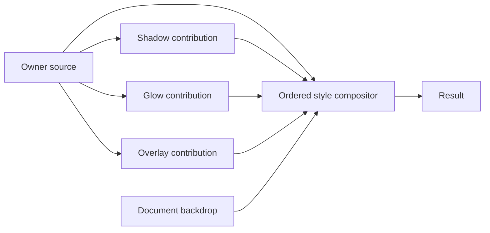

# PSD import and layer styles

[Design history](README.md)

Research date: **2026-10-07**. Capy source baseline:
`ecc1494f27bc55bc6761e6802c8fbb60bd1e7341`. PhotoCraft source baseline:
[`29c280a2c696921757775dad737757e8691ac00a`](https://github.com/storytold/photocraft/tree/29c280a2c696921757775dad737757e8691ac00a).
This is research and a design recommendation, not an implemented feature or a
claim of Photoshop pixel compatibility. Evidence is source inspection and
product documentation; no PSD import prototype, rendering comparison, performance
measurement or proposed UI journey has been run.

## Recommended direction

- Import PSD/PSB into Capy's authored model and save subsequent edits as `.capy`.
  PSD export is a separate project; opening a PSD must not imply lossless editable
  round trips through Capy.
- Evaluate PhotoCraft's standalone PSD crate as the file reader. Its document
  mapping and compositor are references, not a ready-made Capy integration.
- Keep sequential filters as effect layers. Represent Photoshop-style layer
  styles as properties owned by a layer, with dedicated compositing semantics.
- Show one **Styles · 3** badge on the owner row and edit its styles in Properties.
  Keep style categories in their established compositing order; allow reordering
  repeated instances within supported categories.

Styles could be represented as graph nodes or layer-like records internally.
The recommendation is about authored ownership, rendering behavior and the artist's
interface; a node editor is not required for a shadow and an outline.

## What PhotoCraft provides

[`photocraft-psd`](https://github.com/storytold/photocraft/blob/29c280a2c696921757775dad737757e8691ac00a/crates/psd/src/lib.rs)
reads and writes PSD v1 and PSB v2 into a format-level model. It retains encoded
channels, unknown tagged blocks, resources and padding, decodes channels lazily,
and supports the four PSD compression methods. Its writer expects the caller to
supply the merged image; the crate does not composite layers.

Its [package manifest](https://github.com/storytold/photocraft/blob/29c280a2c696921757775dad737757e8691ac00a/crates/psd/Cargo.toml)
has no PhotoCraft workspace-crate dependencies: the runtime dependencies are
`thiserror`, `flate2` and optional `serde`. The repository's
[license declaration](https://github.com/storytold/photocraft/blob/29c280a2c696921757775dad737757e8691ac00a/Cargo.toml)
is MIT OR Apache-2.0. A dependency decision still needs Capy's normal license and
source review. Studying Krita or GIMP behavior does not authorize copying GPL code.

Useful integration references at that revision:

| PhotoCraft component | What it contributes |
| --- | --- |
| [PSD import mapping](https://github.com/storytold/photocraft/blob/29c280a2c696921757775dad737757e8691ac00a/crates/io/src/psd_import.rs) | Converts format records into PhotoCraft's document, with warnings and retained metadata. Capy needs its own mapping. |
| [Style mapping](https://github.com/storytold/photocraft/blob/29c280a2c696921757775dad737757e8691ac00a/crates/io/src/effects_map.rs) | Parses legacy and descriptor-based layer effects into typed style parameters. |
| [Adjustment mapping](https://github.com/storytold/photocraft/blob/29c280a2c696921757775dad737757e8691ac00a/crates/io/src/adjust_map.rs) | PSD adjustment descriptors and unsupported-data preservation. |
| [Smart Filter mapping](https://github.com/storytold/photocraft/blob/29c280a2c696921757775dad737757e8691ac00a/crates/io/src/smart_map.rs) | Maps supported filters and retains unknown descriptors. Unknown filters render as pass-through, so preservation alone does not establish editable fidelity. |
| [Style compositor](https://github.com/storytold/photocraft/blob/29c280a2c696921757775dad737757e8691ac00a/crates/compose/src/effects.rs) | Separate shape-derived contributions, interior/exterior blending, fill opacity, strokes and bevel behavior. This is a CPU reference, not a replacement for Capy's GPU renderer. |
| [Smart Object evaluation](https://github.com/storytold/photocraft/blob/29c280a2c696921757775dad737757e8691ac00a/crates/engine/src/smart_cmds.rs) | Source rendering, placement, sequential filters, per-filter blending and a shared filter-mask mix. |

### Fidelity claims have different meanings

PhotoCraft's [README](https://github.com/storytold/photocraft/blob/29c280a2c696921757775dad737757e8691ac00a/README.md)
reports preserved render appearance after application import/export for 307 of
309 psd-tools corpus files. That is not 307 files matching Photoshop. Its
[corpus test](https://github.com/storytold/photocraft/blob/29c280a2c696921757775dad737757e8691ac00a/crates/io/tests/corpus.rs)
sets a separate Photoshop-oracle floor of 229/309: 219 compared with the merged
image and 10 with a thumbnail. Thumbnail comparisons use a different, reduced
resolution test. These are upstream claims and checked-in thresholds, not runs
performed for this research.

The standalone parser's byte-preserving round trip is a third claim. Once an
application converts records to its own model, edits them and regenerates the
composite, byte identity and visual fidelity are separate concerns. Cached PSD
pixels or retained unknown records can preserve an initial appearance without
providing a correct result after the source changes.

## Import into the Capy format

The proposed path is:

```text
PSD/PSB bytes
  -> bounded format parsing and channel decoding
  -> shared PSD-to-Artwork conversion and capability assessment
  -> color/resource/renderer admission
  -> editable Capy document
  -> first Save as .capy
```

Parsing, decoding and conversion belong off the UI/input path. The result must
pass admission before replacing the live document. The original PSD remains the
source file. Capy's [architecture](../architecture.md) and
[package contract](../reference/capy-package.md) govern the resulting document.

The importer needs a declared fidelity policy for each unsupported feature:
editable conversion, an explicitly rasterized appearance, preservation for later
use, or rejection. A cached merged image is useful for preview or an explicit
flattened import; it does not make a partially mapped layer tree faithful.
Preserving arbitrary PSD records inside `.capy` would need an authored-data
contract and resource policy; the parser retaining them does not supply that
contract. PSD re-export and its loss reporting remain separate scope.

### Mapping and gaps at the Capy baseline

| PSD feature | Existing Capy basis and remaining work |
| --- | --- |
| Raster layers, names, visibility, offsets and opacity | Paint/image resources and occurrences provide a basis. Map bounds, alpha, channels and numeric ranges, including content outside the canvas. |
| Groups and clipping | Stacks, isolated/pass-through groups and clipping exist. Photoshop clipping runs and group interactions need explicit mapping and pixel fixtures. Capy adjustments cannot themselves become clipping members or split a clipping run. |
| Adjustment layers | Standalone adjustment effects modify the accumulated lower composite. Matching a filter name is insufficient: parameter ranges, equations, blend domains and masks need conversion and comparison. |
| Smart Filters | Attached filters already form a sequence, but Photoshop's shared filter mask, source placement, per-filter blend/opacity and owner-mask placement need mapping. See the candidate topology below. |
| Layer styles | No authored style collection or Photoshop shadow/glow/stroke/bevel style suite. The existing Emboss image filter is not Photoshop Bevel & Emboss. New style records, GPU rendering and controls are needed. |
| Masks | One occurrence coverage mask exists. Photoshop raster/vector masks, density, feathering, disable/link flags and mask-versus-style placement do not reduce to one unconditional premultiply. Baking combined coverage loses independent editing. |
| Fill and advanced blending | Occurrences have opacity, but no separate Photoshop Fill opacity, Blend If ranges, knockout or the full advanced style-blending rules. Fill and overall opacity must remain distinct. |
| Blend modes | Capy has 24 pixel blend modes plus group pass-through behavior. Dissolve, Darker Color and Lighter Color are absent. Existing modes still need numerical compatibility checks at each supported depth/domain. |
| Text and vector shape layers | No native editable text or vector-shape layer content. Retaining cached raster appearance is possible in principle; editable import needs new authored types, font handling and vector/path semantics. |
| Smart Objects | Capy image objects retain raster sources and affine placement. They do not provide Photoshop embedded/linked document editing, nested Smart Objects, arbitrary PSD warp semantics or preservation of Photoshop's embedded Smart Object/filter data. |
| Color and depth | RGB working spaces and U8/U16/F32 storage provide useful infrastructure. Source-image CMYK support is not native CMYK document editing; native CMYK/Lab, spot and multichannel workflows remain gaps. ICC interpretation and Photoshop integer/float conventions need explicit handling. |
| Large documents | The parser accepting PSB does not imply Capy can admit it. Capy's dimension ceiling is 32,768; default project limits include 4,096 layers and resource budgets, with further renderer/device limits. |
| Other PSD data | Layer comps, artboards, slices, paths, metadata and unsupported tagged blocks need a preservation/import policy. Do not silently equate retaining bytes with exposing editable features. |

Code anchors: [authored records](../../crates/layer-core/src/authored/artwork.rs),
[scene and attachment rules](../../crates/layer-core/src/authored/scene.rs),
[blend modes](../../crates/layer-core/src/layers.rs),
[color model](../../crates/layer-core/src/color.rs),
[source images](../../crates/layer-core/src/color/source.rs),
[project limits](../../crates/layer-core/src/project.rs),
[dimension limit](../../crates/layer-core/src/lib.rs) and
[filter catalog](../../assets/filters/manifest.json).

## Styles and filters have different evaluation rules

**Sequential filters** transform a working image. Conceptually, two filters
produce `F2(F1(source))`, with each filter's opacity/blending applied at its own
stage. Photoshop applies its Smart Filter list bottom to top and has one mask
for the complete list, rather than a separate mask per filter.
[Adobe Smart Filters](https://helpx.adobe.com/photoshop/using/applying-smart-filters.html)
documents those behaviors.

**Layer styles** generally derive shape or coverage from the owner's content,
then contribute to ordered composition. Many need the owner's alpha rather than
its complete RGB pixels. A glow does not generally become extra geometry that a
neighboring drop shadow automatically shadows. A simplified dependency diagram is:



Here, parallel means shared source dependencies, not a claim about Photoshop's
threads or GPU implementation. Contributions still overlap and blend in order.
Nor does every style read identical untouched pixels: masks, clipping, filter
stages and effect-specific interactions affect evaluation. Source must name a
defined stage, such as owner content after image filtering and before styles.

### Behind, inside and across the owner

Drop shadows and outer glows contribute outside/behind the owner; inner shadows,
inner glows and overlays affect its interior. A stroke can be inside, outside or
centered on its boundary. Bevel/emboss has multiple placement modes, and Stroke
Emboss is a dedicated interaction with a stroke. These are not all equivalent
to one ordinary raster layer placed above the source.

The compositor needs more than a flattened source-plus-styles texture:

- Exterior contributions may blend directly with the underlying document using
  their own blend modes.
- Interior effects can participate in the owner's blend mode through Photoshop's
  **Blend Interior Effects As Group** option.
- Overall opacity and source Fill opacity have different scopes; Fill can hide
  source content while leaving styles visible.
- Mask placement, transparency shaping, knockout and partially transparent
  boundaries can change the combined result.

These controls are documented in
[Adobe's blending guide](https://helpx.adobe.com/photoshop/using/layer-opacity-blending.html).
PhotoCraft's style compositor is a concrete implementation reference, but its
particular render sequence is not a complete specification of Photoshop.

### What Capy's existing chain actually does

The [GPU stack evaluator](../../crates/layer-render-wgpu/src/scene/stack.rs)
builds the owner's content and evaluates attached effects sequentially. Owner
masking happens in the [scene evaluation graph](../../crates/layer-render-wgpu/src/scene/scale/graph.rs)
before that chain; clipped layers are combined afterward and outer owner
opacity/blending is applied later. A standalone adjustment operates on the lower
composite instead. The
[relationship presentation](../../crates/layer-ui/src/layer_relationships.rs)
draws connections through the attached chain.

The [multipass effect contract](../../crates/layer-core/src/effects.rs) allows
passes to read the original input to that one effect. It does not provide the
untouched owner before every earlier effect. Source sharing across styles cannot
be obtained merely by using that existing input. Attached effects also cannot
target a pass-through group directly.

### A possible shared Smart Filter mask mapping

There is a candidate composition using existing primitives, rather than applying
Photoshop's shared filter mask separately to each attached filter. Top to bottom:

```text
Isolated owner wrapper: owner opacity/blend and any post-filter owner mask
  Pass-through subgroup: shared filter mask, opacity 100%
    Filter 2: standalone adjustment
    Filter 1: standalone adjustment
  Original image: Normal, opacity 100%
```

The subgroup receives the original image as its backdrop, evaluates the filters,
then its mask mixes the resulting composite against that original backdrop:
`result = original + mask * (filtered - original)` in the compositing representation.
The outer wrapper can mask the completed result. This differs from independently
masking each filter, which generally gives a different image.

This is a source-derived feasibility hypothesis, not a tested PSD conversion.
Per-filter blending, alpha, bounds, clipping, source transforms and group blending
must be checked on the GPU before adopting it. It also introduces structural
wrappers whose presentation and editing behavior need a deliberate design.

## Could all styles remain effect layers?

Yes, with richer semantics. Separate these three questions:

1. Which image supplies the effect's source or shape?
2. Does it generate an effect-only contribution or a complete processed image?
3. How and where does its output blend into the accumulated result?

Input dependencies and visual placement are independent. A shadow below its owner
can read the owner's pre-style source without a cycle, provided the reference is
to that source stage and not to the final composite containing the shadow.
Reading source does not imply resetting the accumulated image. A full-image
output can still contribute through a mask, opacity or blend mode. Returning
source-plus-effect from every branch would composite the owner repeatedly and
give incorrect translucent edges.

A source/previous switch has plausible uses in a more general Capy graph:

| Effect | Owner source | Previous result within the owner |
| --- | --- | --- |
| Shadow | Shadow the original silhouette. | Shadow a silhouette expanded by an earlier outline. |
| Glow | Glow around the original edges. | Glow around the outlined or otherwise modified shape. |
| Blur | Generate a blurred source copy for an explicit blend. | Blur all accumulated content/effects at that stage. |

A shadow remains a contribution generator under either choice. A source-based
blur needs a defined blending purpose; replacing the entire accumulated result
would discard previous work. Explicit reset/bypass or branch selection can use
that behavior, but it is surprising as the default for an ordinary style.
An opaque full-image contribution can still cover earlier results through normal
compositing, just as an opaque image layer can.

### PSD does not require that switch

Standard Photoshop styles have effect-specific evaluation rules; Smart Filters
form a sequential list. There is no general per-style source/previous selector.
PSD stores style descriptors and repeated instances, not arbitrary wiring among
them. Adobe's [file specification](https://www.adobe.com/devnet-apps/photoshop/fileformatashtml/)
and the [ag-psd descriptor reader](https://github.com/Agamnentzar/ag-psd/blob/master/src/descriptor.ts)
provide the format evidence. A glow field called `source` means edge/center,
not owner/previous routing; see [ag-psd's types](https://github.com/Agamnentzar/ag-psd/blob/master/src/psd.ts).

The switch is therefore an optional Capy extension, not an importer requirement.
Even without it, a renderer needs both sequential filtering and owner-based style
composition. The preferred first design assigns the correct behavior from the
effect system and its specific parameters. General node wiring remains deferred.

## How other editors present these operations

Similar-looking nested FX controls do not establish similar evaluation graphs.

| Editor/system | Documented behavior and relevance |
| --- | --- |
| [Photoshop styles](https://jkost.com/blog/2020/10/working-with-layer-effects-and-layer-styles-in-photoshop.html) | Effects belong to an owner, can appear beneath it, and have dedicated style controls. Category placement and repeated-instance ordering differ from an arbitrary filter chain. |
| [Affinity Layer FX](https://affinity.help/photo2/en-US.lproj/pages/LayerFX/create_layerFX.html) | Owner FX indicator plus Quick FX/Layer Effects controls. Repeated instances of supported types can be reordered. Its UI documentation does not establish that every effect evaluates independently from identical source pixels. |
| [Affinity live filters](https://affinity.help/photo2/en-US.lproj/pages/Layers/livefilters.html) | Filters are layers whose stack placement and nesting control their scope. This is distinct from Layer FX. |
| [Krita styles](https://docs.krita.org/en/reference_manual/layers_and_masks/layer_styles.html) | Owner FX indicator and a Layer Style editor. Its [compositor](https://github.com/KDE/krita/blob/master/libs/image/layerstyles/kis_layer_style_projection_plane.cpp) builds style projections from a shared source layer and composites them in several stages. |
| [Krita clone layers](https://docs.krita.org/en/reference_manual/layers_and_masks/clone_layers.html) | Live source references provide another way to construct derived appearances. That does not require making the ordinary style UI a node editor. |
| [GIMP 3 layer effects](https://docs.gimp.org/3.0/en/gimp-using-layer-effects.html) | Attached effects evaluate bottom to top, with each using the output below it. Nesting an FX list under a layer does not imply shared-source generation. |
| [Pixelmator Pro styles](https://support.apple.com/guide/pixelmator-pro/apply-styles-to-layers-pix1a597f9fb/4.4/mac/26) | Fills, strokes and shadows are edited in the owner's Style pane. This is UI evidence, not proof of its internal dependency graph. |
| [Clip Studio Paint layer properties](https://tips.clip-studio.com/en-us/articles/9943) | Border and other appearance effects live in Layer Property and can apply to a layer folder. This provides a properties-based presentation precedent. |

## Proposed Capy presentation

Represent styles as owner properties instead of independently selectable rows
in the layer tree. Use one clickable **Styles · 3** badge in the layer row and
show individual instances in the existing Properties panel. The name separates
styles from Capy's existing **Add Filter / fx+** entry points.

```text
Layers
  [thumbnail] Logo                         [Styles · 3]
              Multiply · 80%

Properties — Logo
  Styles                                     [+ Add]
    [on] Stroke
    [on] Outer Glow
    [on] Drop Shadow
           Color       [swatch]
           Distance    [control]
           Size        [control]
```

The badge opens the Styles section while keeping the owner selected. Clicking
an instance opens its parameters; a separate enable control toggles that
instance. The badge can remain present with a disabled appearance when all
stored styles are off. A count should describe instances consistently, including
duplicates; exact wording and narrow-panel layout need UI validation.

The ordinary group disclosure continues to reveal contained layers. A group
with its own styles uses the same badge as a paint or image layer. No extra
indented style subtree competes with group children. Hover can summarize names,
but click/tap and keyboard access must expose them without requiring hover.

| Alternative | Tradeoff |
| --- | --- |
| Subtitle text such as `Stroke · Shadow · Glow` | Good for scanning, but truncates and is a weak editing affordance. Duplicate/disabled instances are difficult to express. |
| One chip per style on every layer | Direct access, but consumes width and creates many small targets. Wrapping changes row heights. |
| One badge and a Properties list | Stable layer-list density and clear ownership; individual styles require selecting the layer or opening its badge. Preferred starting point. |
| Full style rows or a node editor | Exposes routing and placement, but adds group/chain ambiguity and complexity unnecessary for standard PSD styles. |

Capy's [row descriptions](../../crates/layer-ui/src/session.rs) already use the
subtitle for blend mode, opacity, reduced color mode and image counts. The
[GTK row](../../apps/layer-linux/src/layers.rs) also contains thumbnails, masks
and relationship controls. The recommendation avoids treating spare subtitle
space as an unlimited style inventory. Per-style chips can be reconsidered if
testing shows that the Properties list makes frequent switching cumbersome.

### Reordering belongs in Properties

Photoshop's style categories have an established order. Supported repeated
instances, such as multiple strokes or shadows, can be reordered within their
category. The [style guidance](https://jkost.com/blog/2020/10/working-with-layer-effects-and-layer-styles-in-photoshop.html)
and PSD descriptor structure support this distinction. It is not arbitrary
dragging of a glow before or after a shadow as if they were sequential filters.

```text
Styles                                      [+ Add]
  Stroke
    [grip] [on] White · 2 px
    [grip] [on] Black · 6 px
  Drop Shadow
    [grip] [on] Near shadow
    [grip] [on] Soft distant shadow
```

A thin white outside stroke above a thick black outside stroke can show both;
reversing their order can let black cover white. Repeated shadow/overlay blending
can also depend on order. Support that editing from the start, using handles
within a category and Move Up/Move Down commands for non-drag access. Follow
Capy's [drag convention](../ui/drag-and-reorder.md). A category with one instance
does not need an active reorder affordance.

Free ordering across categories is a separate potential extension with PSD
export implications. It is not needed for importing Photoshop's style model.

## Work required before claiming support

1. **Define the import contract.** Choose supported modes/depths, feature
   admission, warnings, fallback behavior and retained foreign data. Keep Save
   as `.capy` distinct from future PSD export.
2. **Build a bounded adapter.** Integrate the reader in shared Rust, map basic
   raster/group/mask records, preserve source/color intent and reject unsupported
   allocations before publication. Parsing PSB and admitting a large PSB are
   different acceptance cases.
3. **Validate ordinary composition.** Check blends, clipping, group isolation,
   adjustments, masks and numeric conversion against Photoshop-authored fixtures.
4. **Add authored style ownership and rendering.** Store stable style identities,
   parameters including defaults, instance order and shared settings such as
   global light. Follow the package contract; do not serialize built-in shader
   implementations or UI state. Implement source sharing, expanded bounds,
   backdrop-aware blending, fill/opacity and mask behavior on the GPU.
5. **Add the style UI.** Shared Rust owns actions, selection, enable state,
   reorder rules, undo and text. Hosts present the badge and Properties controls.
   Group, narrow-panel, touch/pen, keyboard and light/dark journeys need checking.
6. **Expand fidelity deliberately.** Smart Object contents, editable text,
   vectors and broader color modes require their own capabilities; cached layer
   pixels do not substitute for them.

Fixtures should cover multiple styles and same-type instances, translucent
edges, Fill zero versus opacity zero, mask-before/after behavior, non-Normal
backdrops, inner/outer/center strokes, bevel interactions, clipped groups,
Smart Filter ordering and the shared mask. Include edits after import and
`.capy` save/reopen, not only the first displayed composite. Use fixed-file
conversion regressions and compare rendered layers to trustworthy Photoshop
references; distinguish a merged-image oracle from a thumbnail or self-round-trip.

An implementation also needs malformed-input/resource-limit tests and affected
GPU/performance measurements under the existing
[testing](../development/testing.md) and
[performance](../PERFORMANCE_TARGETS.md) rules. No estimate or conformance claim
can be inferred from the parser's feature list alone.
