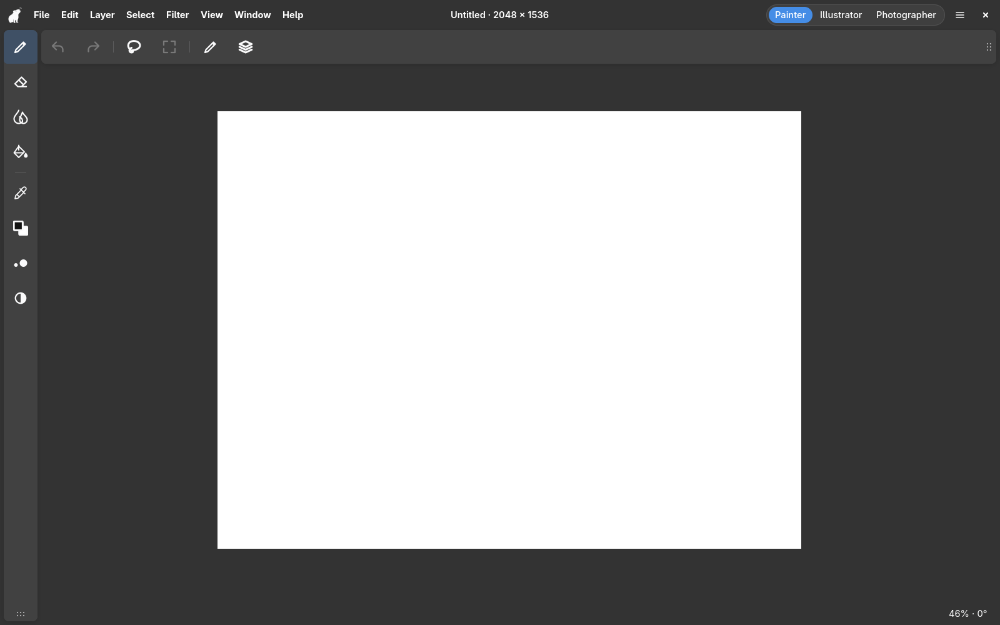
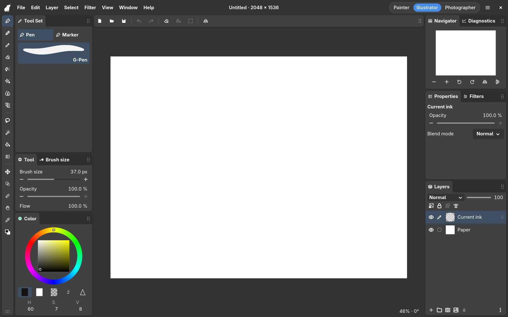
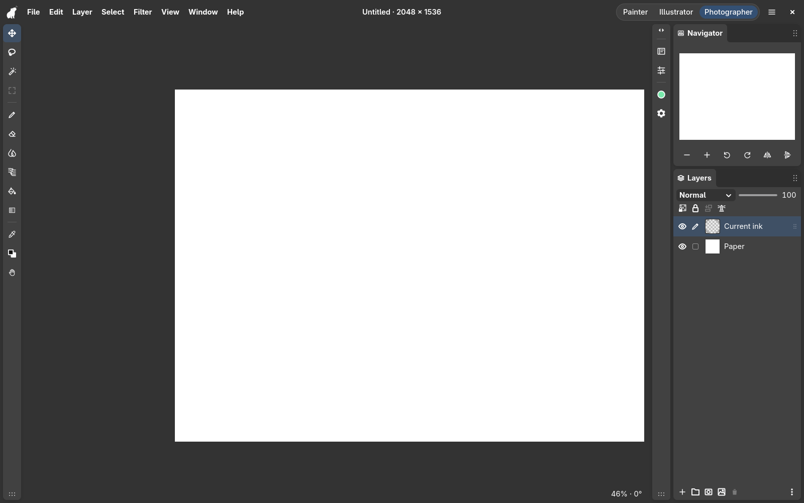
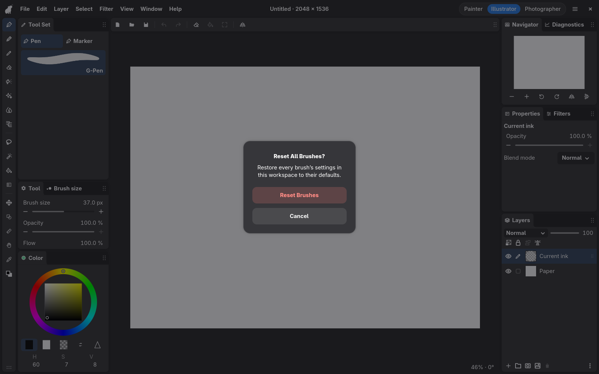
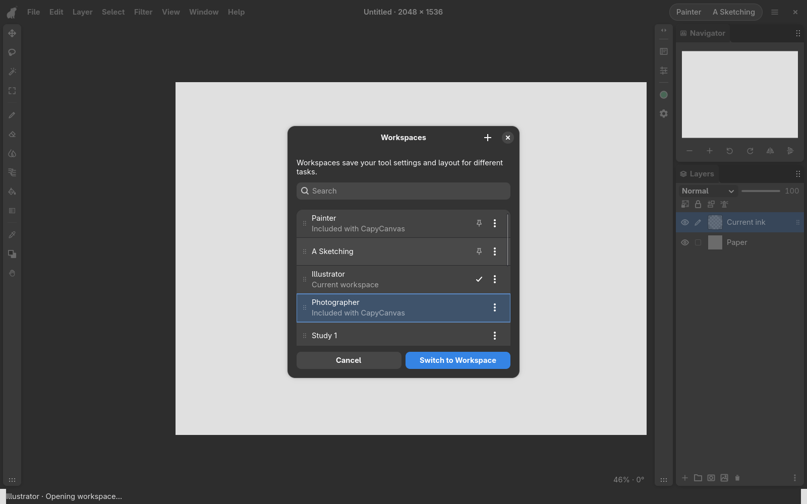
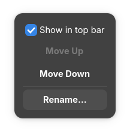
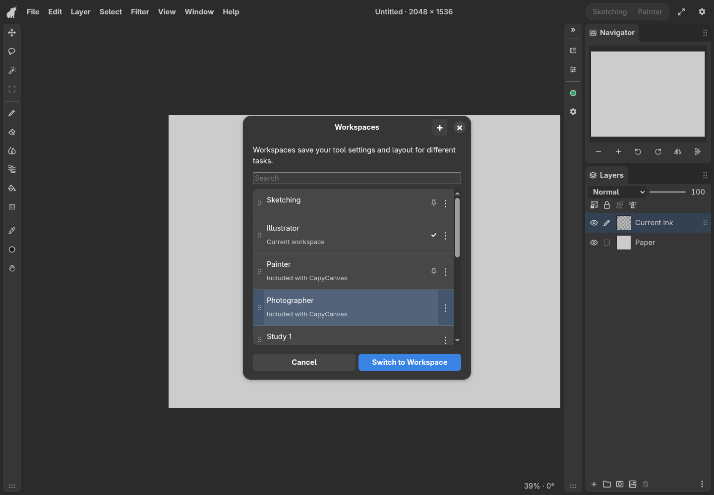
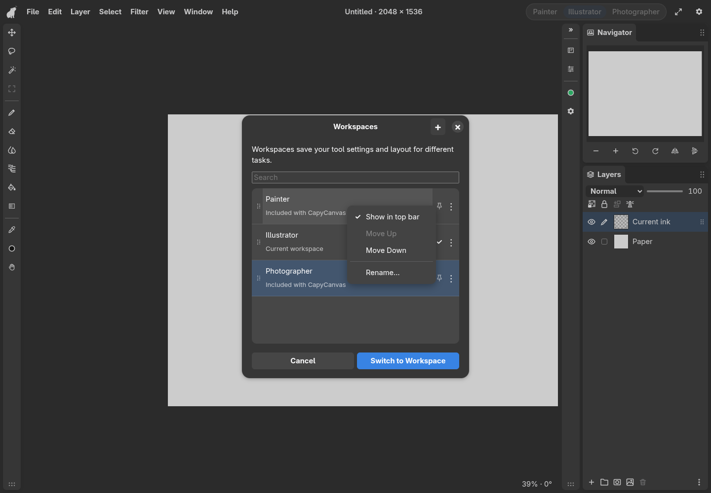

# Default workspaces

2026-09-12: first GTK implementation of Painter, Illustrator, and Photographer.
**Workspaces are the only saved product item**.
There is no Save Layout or Load Layout UI. Workspace changes save automatically.

## Research and choices

[Procreate's interface handbook](https://help.procreate.com/procreate/handbook/interface-gestures/interface)
puts paint, smudge, eraser, layers, and color together, with size, opacity, and
undo/redo on the side. Selection and transform remain readily accessible.
[Clip Studio Paint's Simple Mode](https://help.clip-studio.com/en-us/manual_en/090_tablet/Tablet_interface.htm)
similarly emphasizes drawing tools, color, layers, brush size/opacity, and undo/redo.
Our Painter arrangement uses those common essentials, with Fill as a frequently
used painting operation. Drawers replace persistent panels; file operations
remain in the existing menu.

[Affinity Photo's interface reference](https://affinity.help/photo2/English.lproj/pages/Workspace/interface.html)
separates editing tools from the settings panels in its right Studio.
[Photoshop's panel documentation](https://helpx.adobe.com/photoshop/desktop/get-started/learn-the-basics/collapse-expand-icons.html)
supports keeping frequently used panels expanded and secondary panels as icons.
Photographer adapts those patterns to the panels and commands CapyCanvas already
implements; it does not expose placeholders for clone, healing, crop, histogram,
or other missing photography features.

The header follows the grouped shape and clear active state of the
[user's switcher reference](https://content-management-files.canva.com/8a24f050-ceea-4ef9-9a44-ece1ae982d09/UI.png),
using CapyCanvas theme colors, type, and compact spacing.

## Arrangements

| Workspace | Left | Top | Right |
| --- | --- | --- | --- |
| Painter | Brush, Eraser, Blend, Fill; Eyedropper, Color, Brush size drawer, Opacity | Undo, Redo; Lasso selection, Scale/rotate; Tool Set and Layers drawers | None |
| Illustrator | Existing Tools toolbar and Tool Set/Tool/Brush size/Color column | Existing Commands toolbar | Existing Navigator/Diagnostics, Properties/Filters, Layers arrangement |
| Photographer | Operation, Lasso selection, Auto select, Scale/rotate; Brush, Eraser, Blend, Liquify, Fill, Gradient; Eyedropper, Color, Hand | None | Expanded Navigator above Layers; inner collapsed column for Properties, Filters, Color, Tool |

Painter uses Medium toolbar tiles; Photographer uses Small. Painter starts with Brush
selected and no docked content panels. Photographer starts with Operation selected,
devotes 30% of the expanded right column to Navigator and 70% to Layers, and omits
the illustration Tool Set/Brush size columns and Diagnostics. Illustrator retains
the existing default arrangement and tool selection.

## Workspace behavior

- Seed exactly three default workspaces with stable IDs:
  `builtin:workspace:painter`, `builtin:workspace:illustrator`, and
  `builtin:workspace:photographer`. Fresh installations open Illustrator.
- All three save edits normally and may be renamed. They cannot be deleted.
  The header initially shows these three, follows workspace identities, and
  displays their current names. Its entries can be changed in Manage Workspaces.
- The pill sits to the right of the document title and left of the clock. It uses
  normal workspace switching, including outgoing saves and ownership checks.
  Selecting a workspace restores its latest settings and arrangement. It never
  reapplies the shipped preset. If the active workspace is not shown in the
  switcher, none of its segments is selected.
- If another window owns a default workspace, focus that window through the normal
  ownership path. Do not take it over or reset its contents just to switch modes.
- New Workspace copies the current settings and arrangement and asks only for a
  name. Manage Workspaces retains selection preview, explicit Switch to Workspace,
  and Cancel. Layout History remains a history of arrangements within a workspace.
- Restore Starting Layout returns to that workspace's original arrangement.
  Reset All Brushes resets all brush-setting overrides in the current workspace,
  including inactive presets. It preserves color, selected tool, arrangement,
  document edits, and other workspaces. Resetting brushes creates no layout event.
- Seed idempotently. Upgrades retain existing workspaces and resume the previous
  active one. Existing user names win collisions: the seeded workspace receives
  a numeric suffix, which the pill also shows. Never overwrite user content.
- The first Photographer arrangement used Medium tiles. On switching to an
  untouched copy of that arrangement, update it and its starting layout to Small.
  Keep renamed workspaces and brush edits; leave customized layout histories alone.

## Configurable switcher

Manage Workspaces keeps a single ordered list. Every row has a narrow, dimmed
left grip. Workspaces shown in the top bar have a separate pin icon with the
tooltip **Shown in top bar**. The current workspace retains its checkmark.

Each row's **⋮** menu includes **Show in top bar**. Checking it shows that
workspace in its list position; unchecking hides it without moving the row.
The switcher has no border and a darker, recessed background like a slider track
(80% theme background, 20% black), with a subtle blue active choice.
New workspaces start unchecked. The top bar follows the list order, skipping
unchecked entries. An empty selection hides the pill. The pill scrolls horizontally
when its choices exceed the available width.

Drag any row to change its order, including unchecked rows. Moving a row never
changes its visibility. Mouse can drag any non-button part of the row. Touch and
pen can drag the handle immediately; the rest of the row requires a hold,
following the [app-wide drag convention](drag-and-reorder.md). Ordinary touch
swipes scroll the list. Right-click or touch/pen hold opens the row menu; mouse
holds never open menus. Moving with the
same held contact closes the menu and starts dragging; release without movement
leaves the menu open. An insertion line shows the destination. Escape cancels the
drag. **Move Up / Move Down** is available for every row and supports keyboard
access. Clicking still previews a workspace; menus, scrolling, and dragging
preserve the selected row and its preview.

Pinning and ordering save immediately, independently of the preview. Cancel closes
the manager and cancels the layout preview; it does not undo these app preferences.
All workspaces and windows share the switcher configuration.

## Implementation and host integration

`layer-ui/src/layout_presets.rs` defines shared geometry and initial working state.
`layer-workspace::DEFAULT_WORKSPACES` supplies stable identities. Initialization
creates workspaces directly; no reusable layout records are seeded. Older layout
records and storage APIs remain compatible with existing data, without UI routes.

`metadata.builtin` means included and undeletable. Reusable items with this flag
are also read-only; workspaces with this flag permit normal metadata, layout, and
working-state writes. SQLite enforces both rules. The Web adapter must use the same
distinction instead of rejecting every write to a builtin workspace.

The shared manager exposes `workspace_ids` (complete dialog order), `switcher_ids`
(visible subset), `refresh_switcher`, and `edit_switcher(SwitcherEdit::{Show, Move})`.
Read preferences at startup, on focus, and when refreshing the manager.
`StoreRequest::Switcher` returns optional visible IDs; `None` means the three
defaults, while `Some([])` hides the bar. `WorkspaceOrder` returns the optional
complete order. Without a saved order, existing switcher preferences seed it;
new workspaces follow alphabetically. Visibility edits preserve this order.
`UpdateSwitcher` and `UpdateWorkspaceOrder` atomically compare their respective
previously read list before replacement. These requests need no workspace claim
and change no workspace generations, settings, layout, or history. Invalid/deleted
IDs are rejected; duplicate deliveries are idempotent. SQLite schema 4 adds row
ordering alongside schema 3's visibility preference. Upgrades preserve previous
workspaces and pins. The browser reducer supports the same operations and upgrades
schema 2 and 3 snapshots.

GTK's `workspace_switcher.rs` renders the pill and uses the shared manager.
`UiSession::reset_workspace_brushes` performs the brush reset; hosts provide the
confirmation and save the resulting capture. `WorkspaceCommand::ResetBrushes`
routes the shared menu entry. Saved-layout menu entries and GTK flows were removed.
Legacy enum variants stay decodable for hosts updating concurrently, but must not
be exposed as new UI.

See the [host handoff](workspace-manager-host-handoff.md) for preview, ownership,
save failure, lifecycle, and accessibility requirements.

## GTK review

Native captures from the real-pointer interaction test:

Run `cargo run --locked --release -p layer-linux` from the repository root.
Use the three header choices, change a brush size, and switch away and back to
check that each workspace keeps its changes. Window → Workspaces contains
New Workspace, Manage Workspaces, Layout History, Restore Starting Layout, and
Reset All Brushes. The manager's plus button copies the current workspace.

Initial preset validation: 314 shared tests passed (273 `layer-ui`, 41 `layer-workspace`). Six
native GTK tests pass with isolated storage and a private Wayland compositor:
real-pointer menus/pill/drawers/reset, manager previews/history, database restart
and independent windows, ownership takeover, unavailable-storage close recovery,
and fullscreen title/clock placement. Shared host, Apple, and Windows bridge
compilation passes. Other platforms' native UI acceptance remains with their
host implementations.

The pill-color and Small-toolbar refinement reran the shared suite and native
pointer test. The upgrade test also covers brush edits, renaming, preservation of
customized layouts, durable publication, and repeated initialization.

## Switcher acceptance

The integrated shared suite passes 331 tests (278 `layer-ui`, 53 `layer-workspace`).

Run `bash apps/layer-linux/bench/workspace-switcher.sh` for isolated real mouse,
touch, and keyboard verification. The test covers whole-row and handle dragging,
narrow grips on every row, immediate touch handles, held touch rows, right-click
and hold menus, same-contact menu-to-drag continuation, long-list scrolling, keyboard Move Up,
reordering hidden rows without pinning, pinning custom workspaces, hiding every
entry, drag cancellation, preview
preservation, and persisted choices after reopening. The shared suite covers
cross-window preference updates, idempotency, conflict rejection, and SQLite/browser
parity. A focused Wasm/IndexedDB run passes 39 storage contract cases. Native
pen timing still needs a hardware check; the automated native driver covers
mouse, touch, and keyboard. Shared, Android, Apple, and Windows bridges compile.

## Web switcher acceptance

Web now uses the same persisted visibility and row order as GTK. The shared
`WorkspaceController` exposes `switcher`, `order`, and independent preference
status; `EditSwitcher` acknowledgements preserve pending and visible previews.
Web refreshes on focus and uses BroadcastChannel to update other tabs after a
successful preference edit. The fixed `defaults` field remains for compatibility;
new host switchers should render `switcher`.

`node apps/layer-web/test.mjs --workspace-switcher` passes in desktop Chrome on an
isolated Wayland display. It covers native mouse/touch and CDP pen input: every-row
grips, hold/secondary menus, same-contact dragging, rejection before touch/pen
holds, unpinned reordering, keyboard moves, scrolling, cancellation/blur, live
preview preservation, multiple tabs, overflow, and restart. The existing
`--workspace-manager` regression passes too. Physical stylus testing remains a
separate hardware check. The headless GPU environment emits an existing external
Instance warning; desktop Chrome acceptance has no page errors and renders the
canvas previews correctly. Shared controller tests and 12 packaging tests pass.

Other platforms can use the [minimal implementation handoff](workspace-switcher-platform-handoff.md).

