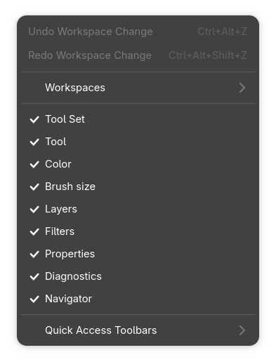
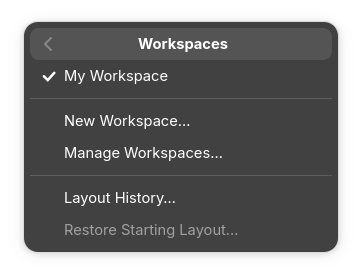
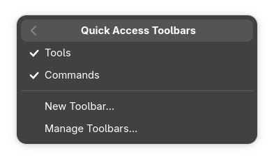
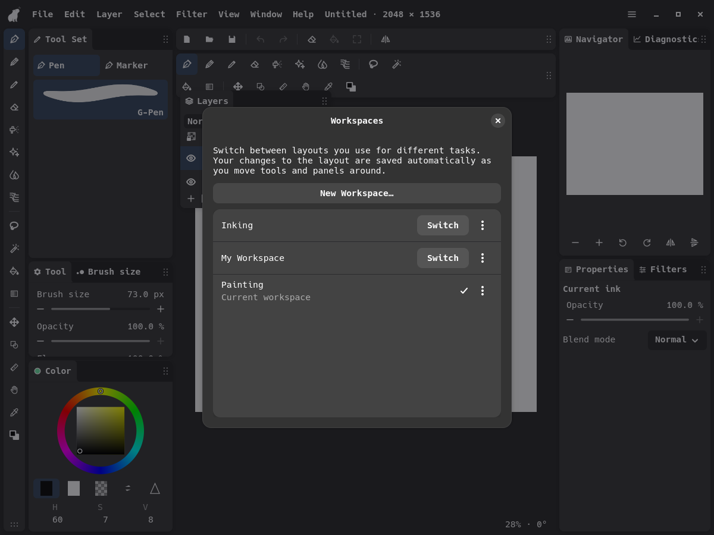
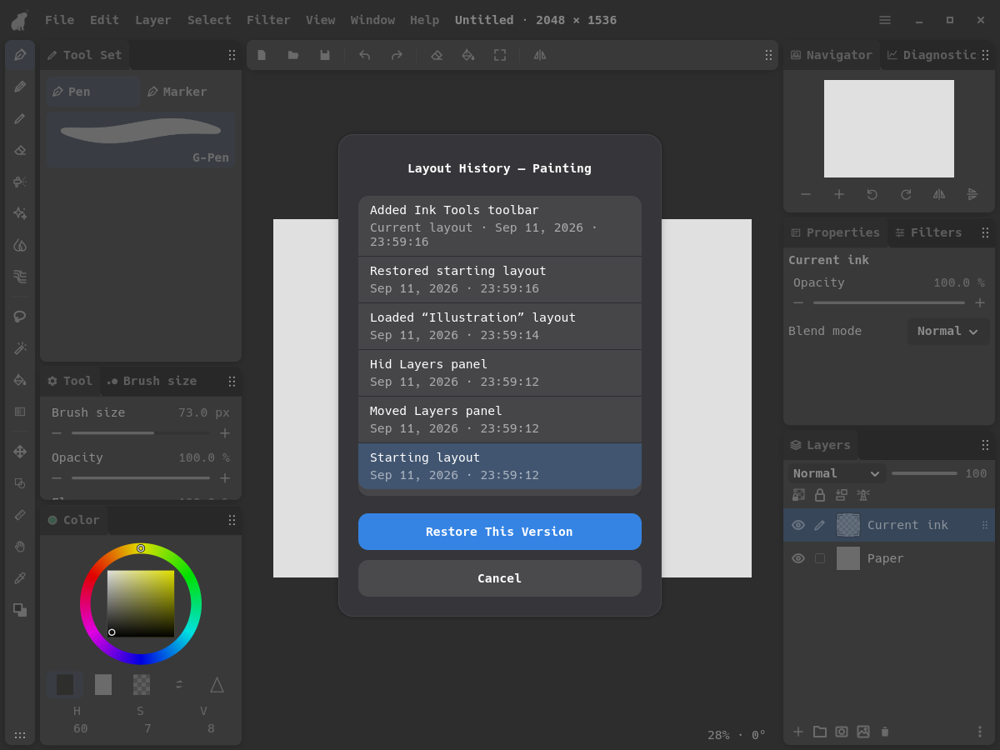

# Approved GTK workspace manager design

Updated for the user’s 2026-09-12 simplification: workspaces are the saved setup;
separate layout load/save controls have been removed. This is the visual reference
for other hosts; use the [host implementation handoff](workspace-manager-host-handoff.md) for scope,
integration responsibilities, and acceptance checks.

## Menus

Window starts with Undo/Redo, followed by Workspaces, Quick Access Toolbars,
and the direct panel rows. Quick Access Toolbars sits directly below Workspaces
in the main Window menu. Its entries keep their short names.
Workspaces groups its commands by purpose:

- New Workspace / Manage Workspaces
- Layout History / Restore Starting Layout

Undo Layout Change and Redo Layout Change describe what the top-level actions undo.
**Layout History** contains earlier arrangements of the current workspace.





## Manage Workspaces

The compact dialog has a selectable list, a square **+** button at the top right,
and Cancel / Switch to Workspace buttons below the list. Rename and Delete remain
in each row's options menu. Its explanation is:

> Workspaces save your tool settings and layout for different tasks.

Selecting or double-clicking a row previews its layout in the editor behind the
dialog. Only Switch to Workspace finalizes the selection. Cancel or closing the
dialog restores the original layout. Browsing does not switch the active workspace
or change either workspace's saved layout/history.



New Workspace asks for a name and copies the current layout and tool settings into
an independent workspace. There is no saved-layout source selector. A separate
Reset All Brushes action is planned; it is not implemented by this UI cleanup.

Recently Deleted, backups, import/export, and version-management controls remain
absent from these managers.

## Layout History

The scrollable list previews the actual editor layout. Cancel restores the layout
from before opening the dialog; Restore This Version commits one undoable change.
The title includes the current workspace name. There are no preview instructions.

Restore Starting Layout returns to the layout the workspace began with. It remains
undoable. Its command and confirmation replace the ambiguous Reset Layout label and sit beside Layout History.



## Try it

Close the older GTK instance and run from the repository root:

```sh
cargo run --locked --release -p layer-linux
```

Check Window → Workspaces and Layout History. Create a workspace, change its tool
settings and panel arrangement, then switch between workspaces. Preview another
workspace and cancel before trying Switch to Workspace. Preview and restore a
history entry, then undo the change.
