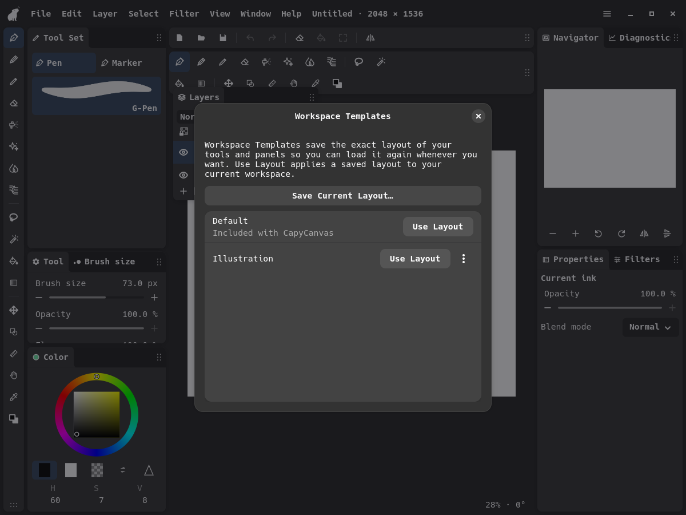

# GTK workspace manager review

Updated for the latest user feedback, 2026-09-11. Ready for another GTK review
before adapting other hosts.

## Menus

Window starts with Undo/Redo, followed by Workspaces and the direct panel rows.
Quick Access Toolbars is inside Workspaces. Its entries keep their short names.
Workspaces also has a separate **Manage workspace templates…** entry.


## Manage Workspaces

The main page keeps the simple New, Switch, and Rename/Delete list. Its explanation
now says:

> Switch between layouts you use for different tasks. Your changes to the layout
> are saved automatically as you move tools and panels around.

Recently Deleted, backups, import/export, storage administration, and the header
More options menu have been removed from these workspace flows.


## Manage Workspace Templates

This manager uses the same compact list design. Save Current Layout saves a named
Workspace Template. Each row has Use Layout; saved entries also offer Rename and
Delete. The included Default layout can be used directly.

Use Layout applies the saved layout to the **current workspace** and closes the
manager. It is one undoable layout change. It does not open a workspace-creation
dialog. Import, export, and version-management controls are absent.



## Layout History

The scrollable list previews the actual editor layout. Cancel restores the layout
from before opening the dialog; Restore This Version commits one undoable change.
The explanatory “Select a version to preview…” text has been removed.


## Try it

Close the older GTK instance and run from the repository root:

```sh
cargo run --locked --release -p layer-linux
```

Review Window → Workspaces, both managers, and Layout History. Save a Workspace
Template, move a panel, then use that Workspace Template and undo the change.
